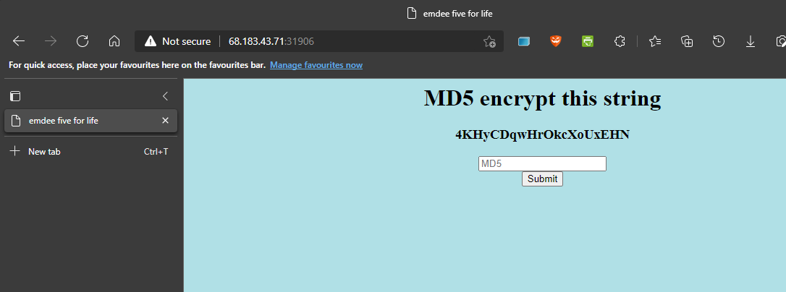
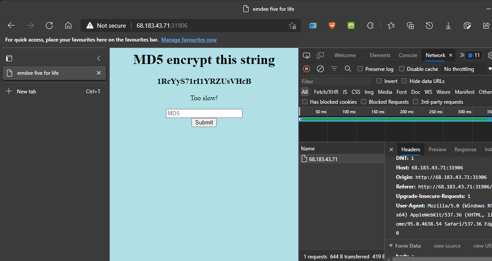
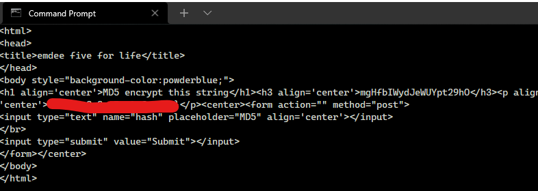

# HackTheBox(HTB) - Emdee Five For Life - WriteUp

> Austin Lai | October 28th, 2021

---

<!-- Description -->


Difficulty: Easy

The room is completed on October 28th, 2021

```text
Can you encrypt fast enough?

- Python script
- HTTP request
- md5 hash
```

<!-- /Description -->

## Table of Contents

<!-- TOC -->

- [HackTheBox(HTB) - Emdee Five For Life - WriteUp](#hacktheboxhtb---emdee-five-for-life---writeup)
    - [Table of Contents](#table-of-contents)
    - [Let's Begin Here !!!](#lets-begin-here-)

<!-- /TOC -->

---

## Let's Begin Here !!!

Start the instance and download files given on the box.

The machine given a page as below:



Look like the machine given a string and we have to convert it to md5 hash and submit to it.

However, no matter how we submit the correct md5 hash, the page only response "Too slow!"



This got me thinking to craft a script for this, we can use bash script; but we are using python script here (might build a bash script for this to try out later)

<details><summary>Python Script - Submit MD5 Hash</summary>

```python
import re
import hashlib
import requests

########################
# Working code in below
url='http://68.183.43.71:31906/'
try:
    # Create a session using requests.session
    establish_session = requests.session()

    # Make a request session to the URL
    session_output = establish_session.get(url)

    # To view the response from session, can use session_object.text
    # print(session_output.text)

    # Find the strings to be md5 encrypted - that will return list
    # we are using re.findall here to search for “all” occurrences
    # r = to specify regular expression
    # base on the source code, we can searching for "h3 align='center'>
    # then () is to capture the group that matches the regular expression to capture strings to be encrypted
    # last, insert the session_output.txt as the response from the request
    strings = re.findall(r'h3 align=\'center\'>(.+?\w+)</', session_output.text)

    # Generate md5 hash for the string
    md5_hash = hashlib.md5(strings[0].encode('utf-8')).hexdigest()
    # print(md5_hash)

    # Create post data
    post_data = {'hash': md5_hash}
    # print(post_data)

    # Send the post data to the session
    send_post = establish_session.post(url = url, data = post_data)
    print(send_post.text)

except KeyboardInterrupt:
    print('interrupted!')
```

</details>

You can download the script [here - python-http-submit-md5](python-http-submit-md5.py)

You will get the flag !



<br />

---

> Do let me know any command or step can be improve or you have any question you can contact me via THM message or write down comment below or via FB

