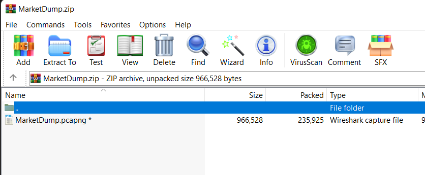
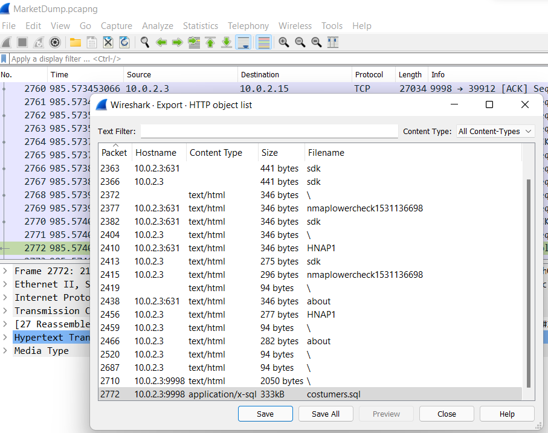
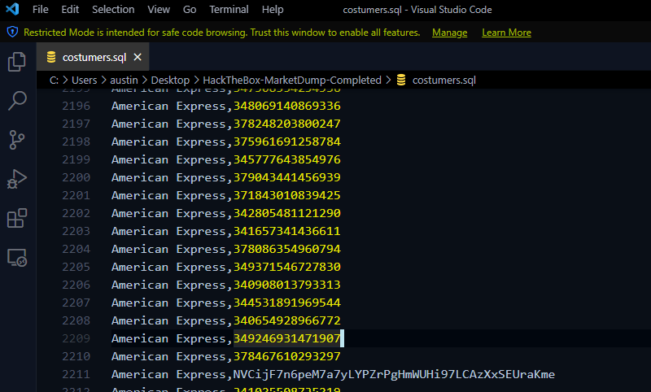
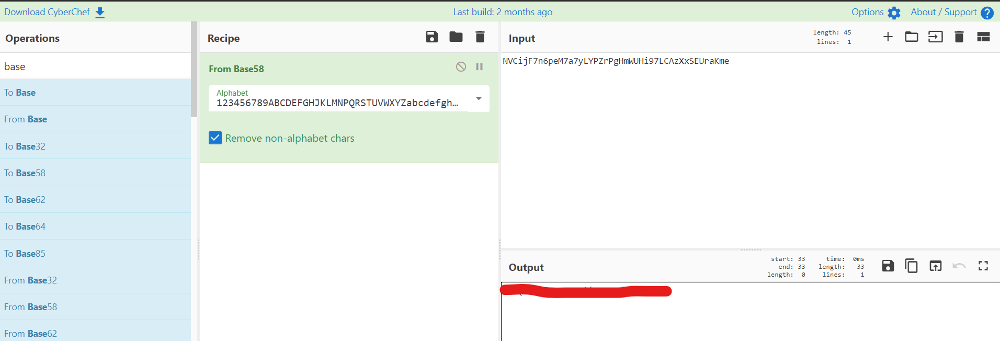

# HackTheBox(HTB) - MarketDump - WriteUp

> Austin Lai | October 28th, 2021

---

<!-- Description -->


Difficulty: Medium

The room is completed on October 28th, 2021

```text
We have got informed that a hacker managed to get into our internal network after pivoting through the web platform that runs in public internet. He managed to bypass our small product stocks logging platform and then he got our costumer database file. We believe that only one of our costumers was targeted. Can you find out who the customer was?

- Wireshark
```

<!-- TOC -->

- [HackTheBox(HTB) - MarketDump - WriteUp](#hacktheboxhtb---marketdump---writeup)
    - [Let's Begin Here !!!](#lets-begin-here-)

<!-- /TOC -->

---

## Let's Begin Here !!!

Start the instance and download files given on the box.

The zip file given called "MarketDump.zip" with a pcapng file as shown below:



Open up with wireshark, immediate we look at the HTTP object list that listed down all the available HTTP object in the pcapng file.

There is "customers.sql" seem like what we looking for:



We export out the "customers.sql" from pcapng file, below is the content of it; that with one specific line which is interesting:



We check the strings using [CyberChef](https://gchq.github.io/CyberChef/), and trying different bases.

Here is the flag:



<br />

---

> Do let me know any command or step can be improve or you have any question you can contact me via THM message or write down comment below or via FB
